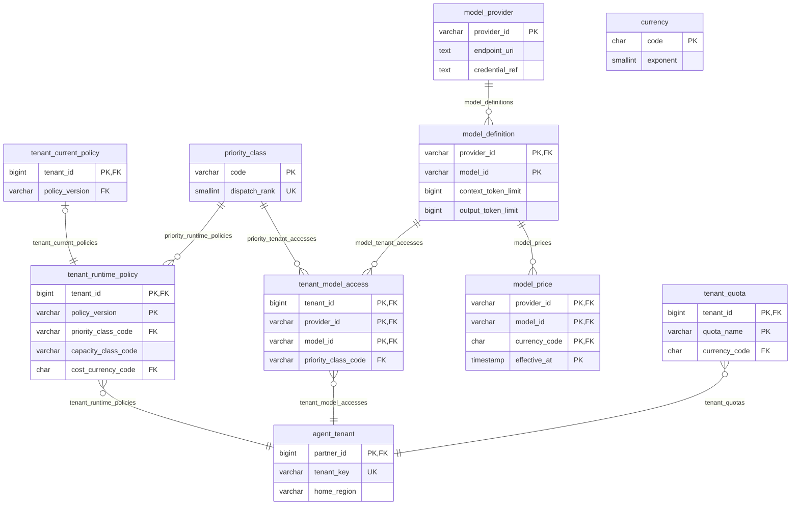
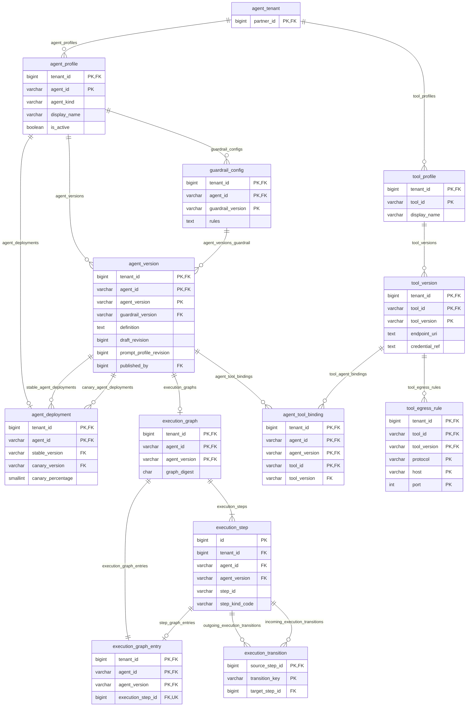
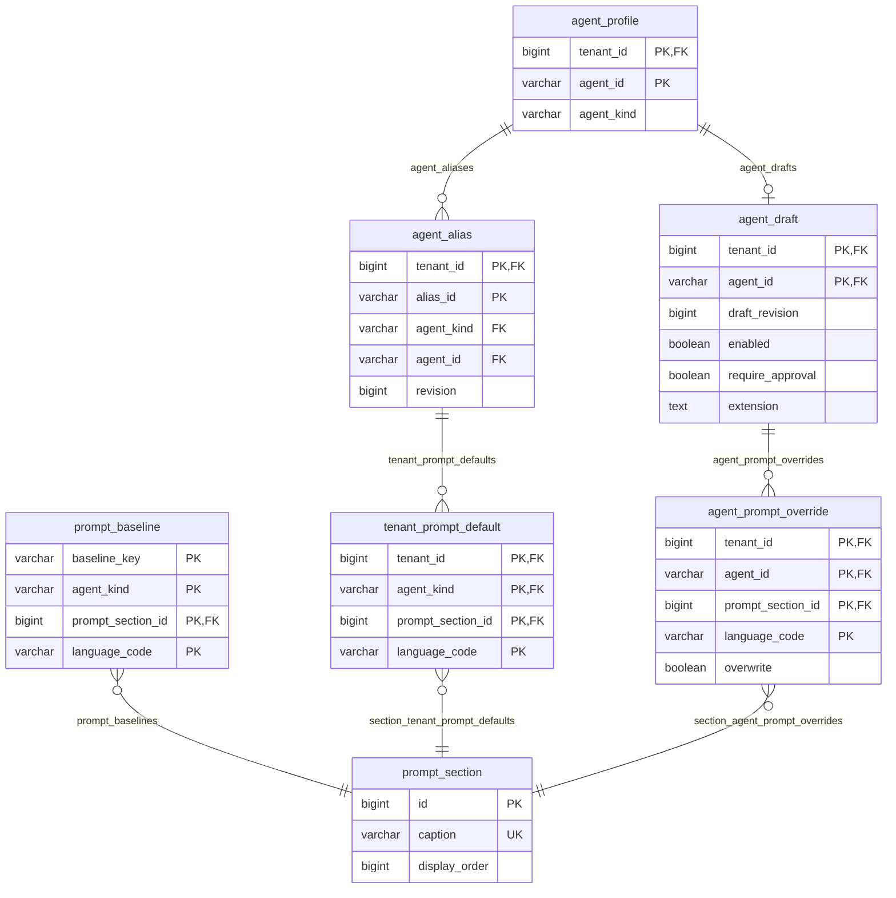
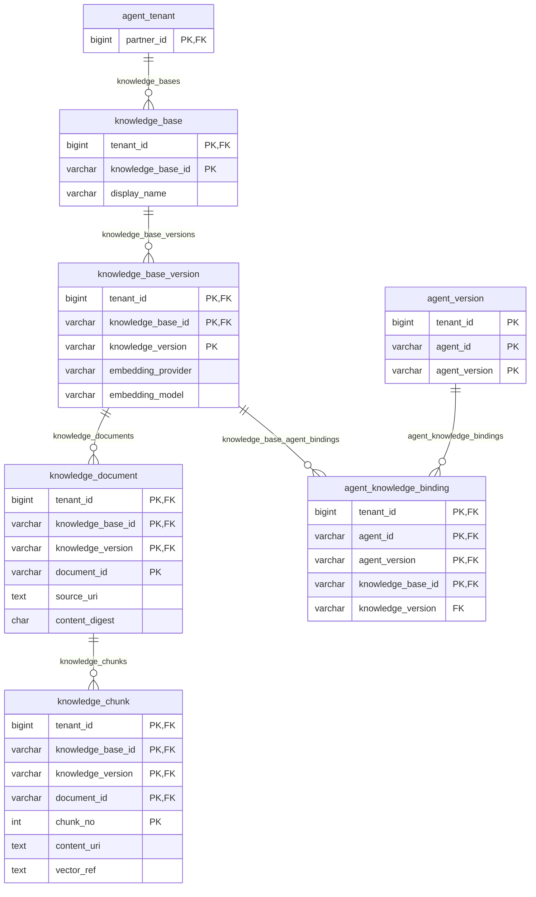
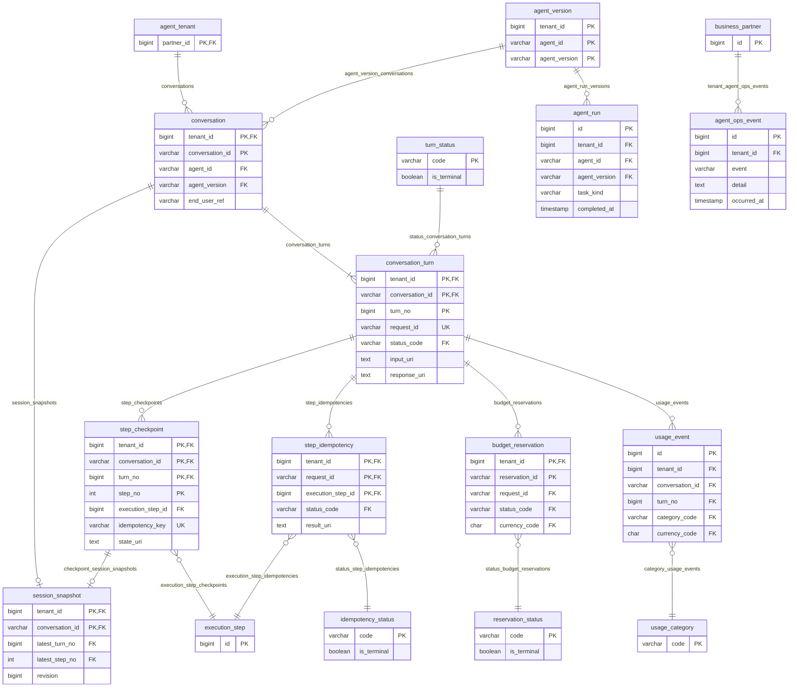
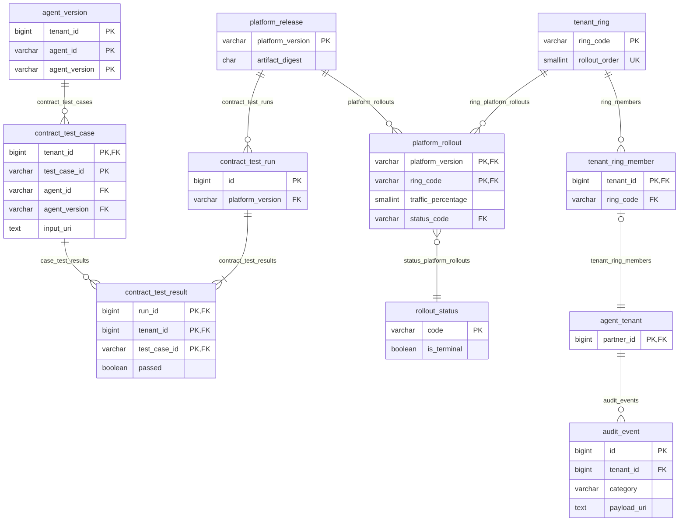

# Scout database reference

Scout requires keel `tenant_management`, which declares direct dependencies on keel `core` and `geo`. Install the groups from the same pinned `github.com/nauticana/keel` module in dependency order: `core`, `geo`, `tenant_management`, then Scout. Keel supplies `business_partner`, users and sessions, authorization, consent, metadata-driven REST, and `table_sequence_usage`. `agent_tenant` is a one-to-one child of `business_partner`, and Studio actor fields reference `user_account`; Scout does not copy either YAML definition.

The diagrams below intentionally show only Scout-owned tables. Keel-owned tables, including the parent `business_partner`, are omitted because they are dependencies rather than part of the agent domain. Generate both layers together as documented in [README.md](README.md#generate-dialect-specific-ddl).

The YAML files under `schema/` are authoritative. This document explains ownership and relationships; it is not another schema source.

## Storage boundaries

| State | Authoritative location |
|---|---|
| Tenants, policies, immutable definitions, graph metadata, usage, rollout, audit indexes | Relational database |
| Large definitions, turn content, checkpoints, and audit payloads | Object storage by URI and digest |
| Hot session and graph entries | Cache backed by durable relational/object state |
| Turn dispatch and reply frames | Durable queue and short-lived reply broker |
| Embedding vectors | Tenant-partitioned vector index |
| Provider credentials | keel secret provider |

All relational identifiers are lowercase. Tenant-owned relations carry `tenant_id` through their primary or foreign keys. Structured payload columns use canonical JSON stored as `TEXT` so keel can emit PostgreSQL or MySQL DDL from the same YAML.

`execution_step.step_kind_code`, `tenant_runtime_policy.capacity_class_code`, and Studio prompt language columns use keel constant domains through `constant_lookup`; none is a foreign key or a Scout-owned table. The execution kinds are `model`, `tool`, and `knowledge`; the capacity classes are `shared` and `dedicated`.

## REST relationship names

Keel uses each foreign-key constraint name as the generated parent-side relation field, and `rest_api_child.constraint_name` selects that exact relation. These names are therefore API contracts. An owning relationship uses the plural child collection; a second path to another parent adds a role that explains the collection from that parent's perspective.

| Parent | Foreign key / relation field | Child objects |
|---|---|---|
| `business_partner` | `agent_tenants` | `agent_tenant[]` |
| `agent_tenant` | `agent_profiles` | `agent_profile[]` |
| `agent_profile` | `agent_versions` | `agent_version[]` |
| `agent_profile` | `agent_studio_events` | `agent_studio_event[]` |
| `agent_version` | `stable_agent_deployments` | `agent_deployment[]` |
| `agent_version` | `canary_agent_deployments` | `agent_deployment[]` |
| `execution_step` | `outgoing_execution_transitions` | `execution_transition[]` |
| `execution_step` | `incoming_execution_transitions` | `execution_transition[]` |

The YAML foreign-key definitions are the complete relationship-name registry. Any future `foreign_key_lookup` or `rest_api_child` seed must reference those names verbatim. Renaming one is an API compatibility change even when its columns do not change.

## Tenant and model governance

`tenant_runtime_policy`, `tenant_quota`, and `model_price` reference `currency`; those edges are omitted from the diagram to keep the layout readable. Policies are immutable by `(tenant_id, policy_version)`, and `tenant_current_policy` changes only the active pointer.

## Agent, tool, and execution control plane

Agent, guardrail, and tool versions are immutable. `agent_deployment` holds stable and canary pointers. The compiled graph is normalized into steps, one entry, and directed transitions so publication can validate references before runtime traffic arrives.

## Agent Studio authoring

`agent_alias.revision` guards both alias changes and tenant defaults for that logical kind, preserving one shared optimistic token. Agent overrides are guarded by `agent_draft.draft_revision`. Platform baseline selection is supplied by `PromptBaselineSelector`; baseline data remains product-owned.

Publication freezes compiled languages and source provenance into `agent_version.definition`. Release metadata records the source revisions, change summary, publisher, publication time, and optional restored version without duplicating live draft rows. `agent_studio_event` keeps queryable lifecycle actions and actor/time metadata; it is omitted from the ER layout to preserve the authoring flow.

## Knowledge

Relational rows prove tenant and version ownership. Document and chunk content remain external by URI and digest, while `vector_ref` points to the tenant-partitioned vector index.

## Conversation runtime and metering

`step_checkpoint`, `budget_reservation`, and `usage_event` reference `currency`; those edges are omitted from the diagram to keep the layout readable. `agent_ops_event` deliberately references the Keel business partner directly because provisioning failures can occur before `agent_tenant` exists. The durable checkpoint precedes cache refresh and queue acknowledgement, and `step_idempotency` makes at-least-once delivery replay-safe.

## Platform release safety and audit

Agent canaries in `agent_deployment` remain independent from platform rings in `platform_rollout`. Compatibility results, rollout health, and redacted audit events provide the evidence required to advance or restore a release.

## Scout table inventory

| Group | Tables |
|---|---|
| Catalog | `currency`, `priority_class`, `turn_status`, `idempotency_status`, `reservation_status`, `rollout_status`, `usage_category` |
| Tenancy | `agent_tenant`, `tenant_runtime_policy`, `tenant_current_policy`, `tenant_quota` |
| Control plane | `agent_profile`, `agent_draft`, `agent_alias`, `prompt_section`, `prompt_baseline`, `tenant_prompt_default`, `agent_prompt_override`, `guardrail_config`, `tool_profile`, `tool_version`, `tool_egress_rule`, `agent_version`, `agent_tool_binding`, `execution_graph`, `execution_step`, `execution_graph_entry`, `execution_transition`, `agent_deployment`, `knowledge_base`, `knowledge_base_version`, `knowledge_document`, `knowledge_chunk`, `agent_knowledge_binding`, `model_provider`, `model_definition`, `model_price`, `tenant_model_access` |
| Runtime | `conversation`, `conversation_turn`, `step_checkpoint`, `session_snapshot`, `step_idempotency`, `budget_reservation`, `usage_event`, `agent_run`, `agent_ops_event` |
| Release | `platform_release`, `tenant_ring`, `tenant_ring_member`, `contract_test_case`, `contract_test_run`, `contract_test_result`, `platform_rollout`, `audit_event` |
