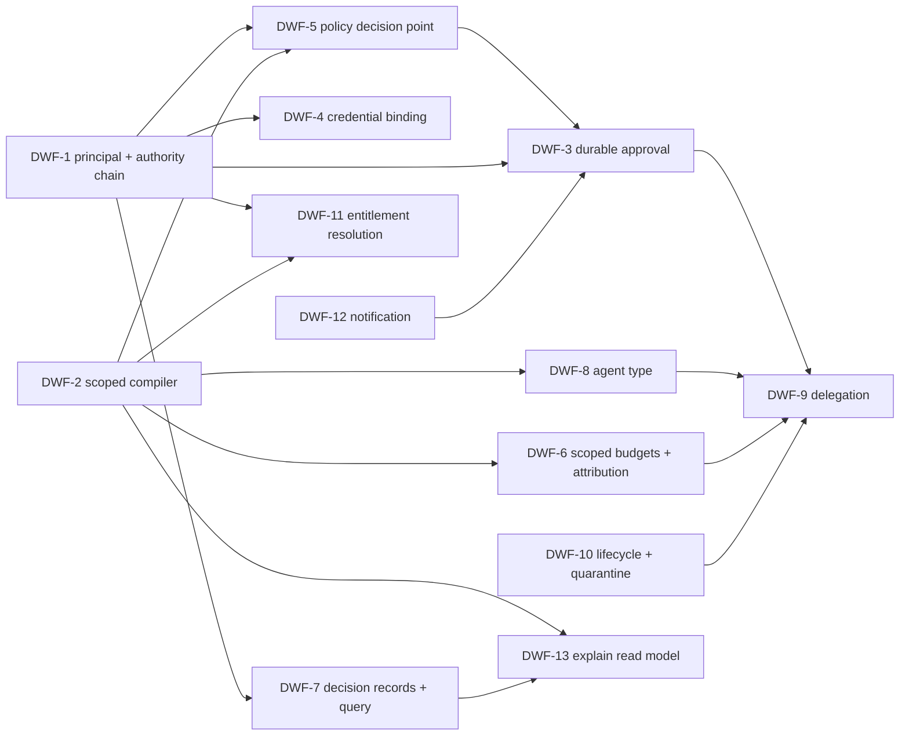

# Scout — Digital Work Force building blocks

Gap analysis for the **Enterprise Agent Organization Control Plane** (Digital Work Force, DWF) described in `~/dev/jobprep/busdev/idea-12-enterprise-agent-organization.md`. Audited against the working tree at `6d0db48` on **2026-08-17**.

This document covers **shared building blocks only**. It deliberately does not design the product: no organizational unit, position, HR semantics, policy pack, process template, or Sail screen appears here. Those are the proprietary layer (idea-12 §12, "settle the open-core line first"). What follows is the generic substrate that layer needs and that Scout does not have today.

Companion task list: [TODO_DWF.md](TODO_DWF.md). Prior idea/task inventory: [IDEAS.md](IDEAS.md) / [TODO.md](TODO.md).

**Status.** All three waves shipped on 2026-08-17. Every block DWF-1 through DWF-13 now has an implementation in the tree, with four deliberate exceptions, all of them external adapters or the prompt retrofit: OPA/cedar-go behind the policy port (A3), SPIFFE and RFC 8693 behind the credential port (K4), the OpenTelemetry GenAI mapping (V4), the A2A adapter behind `AgentInvoker` (D5), and the prompt inheritance retrofit onto `config_scope_binding` (C5). The gap descriptions below are kept as written — they are the evidence the design answers — with a shipped note on each block.

---

## 1. Ownership rule applied to DWF

Idea-12 §12 draws the open-core line through the compiler. Applied to every block below:

| Layer | Owns | Examples from this analysis |
|---|---|---|
| **keel** | Horizontal identity, secrets, messaging, storage | Principal issuance and claims, RBAC evaluation, secret provider, outbound notification, audit storage |
| **Scout** | Agent-platform mechanism, kind-agnostic | Principal threading, scope + binding tables, the compilation engine, approval lifecycle, credential binding, decision records, delegation grants |
| **Commercial app** | Business meaning | `organization_unit`, `position_type`, `organization_position`, human-counterpart semantics, policy packs, process templates, evaluation corpora |

The test used throughout: **if the table or contract needs a business term to be understood, it does not belong in Scout.** `scope` belongs in Scout; `plant` does not. `delegation_grant` belongs in Scout; "AP manager approves invoices over €10k" does not.

Consequence for idea-12 §8: of its fifteen entities, **five are Scout** (`agent_type`/`agent_type_version`, `scoped_policy_binding`, `scoped_tool_binding`, `scoped_knowledge_binding`, `tool_credential_binding`, `delegation_rule`, `effective_agent_release`), **the rest are the product**. Scout must supply a generic `scope` node the product's `organization_unit` attaches to, rather than modelling the org itself.

---

## 2. What idea-12 §7 understates

§7 calls the new surface "narrow and nameable" and lists five items. Three are right. The corrections:

1. **"Three-level prompt inheritance with provenance" is not a generalizable compiler.** It is three physical tables with `instruction`/`output` TEXT columns and a closed three-value enum. Nothing else in Scout inherits at all.
2. **The agent-principal problem is not only keel's.** Scout's own governed tool path carries no agent identity: `domain.ToolCall` has no agent field, and the gateway authorizes and fetches credentials by `(tenant, tool)`. Making agents first-class principals in keel changes nothing until Scout threads a principal through every contract.
3. **Durable human-in-the-loop is missing entirely and §7 does not list it.** A pending approval currently *fails the turn*. §15 items 4, 7 and 8 are unbuildable without a new turn lifecycle state.
4. **Budgets, quotas and the usage ledger have no agent dimension.** §14's per-managed-agent subscription and §15's "cost per completed business outcome" cannot be computed from `usage_event` as it stands.
5. **Audit is write-only and structurally empty.** §15 item 5 ("why is this allowed?") and item 9 ("complete action/evidence/audit history") have no read side and no decision record.

---

## 3. Gap register

Severity: **HIGH** = blocks the idea-12 §15 MVP. **MED** = required before a first customer. **LOW** = required at scale. ✅ marks a block shipped.

| ID | Building block | Owner | Severity | External reuse |
|---|---|---|---|---|
| ✅ DWF-1 | Principal and authority chain threaded through the runtime | Scout + keel | **HIGH** | keel RBAC (extend), RFC 8693 `act`, SPIFFE SVID |
| ✅ DWF-2 | Generic scoped-inheritance compilation engine with provenance | Scout | **HIGH** | none — build |
| ✅ DWF-3 | Durable human-in-the-loop: suspend, approve, resume, escalate | Scout | **HIGH** | Temporal / A2A `input-required` semantics |
| ✅ DWF-4 | Principal-scoped, just-in-time credential binding | Scout + keel | **HIGH** | SPIFFE, RFC 8693, keel secret provider |
| ✅ DWF-5 | Policy decision point port | Scout | **HIGH** | OPA or cedar-go behind the port |
| ✅ DWF-6 | Scope-keyed budgets, quotas, concurrency; org dims on the usage ledger | Scout | **HIGH** | none — extend existing |
| ✅ DWF-7 | Structured decision record and audit query port | Scout | **HIGH** | Preloop evidence shape, W3C PROV, OTel GenAI |
| ✅ DWF-8 | Agent type as a first-class versioned resource | Scout | MED | A2A AgentCard for the published surface |
| ✅ DWF-9 | Agent-to-agent delegation: agent step kind, work item, bounds | Scout | MED | A2A protocol + Go SDK, ADK Go, Eino |
| ✅ DWF-10 | Audited agent lifecycle state machine and version quarantine | Scout | MED | none — extend existing |
| ✅ DWF-11 | Entitlement resolution from a principal | Scout | MED | OpenFGA / SpiceDB if the graph grows |
| ✅ DWF-12 | Outbound notification port | keel | MED | keel messaging/outbox |
| ✅ DWF-13 | Effective-configuration explain read model | Scout | MED | none — build |

---

### DWF-1 — Principal and authority chain

**Exists.** `TurnRequest.AgentID` ([domain/conversation.go:6-12](domain/conversation.go#L6-L12)). `StudioActor{TenantID, ActorID}` for control-plane edits ([handler/studio.go:500-506](handler/studio.go#L500-L506)). `KnowledgeQuery.Principal string` ([domain/knowledge.go:64-79](domain/knowledge.go#L64-L79)).

**Missing.** There is no principal type, and the data plane loses agent identity at the governance boundary:

- [domain/tool.go:11-19](domain/tool.go#L11-L19) — `ToolCall` is `{TenantContext, RequestID, ConversationID, ToolID, ToolVersion, Arguments}`. No agent id, no acting principal, no on-behalf-of.
- [service/toolgateway/governed_gateway.go:43-72](service/toolgateway/governed_gateway.go#L43-L72) — resolves the tool by `(tenant, tool, version)`, authorizes a call with no agent identity, then calls `Credential(ctx, tenantID, toolID)`. `agent_tool_binding` exists in schema but **is not consulted at invoke time**; `ToolRegistry.List(tenant, agentID, agentVersion)` is a publication-time query only.
- `TenantContext` ([domain/tenant.go:6-15](domain/tenant.go#L6-L15)) carries `PriorityClass`, `Tier`, `Region` — no org scope, legal entity, or cost center.
- `KnowledgeQuery.Principal` is an opaque string with caller-supplied entitlements; nothing derives or verifies it.

**Required block.** A `domain.Principal` — kind (`agent` / `human` / `service`), stable id, home scope, entitlements digest, and an **authority chain** (ordered delegation hops, each with grant id and bound) — threaded through `TurnRequest → StepInput → ToolCall → KnowledgeQuery → ModelRequest → Observation → AuditEvent`. Plus a `PrincipalResolver` port that turns a transport credential into a verified principal, and an optional `ExternalPrincipalSource` so Entra Agent ID or AWS Agent Registry can be the authority without Scout depending on either (idea-12 §12 option C).

**Reuse.** RFC 8693 token exchange already standardises exactly this: the `act` claim is a nested actor chain and `may_act` bounds who may delegate to whom. Adopt the claim shape as the wire format rather than inventing one; it makes an Entra/Okta/AgentCore integration a mapping instead of a translation. SPIFFE/SPIRE SVIDs give a short-lived, rotating, cryptographically verifiable workload identity per agent instance and a Delegated Identity API for issuing on behalf of workloads that cannot attest themselves — the right answer to §16's "shared or leaked credentials" risk. Both sit behind the `PrincipalResolver` port; neither becomes a Scout dependency.

**Why it is first.** Every other block below takes a principal as input. Doing it late means re-breaking every contract.

**Shipped.** `domain.Principal` with an RFC 8693-shaped `AuthorityChain`, threaded through `TurnRequest`, `ToolCall`, `KnowledgeQuery`, `GuardrailSubject`, `SafetyEvent`, and `Observation`; `TenantContext.ScopeID`; `contract.PrincipalResolver` / `ExternalPrincipalSource` / `DelegationVerifier` with `principal.TableResolver` and `ChainVerifier`; and `toolgateway.BindingAuthorizer`, which enforces `agent_tool_binding` for the calling principal at invoke time. `ModelRequest` deliberately stayed unchanged — it crosses into provider adapters, and principal identity has no business leaving the platform.

#### DWF-1a — How agents attach to keel RBAC (decision)

Idea-12 §12 says agent principals "require a deliberate principal model or parallel agent-role assignment". Keel's existing authorization model is a better fit than that sentence implies, and it should be **kept and extended, not replaced**:

- `authorization_object` + `authorization_object_action` + `authorization_role` + `authorization_role_permission` are subject-agnostic already — they describe *what a role may do*, never *who holds it*.
- `authorization_role_permission` carries `low_limit` / `high_limit` / `bypass_scope`. That is a **bounded authority grant**, which is exactly idea-12 §2's "bounded autonomous" mode: value, scope and range limits expressed in the authorization model rather than in a prompt.
- `user_permission` already carries `begda` / `endda`, so effective-dated authority is a solved problem in keel; Scout's own bindings are the ones missing it (DWF-10).
- The evaluation path is one named query, `QCheckAuthorization` in keel `data/abstract_repository.go`, joining `user_permission` to `authorization_role_permission` and taking a `userID`.

Only the **subject side** needs work. Two candidate shapes were considered.

**Option A — `agent_permission` parallel to `user_permission`.** A new assignment table `(tenant_id, agent_id, role_id, begda, endda, granted_by)` FK'd to `agent_profile` and `authorization_role`, plus a second named query that joins it, and a `Principal{Kind, ID}` argument replacing the bare `userID` on the evaluation entry points.

**Option B — agents as rows in `user_account` with a different authentication method.** Zero change to permission evaluation, sessions, or any `created_by` / `modified_by` / `published_by` foreign key.

**Decision: Option A.** Option B is genuinely attractive and is roughly what Microsoft Entra Agent ID does at directory level, but it is cheaper only until the first sweep job runs:

| Concern | Option A | Option B |
|---|---|---|
| Permission engine | Untouched — same objects, actions, roles, `low_limit`/`high_limit` | Untouched |
| Bounded authority for "bounded autonomous" mode | Inherited free | Inherited free |
| Credential columns | Agent identity carries only what it needs | Agents inherit `passtext`, `passdate`, `login_attempts`, `lock_time`, `twofa_*`, `single_device_session` — twelve columns that must never apply |
| Silent failure modes | None | A password-expiry job, an inactive-account lockout sweep, a 2FA enforcement policy or a "disable after 90 days without login" task will hit agent rows. The failure is an agent silently locked out, or an interactive login path left open on a machine identity |
| Natural keys | Agent keyed by `(tenant_id, agent_id)` as today | `user_account` has unique indexes on `user_email` and `phone`; an agent has neither |
| Blast radius | Nil for human flows | Every human-facing query needs a `principal_kind` filter added: user lists, admin pickers, seat/licence counting, GDPR export and erasure, notification broadcast. Each one missed is a leak or a mis-billed seat |
| Audit provability | "Human or agent?" is structural | "Human or agent?" is a column value — weaker evidence for the EU AI Act posture in idea-12 §16 |
| Positioning | Matches §9: software principals with delegated authority | Storing agents in the user table is the technical form of the "agents are employees" claim §9 explicitly rejects |

Option B also does not stay small. To be safe it forces `principal_kind NOT NULL` on `user_account`, partial unique indexes, a filter on every human-only query and job, and the credential columns split out into a separate `user_credential` table so agents never carry them — which is a larger change than Option A, arriving later and under pressure.

**Shape to build (Option A):**

1. `agent_permission (tenant_id, agent_id, role_id, begda, endda, granted_by)` — mirrors `user_permission` exactly, including effective dating. Downstream products may narrow, never broaden, an agent's roles relative to its type (DWF-2).
2. A second named query alongside `QCheckAuthorization` that joins `agent_permission`, identical in every other respect so `low_limit` / `high_limit` / `bypass_scope` semantics stay one implementation.
3. `Principal{Kind, ID}` replacing the bare `userID` on `CheckPermission`, `CheckActionPermission`, `GetPermission` and the REST/table-action middleware. Clean break per the shared-library rule — no `…ForUser` wrapper kept behind.
4. **Where a column must record "who did this" and either kind is possible** — the DWF-7 decision record, DWF-3 approval decisions — use two nullable FK columns (`user_id`, `agent_id`) with an XOR check constraint rather than a polymorphic `(actor_kind, actor_id)` pair, so every relationship stays a real declared FK. Introduce a physical `principal` table only if such columns pass three or four; today they do not.
5. Human-held authority stays the ceiling: a delegation grant (DWF-9) may only convey a subset of the delegating human's effective permission set. Because both sides now evaluate through the same objects, actions and limits, that check is a set comparison in one lattice instead of a translation between two models — which is the strongest single argument for Option A.

Existing Scout columns FK'd to `user_account` (`agent_version.published_by`, `agent_alias.modified_by`, `agent_studio_event.actor_id`) are control-plane edits made through Studio by humans and stay as they are. When an agent publishes or edits, it does so through a delegation grant recorded in the decision record, not by masquerading as a user row.

**Shipped.** `agent_permission` and `principal.RoleAuthorizer`, which runs the same grant query against whichever assignment table the principal kind selects. One correction to the plan: the table lives in Scout's new `authorization` module rather than in keel `core`, because it references `agent_profile`, which keel cannot see. The keel-side `Principal{Kind, ID}` signature change is a separate keel release (P3a); until it lands, Scout evaluates agents through `RoleAuthorizer` and keel still evaluates humans through `userID`.

---

### DWF-2 — Generic scoped-inheritance compilation engine

**Exists.** Prompt inheritance only: `prompt_baseline` → `tenant_prompt_default` → `agent_prompt_override`, with `PromptSourceLevel` a closed three-value enum ([domain/studio.go:25-32](domain/studio.go#L25-L32)) and provenance carried in a parallel `Sources []ResolvedPrompts` array on the definition ([domain/agent.go:8-25](domain/agent.go#L8-L25)).

**Missing.**

- The three levels are three physical tables keyed on `agent_kind` with `instruction`/`output` columns — exactly the "three physical copies of every setting" idea-12 §8 warns against. Adding a fourth scope means a fourth table.
- **Nothing else inherits.** `guardrail_config`, `agent_tool_binding`, `agent_knowledge_binding` are flat per-agent(-version) rows. Models split across `tenant_model_access` (tenant) and `AgentDefinition.Models` (agent) with no compile step relating them.
- **No monotonic narrowing.** Nothing in Scout can express "a child may only narrow." There is no comparator for model sets, budgets, tool sets, entitlement labels, or autonomy modes.
- **No sealed clause.** `agent_prompt_override.overwrite` is a boolean the *child* sets; a baseline cannot declare a safety clause unoverridable. Idea-12 §3 requires exactly that.
- `CompiledPromptSection` ([domain/studio.go:112-119](domain/studio.go#L112-L119)) drops source level, so the frozen artefact itself is not self-describing.

**Required block.** A resource-kind-generic engine:

1. `scope` — a hierarchical node with an opaque `config_scope_kind` (the product names them: company, division, plant, team). Scout never interprets the kind.
2. `config_scope_binding` — `(scope, config_resource_kind, resource_id, resource_version, config_merge_mode, sealed, effective_from/to)`. One table serves policy, tool, knowledge, model, budget and prompt bindings.
3. `contract.ScopeResolver` — ordered scope chain for a principal.
4. `contract.EffectiveConfigCompiler` — merge a chain into a frozen artefact, per resource kind, via a registered `ResourceMerger`.
5. `contract.NarrowingChecker` — a per-kind lattice comparator; publication fails when a child broadens. This is the security-relevant half and must be enforced at publish, not read.
6. `domain.Provenance` — `{scope, scope_version, source_binding, approver, compiled_at, rule}` retained per effective field, inside the frozen artefact.
7. `effective_agent_release` — the immutable compiled result the runtime pins, with a digest.

Retrofit prompts onto this engine rather than leaving a second mechanism (clean break; the global rule forbids keeping the old path as a shim).

**Reuse.** None. No evaluated project supplies a compile-and-freeze-with-provenance primitive over arbitrary resource kinds — this is idea-12's own §12 finding, and it is why the block is build-not-buy. Cedar's policy *validation* tooling is the nearest relative and is worth reading for how it proves a policy set well-formed before deployment, but it validates policies, not a merge lattice.

**Shipped.** The `scope` module (`scope`, `config_scope_binding`, `effective_agent_release`) with `config_scope_kind`, `config_resource_kind`, and `config_merge_mode` catalogs; `service/scope` with `Compiler`, `MergerRegistry`, `LatticeChecker`, and the table-backed repositories; `domain.Provenance` retained per effective resource alongside every binding it superseded; and the freeze step in `AgentPublisher`. Two design points proved out in the build: `sealed` is set by the binding's own scope rather than the child, which is what makes a company clause genuinely non-overridable; and the narrowing check runs on the **merged result** rather than the candidate, which is what makes one rule cover every merge mode — a `replace` that grants more and an `append` that widens a set fail the same comparison. Prompt inheritance still runs on its own three tables (C5), so two mechanisms exist until that retrofit lands.

---

### DWF-3 — Durable human-in-the-loop

**Exists.** `ToolApprovalGate.Decide` returning `approved` / `pending` / `denied` ([contract/guardrail.go:54-57](contract/guardrail.go#L54-L57), [domain/guardrail.go:127-134](domain/guardrail.go#L127-L134)). `human_review_item` for evaluation labelling ([schema/evaluation/human_review_item.yml](schema/evaluation/human_review_item.yml)).

**Missing — this is the largest undeclared gap.**

- A pending approval becomes an error: `ErrApprovalPending` wraps `domain.ErrForbidden` ([service/guardrail/layered_enforcer.go:30-31](service/guardrail/layered_enforcer.go#L30-L31)). **The turn fails.** There is no wait.
- `turn_status` is `queued, running, streaming, completed, failed, cancelled` ([schema/seed/catalog/catalog.yml](schema/seed/catalog/catalog.yml)) — no suspended/awaiting state, and `TurnRecordStore` ([contract/data_plane.go:140-155](contract/data_plane.go#L140-L155)) has no suspend or resume.
- No approval-request record, no decision-carrying resume, no deadline, no escalation, no backup routing, no reassignment on absence (idea-12 §5's explicit requirement).
- No inbox read port, so the human-facing queue in §5 has no source.
- `human_review_item` is not reusable: it FKs `evaluation_run` and `golden_example`. It is an eval labelling queue, not a runtime approval store.

**Required block.** Suspended turn lifecycle (`suspended` status + `TurnRecordStore.Suspend/Resume`, holding the reservation rather than settling it), a durable `approval_request` keyed to `(tenant, request, execution_step, principal)` with risk tier, evidence ref, proposed action and deadline, an `ApprovalInbox` read port, an `EscalationPolicy` port (timeout → backup → abandon), and a resume path that re-enters the graph at the pending step through the existing `StepIdempotencyStore` so no side effect is duplicated.

**Shipped.** `turn_status` gained `suspended`; `TurnRecordStore` gained `Suspend`/`Resume`; `guardrail.ErrApprovalPending` now wraps the new `domain.ErrApprovalPending` rather than `ErrForbidden`, so `TurnRuntime` parks the turn instead of failing it. The `approval` module holds `approval_request` and `approval_decision`, and `service/approval` supplies the gate, inbox, backup escalation, sweeper, and the resumer that records a verdict, requeues the turn, and re-dispatches it. Two decisions proved out in the build: the budget reservation stays **held** across a suspension — settling would resume with no budget and releasing would let a tenant park work to dodge its ceiling — and the proposal digest is a `WHERE` predicate on resolve, so approving a changed action updates nothing rather than resolving the wrong proposal.

**Reuse.** Do not adopt a durable-execution platform — Scout already has the hard half (durable turns, checkpoints, step idempotency, dead letters), which is idea-12 §11's own conclusion for Temporal. Do adopt the *semantics*: Temporal's `wait_condition` + signal + durable timer + automatic escalation to a backup approver is the reference model for suspend-with-deadline, and its "worker consumes no compute while suspended" property is the correctness bar. LangGraph's `interrupt()` is a useful comparison but a weaker one — code before the interrupt can re-run, which Scout's step idempotency already prevents. A2A's task lifecycle includes an `input-required` state, which is the same concept expressed on the wire, and is what DWF-9 should reuse when a suspended agent is waiting on a *remote* party. Keep Temporal as an optional executor behind a port only if a customer workflow spans days across systems Scout does not own.

---

### DWF-4 — Principal-scoped credential binding

**Exists.** `ToolCredentialProvider.Credential(ctx, tenantID, toolID)` ([contract/tool_gateway.go:22-26](contract/tool_gateway.go#L22-L26)); `tool_version.credential_ref` ([schema/tool/tool_version.yml](schema/tool/tool_version.yml)); keel's secret provider behind it.

**Missing.** The signature is the problem. One credential per `(tenant, tool)` means **every agent using a tool version shares one indistinguishable identity** — the exact thing idea-12 §4 forbids. There is no scope, no purpose, no delegated-user connection, no record of whose authority was used, no expiry contract, and no revocation hook for when a human counterpart leaves.

**Required block.** `tool_credential_binding` at principal scope (never secret material — a reference to a keel-held scoped identity or OAuth connection), a credential port taking `(principal, tool, action, purpose)` and returning a short-lived credential plus the authority actually exercised, and a revocation/reauthorization signal when the underlying delegation ends.

**Shipped.** `tool_credential_binding` keyed on `(tenant, principal, tool, purpose)` with effective dating and a revocation column; `ToolCredentialProvider` re-keyed on the principal and returning the `AuthorityRef` it exercised; `BoundCredentialProvider` resolving just in time after policy, guardrails, egress, and admission; and `GovernedGateway.recordCredential` writing which authority was used and never the secret.

**Reuse.** keel owns the secret and OAuth-connection store; Scout owns the binding and the just-in-time resolution path. SPIFFE SVIDs are the strongest fit for the workload-identity half (short-lived, auto-rotating, per-instance), and RFC 8693 token exchange for the delegated-user half — the two-layer pattern (mTLS answers "which workload", JWT `act` answers "on whose behalf") is now the conventional answer and both are verifiable independently. Both go behind the port; neither is a Scout dependency.

---

### DWF-5 — Policy decision point

**Exists.** Authorization scattered across `ToolAuthorizer`, `ToolEgressPolicy` ([contract/tool_gateway.go](contract/tool_gateway.go)), and guardrail rule kinds `tool_allowlist` / `destination_allowlist` ([domain/guardrail.go:57-58](domain/guardrail.go#L57-L58)). Guardrails are an opaque `Rules []byte` blob pinned per agent version.

**Missing.** No single decision point. The guardrail blob is not composable across scopes, not queryable, and offers nowhere for an external evaluator to sit — so idea-12 §11's OPA recommendation currently has no port to plug into. There is also no obligation channel (the mechanism by which a policy says "allowed, but require approval / redact / cap spend"), which is how §2's operating modes (advise, draft, execute-with-approval, bounded-autonomous) must actually be enforced.

**Required block.** `contract.PolicyDecisionPoint`: `Decide(ctx, principal, action, resource, environment) → Decision{allow, obligations, matched policy id+version, reason}`, with policy as a first-class **resource kind** in DWF-2 so it binds at any scope, and obligations consumed by the tool gateway (approval → DWF-3, redaction → guardrails, spend cap → DWF-6). Scout stays the enforcement owner; the evaluator is pluggable.

**Shipped.** `contract.PolicyDecisionPoint` with `policy.SetEvaluator` over the statements frozen into the effective release, obligations applied at the tool boundary, and `policy` as a `config_scope_binding` resource kind with its own narrowing rule — a child may drop an allow or add a deny, never add an allow. The native evaluator ships first so no external engine is on the critical path.

**Reuse.** This is the clearest adopt-behind-a-port in the whole register.

| Candidate | Fit | Verdict |
|---|---|---|
| **OPA** | CNCF, Go-embeddable as a library, Rego, mature ecosystem, policy bundles version cleanly | **Default choice.** Note the 2026 Styra change: Styra DAS moved to community-maintained and enterprise support ended; OPA itself remains under CNCF governance, so the risk is tooling, not the engine |
| **cedar-go** | Embeddable only, no server; statically analysable, so a policy set can be *proved* well-formed — attractive next to DWF-2's narrowing checker | **Strong second.** Prefer if formal verification of the authority model becomes a sales requirement |
| **Cerbos** | Policy-as-code with a server; clean per-resource model | Reference only — adds a deployment |
| **Casbin / Oso** | Lightweight embeddable | Fallback if Rego proves too heavy for on-prem installs |
| **OpenFGA / SpiceDB** | Relationship authorization, not policy evaluation | Different question — see DWF-11 |

Write the port first and ship a native rule evaluator behind it; adopt OPA when a customer's policy outgrows it. Never let Rego become the canonical state.

---

### DWF-6 — Scope-keyed budgets, quotas and cost attribution

**Exists.** `tenant_quota` ([schema/tenancy/tenant_quota.yml](schema/tenancy/tenant_quota.yml)), `tenant_runtime_policy`, `domain.TenantRuntimePolicy`, `BudgetLimits`, `BudgetReservation` ([domain/tenant.go](domain/tenant.go)), `TenantWeightPolicy` ([contract/data_plane.go:105-109](contract/data_plane.go#L105-L109)), `isolation.BudgetLedger`, `WindowedCostBreaker`.

**Missing.** Every one of them is keyed on tenant alone. There is no per-agent, per-type or per-scope spend ceiling, no per-principal concurrency cap, and no schedule/time-window limit (idea-12 §3 requires "individual schedules, quotas and autonomy limits"). `usage_event` keys `(tenant, conversation, turn)` with no agent, principal, or org scope ([schema/runtime/usage_event.yml](schema/runtime/usage_event.yml)) — so per-unit chargeback, §14's per-managed-agent subscription metric, and §15's "cost per completed business outcome" are all uncomputable.

**Required block.** A scope-keyed budget/quota/concurrency policy resolved through DWF-2 (so a child narrows and never broadens), per-principal reservation on the existing ledger, an autonomy-mode-aware time window, and principal + scope dimensions on `usage_event` and `domain.Observation`. The money rules from the global conventions hold: integer minor units, currency-derived exponent.

**Shipped.** `isolation.ReleaseLimits` reads the budget and autonomy frozen into the release (compilation already narrowed both), degrading a `bounded_autonomous` agent to `execute_with_approval` outside its operating window rather than stopping it; and `usage_event` plus `RecordUsage` gained principal and scope attribution. Per-principal concurrency on `TenantWeightPolicy` is the one piece left (B1a).

**Reuse.** None. This is an extension of Scout's own isolation package, which is already the right shape.

---

### DWF-7 — Structured decision record and audit query

**Exists.** `domain.AuditEvent{TenantID, Category, Payload []byte, OccurredAt}` ([domain/audit.go](domain/audit.go)); `audit_event` stores `category + payload_uri + payload_digest` ([schema/release/audit_event.yml](schema/release/audit_event.yml)); `AuditSink.Record` ([contract/observability.go:9-13](contract/observability.go#L9-L13)); `SafetyEvent` ([domain/guardrail.go:103-114](domain/guardrail.go#L103-L114)); `domain.Observation` with `ComponentVersions` ([domain/observation.go](domain/observation.go)).

**Missing.** The record has no actor, no principal, no resource, no decision, no authority chain, no matched policy. `SafetyEvent` likewise carries no principal. And `AuditSink` is **write-only** — there is no query port, so idea-12 §15's "why is this allowed?" explanation and complete audit timeline have no source. `Observation` is the closest thing to a provenance record and is a metrics type, not an evidence type.

**Required block.** A `domain.DecisionRecord` — principal, authority chain, action, resource, effective-release version, policy id+version, decision, obligations, reason, redacted evidence ref — emitted at every governed boundary (tool, model, retrieval, approval, publication, state change), plus an `AuditQuery` read port supporting the timeline and explain views. Keep it distinct from telemetry: metrics are sampled and lossy; evidence is not.

**Shipped.** `domain.DecisionRecord` replacing `AuditEvent`, a rebuilt `audit_event` with typed identity, authority, scope, policy, outcome, obligations, and reason, `contract.AuditQuery` as the read side, and `observability.TableAuditSink` implementing both. Records are emitted at model routing, tool invocation, guardrail hits, credential resolution, approval verdicts, rollout transitions, version resolution, and turn terminal states.

**Reuse.** Preloop (Apache 2.0) is the closest open-source reference and its evidence shape is worth copying directly — matched policy, inputs, approver, runtime principal, outcome, with an export and query interface built for GRC consumption. W3C PROV, and the PROV-AGENT extension for agent-centric provenance, give a vocabulary for the authority chain that will map to auditor expectations better than a bespoke schema. OpenTelemetry GenAI semantic conventions should be adopted for the *telemetry* half so tracing interoperates — but pin the version: as of mid-2026 every `gen_ai.*` attribute still carries the "Development" stability badge, and the conventions moved to their own repository on the v1.42.0 release, so agent and tool-orchestration attributes are provisional. Never make the audit record depend on them.

---

### DWF-8 — Agent type as a first-class versioned resource

**Exists.** `agent_kind` — a bare `VARCHAR(80)` column on `agent_profile` ([schema/agent/agent_profile.yml](schema/agent/agent_profile.yml)), **not an FK to anything**, with no owning entity. `agent_alias` gives one kind a revisioned shared prompt profile ([schema/agent/agent_alias.yml](schema/agent/agent_alias.yml)). `agent_version` stores a definition blob, digest, guardrail version and publisher ([schema/agent/agent_version.yml](schema/agent/agent_version.yml)).

**Missing.** No type entity, no type version, no publishable template, no "instantiate an instance from a type version", no conformance check that a live instance still satisfies its type version after the type is republished. `AgentDefinition` ([domain/agent.go:8-25](domain/agent.go#L8-L25)) carries prompts, models and an approval boolean; capability, tool, knowledge and policy sets live outside it or inside `Extension json.RawMessage`.

**Required block.** `agent_type` + `agent_type_version` as publishable, digest-addressed resources; a `agent_capability_package` as a reusable named bundle of tool/knowledge/policy bindings; extension of `AgentDefinition` to carry those sets as typed fields; and an instantiation + conformance service. Human job archetypes (`position_type`) stay in the product — Scout only needs the *agent* type.

**Shipped.** `agent_type` and `agent_type_version` as publishable, digest-addressed resources; `agent_profile.agent_type_id` as a real foreign key, with the `agent_kind` vocabulary renamed to match across schema, domain, and contracts; `agent_capability_package` plus `agent_type_capability`; and `AgentTypeStore` with instantiate-and-narrowing-check and conformance reporting. `AgentDefinition` pins the type version rather than duplicating the tool, knowledge, and policy sets the effective release already carries.

**Reuse.** A2A's AgentCard is a reasonable model for the published, discoverable surface of a type version (capabilities, skills, endpoints, declared auth schemes) and reusing its shape buys interoperability cheaply. It describes capability, not authority, so it complements rather than replaces the type version.

---

### DWF-9 — Agent-to-agent delegation

**Exists.** Exactly three execution step kinds: `model`, `tool`, `knowledge` ([schema/seed/execution_graph/graph.yml](schema/seed/execution_graph/graph.yml)). Work enters only through `ConversationIngress.OpenTurn` ([contract/data_plane.go:18-22](contract/data_plane.go#L18-L22)), so all work is conversation-shaped. `agent_run` records completed runs only ([schema/runtime/agent_run.yml](schema/runtime/agent_run.yml)).

**Missing.** No agent step kind, so an agent cannot invoke another agent inside the governed graph. No human-approval step and no wait step (DWF-3). No work item addressable to a *principal* rather than a conversation, so "assign work to an agent" has no representation. No delegation depth limit, no budget propagation across hops, no cycle detection, and no typed delegation grant — all four are named controls in idea-12 §16.

**Required block.** An `agent` step kind with delegation depth, budget and scope propagated as narrowing constraints; a `delegation_grant` record (who may assign or approve what, under what bound, valid when); a work-item entity with its own lifecycle addressed to a principal; a cycle detector (Scout already has `isolation.MemoryLoopDetector` to build on); and a result-return contract.

**Shipped.** The `agent` step kind with `AgentStepExecutor`, `delegation_grant` with `TableGrants` and `GrantAuthorizer`, `agent_work_item` addressed to a principal, `principal.Narrow` for depth/budget/scope/currency, and ancestry-walk cycle detection. Two properties proved out: `GrantAuthorizer` re-checks that the **grantor still holds** what it passes on, so a revoked role stops flowing through an older grant; and the work item's request id is derived from turn, step, and target, so a replayed step re-attaches instead of fanning out.

**Reuse.** A2A is the right wire protocol: spec 1.0 under the Linux Foundation with Google, Microsoft, AWS, Salesforce and IBM on the committee, five SDK languages **including Go**, AgentCards for discovery, and a task lifecycle (`submitted`, `working`, `input-required`, `completed`, `failed`, `canceled`) that maps cleanly onto Scout's turn states plus the DWF-3 suspended state. Adopt it for cross-process delegation the way idea-12 §11 recommends adopting the official MCP Go SDK for tools — but note the published caveat that both MCP and A2A define *mechanism* and leave the identity model, policy graph, budgets and control plane to the implementer. That residue is precisely DWF-1, DWF-5 and DWF-6, and it is the part Scout must own. For in-process graph composition, ADK Go and Eino remain evaluate-first component sources behind Scout ports, unchanged from idea-12 §11.

---

### DWF-10 — Agent lifecycle state and quarantine

**Exists.** `agent_profile.is_active BOOLEAN` ([schema/agent/agent_profile.yml](schema/agent/agent_profile.yml)); `agent_deployment` with stable/canary and `RestorePrevious` ([schema/agent/agent_deployment.yml](schema/agent/agent_deployment.yml), [contract/control_plane.go:88-98](contract/control_plane.go#L88-L98)); platform-release quarantine ([contract/release.go:86-92](contract/release.go#L86-L92)).

**Missing.** Idea-12 §7 already concedes there is no agent-version quarantine. Beyond that: `is_active` is a plain boolean with **no reason, no actor, no timestamp and no audit row**, and there is no drain or suspend intermediate state. Effective dating is also absent from every Scout binding — note that keel solved this years ago with `begda` / `endda` on `user_permission`, so this is a convention to adopt, not to design.

**Shipped.** `agent_state` catalog plus `state_code`/`state_reason`/`state_changed_by`/`state_changed_at` replacing the bare boolean, a compare-and-swap `Transition` that refuses illegal moves and emits a decision record, `agent_version_quarantine` that overrides pins and deployment pointers without editing them, and effective dating on every new binding and grant.

**Required block.** An audited agent state machine (`draft → active → suspended → draining → retired`) with reason and actor on every transition, a per-agent-version quarantine that withdraws one version without touching the deployment, and keel's `begda` / `endda` convention applied to every scoped binding and delegation grant.

---

### DWF-11 — Entitlement resolution from a principal

**Exists.** `KnowledgeQuery.Principal string` + caller-supplied `Entitlements []byte`, compiled into the search predicate and failing closed ([domain/knowledge.go:64-79](domain/knowledge.go#L64-L79), [service/knowledge/entitlement_labels.go](service/knowledge/entitlement_labels.go), `PgVectorIndex`). This part is well built.

**Missing.** Nothing *derives* a principal's entitlements from identity, type or org scope — the caller asserts them. And nothing checks that an agent's labels are a subset of its type's or its tenant's, so DWF-2's narrowing rule does not reach knowledge.

**Required block.** An `EntitlementResolver` port keyed on principal + scope, with subset enforcement at publication, and the resolved set frozen into the effective release so retrieval never trusts a runtime caller.

**Shipped.** `contract.EntitlementResolver` with `knowledge.ReleaseEntitlements`, reading labels from the frozen release. An agent whose release binds no entitlements retrieves nothing, so the closed default is structural rather than a caller's discipline.

**Reuse.** Once entitlements derive from supervisor/counterpart/unit *relationships* rather than labels, this becomes a relationship-authorization question. Idea-12 §11's "defer SpiceDB" verdict stands — but if it is revisited, **OpenFGA is the better first look for Scout** because it can be used as a Go library rather than only as a separate service, which keeps the consistency boundary inside the process. SpiceDB's stronger Zanzibar consistency model (`at_least_as_fresh`, `fully_consistent`) is the reason to prefer it later, at scale, and the reason it costs more operationally now.

---

### DWF-12 — Outbound notification

**Missing.** Scout has no notification or outbound-messaging port at all. A human counterpart cannot be told that a decision is waiting, that an escalation fired, or that an agent was quarantined — which makes the DWF-3 inbox a pull-only surface nobody watches.

**Required block.** keel owns this (messaging/outbox is a horizontal concern per the global rule). Scout needs only a thin `Notifier` port it emits through, plus the delivery record referenced from the approval request.

**Shipped.** `contract.Notifier` and its emission from `approval.Gate`, deliberately non-blocking: a notification failure must not deny an otherwise valid pending request, because the inbox is the authoritative queue. The delivery record waits on keel's outbox row.

---

### DWF-13 — Effective-configuration explain read model

**Exists.** `AgentPromptSection` exposes baseline / tenant default / override / effective to Studio ([domain/studio.go:128-137](domain/studio.go#L128-L137)) — for prompts only.

**Missing.** No generic explain surface. Idea-12 §15 item 5 ("effective-configuration/provenance view and a 'why is this allowed?' explanation") needs one read model spanning every resource kind, and the Sail screens in §7 need a diff between two effective releases.

**Shipped.** `scope.Explainer` over the provenance frozen at publication — the losing candidates were retained precisely so the answer survives a later binding change — plus a release diff classifying each resource as added, removed, or modified.

**Required block.** A read model over DWF-2's provenance and DWF-7's decision records: effective value + winning source + losing candidates + narrowing outcome, per resource kind, plus an effective-release diff. Studio's prompt view becomes one consumer of it, not a parallel mechanism.

---

## 4. External projects and standards, mapped to the gaps

Consolidated verdicts. **Adopt** = take the implementation behind a Scout port. **Adopt shape** = take the data/wire format, not the runtime. **Reference** = read it, build our own. **Defer/Reject** = documented no, with the condition that would reopen it.

| Project / standard | Gap it addresses | Verdict | Condition |
|---|---|---|---|
| RFC 8693 token exchange (`act`, `may_act`) | DWF-1, DWF-4 | **Adopt shape** | Makes external identity planes a mapping, not a translation |
| SPIFFE / SPIRE (SVID, Delegated Identity API) | DWF-1, DWF-4 | **Adopt behind port** | Optional; on-prem installs without SPIRE fall back to keel-issued credentials |
| Official MCP Go SDK | DWF-4, DWF-9 | **Adopt** (already idea-12 §11) | Replaces proprietary MCP plumbing |
| A2A protocol + Go SDK | DWF-9, DWF-8, DWF-3 | **Adopt for cross-process delegation** | Mechanism only; authority stays Scout's |
| OPA | DWF-5 | **Adopt behind port** | Watch tooling risk after the 2026 Styra transition; the engine stays CNCF |
| cedar-go | DWF-5 | **Strong alternative** | Prefer if static provability of the authority model becomes a requirement |
| Preloop (Apache 2.0) | DWF-7, DWF-3 | **Reference** | Its audit-evidence shape and approval flow are the closest open-source prior art |
| Temporal | DWF-3 | **Reference semantics only** | Adopt the platform only if a workflow spans systems Scout does not own |
| Restate / DBOS / Inngest | DWF-3 | **Reference** | Same reasoning; lighter, but still a second runtime |
| LangGraph `interrupt()` | DWF-3 | **Reference** | Weaker guarantee than Scout's step idempotency already provides |
| W3C PROV / PROV-AGENT | DWF-7, DWF-2 | **Adopt vocabulary** | Auditor-facing naming for the authority chain |
| OpenTelemetry GenAI semconv | DWF-7 | **Adopt, version-pinned** | `gen_ai.*` is still Development-stability; never let audit depend on it |
| OpenFGA | DWF-11, DWF-1 | **Defer, ahead of SpiceDB** | Usable as a Go library, so it keeps the consistency boundary in-process |
| SpiceDB | DWF-11 | **Defer** (idea-12 §11 unchanged) | Revisit when relationship depth beats label subsets |
| Cerbos / Casbin / Oso | DWF-5 | **Fallback** | If Rego is too heavy for an air-gapped install |
| Google ADK Go, CloudWeGo Eino | DWF-9 | **Evaluate first** (idea-12 §11 unchanged) | Executor components behind ports; no authority model |
| Microsoft agent-framework-go | DWF-9 | **Watch** | Preview-grade; keep behind an adapter |
| tRPC-Agent-Go, LangChainGo | DWF-9 | **Prototype / selective** | Unchanged from idea-12 §11 |
| kagent + agentgateway | DWF-5, DWF-7, DWF-9 | **Reference** | Rust and Kubernetes-shaped; not in-process adoptable, but its per-tool authorization + A2A traffic governance is a good target picture |
| Entra Agent ID, AWS Agent Registry | DWF-1 | **Optional external source** | Idea-12 §12 option C: behind `ExternalPrincipalSource`, never as the authority Scout requires |
| keel `authorization_object` model | DWF-1a, DWF-5 | **Extend, do not replace** | Subject-agnostic already, and `low_limit`/`high_limit` gives bounded authority free; only the subject side (`agent_permission`) is new |

**Net:** every gap except DWF-2, DWF-6, DWF-10 and DWF-13 has a credible external component or standard to sit behind a port. Those four are Scout's own work — and DWF-2 is the one idea-12 §12 identifies as the generic primitive that belongs in open Scout while what it compiles stays proprietary. That remains the correct line.

---

## 5. Sequencing

Three waves, matching the severities in §3:

1. **Spine** — DWF-1, DWF-2. Both are breaking changes across many contracts; doing them together is cheaper than twice.
2. **Governance** — DWF-5, DWF-4, DWF-3, DWF-7, DWF-6, DWF-12. This wave is what makes the idea-12 §15 MVP demonstrable.
3. **Organization** — DWF-8, DWF-10, DWF-11, DWF-13, DWF-9. Delegation last, because it consumes everything above it.

---

## 6. Feedback owed to idea-12

Five amendments this analysis produces for the source document:

0. §12's estimate paragraph says the authorization change "is not a small extension to `user_permission`". That is half right and half pessimistic. The *engine* needs no change at all: `authorization_object`, `authorization_object_action`, `authorization_role` and `authorization_role_permission` are subject-agnostic, and `low_limit`/`high_limit` already expresses bounded authority. Only the subject side is new — one `agent_permission` table, one parallel named query, and a `Principal{Kind, ID}` argument on the evaluation entry points (DWF-1a). What is genuinely large is threading that principal through Scout's data plane, which §12 does not mention.

1. §7's "To build" row *agent as a first-class principal* should split into the keel authorization half and the **Scout runtime-threading half** — they are separate pieces of work and only the first is currently described.
2. §7 should gain a row for **durable human-in-the-loop**; §15 items 4, 7 and 8 depend on it and it exists nowhere today.
3. §7's claim that the organizational surface "directly matches Scout's existing prompt chain" should be softened: it matches the *concept*; the mechanism is prompt-text-specific and must be generalised (DWF-2).
4. §14's commercial hypothesis needs DWF-6 before a per-managed-agent price can be measured against delivery cost — the usage ledger cannot currently attribute cost to an agent, let alone to an organizational unit.

---

## Sources

External claims above were checked in August 2026; this landscape moves fast, so re-verify before customer-facing use.

- [Agent2Agent protocol — Google Developers Blog](https://developers.googleblog.com/en/a2a-a-new-era-of-agent-interoperability/), [A2A overview and delegation](https://mastra.ai/blog/what-is-agent-to-agent-protocol), [governance gaps in MCP/A2A/ACP](https://arxiv.org/pdf/2606.31498)
- [SPIFFE/SPIRE for AI agent identity](https://stacklok.com/blog/agentic-identity-explained-how-to-apply-spiffe-and-relationship-based-authorization-to-ai-agents-in-2026/), [zero-trust identity with SPIFFE and token exchange](https://next.redhat.com/2026/06/10/wiring-zero-trust-identity-for-ai-agents-spiffe-token-exchange-and-kagenti/), [SPIRE agent reference](https://spiffe.io/docs/latest/deploying/spire_agent/)
- [Policy engine comparison — OPA vs OpenFGA vs Cedar](https://www.permit.io/blog/policy-engine-showdown-opa-vs-openfga-vs-cedar), [open-source authorization tools 2026](https://startwithidentity.com/articles/top-7-open-source-authorization-tools/), [OpenFGA alternatives / Zanzibar consistency](https://authzed.com/learn/openfga-alternatives)
- [Temporal human-in-the-loop approvals](https://temporal.io/blog/human-in-the-loop-approvals), [Temporal HITL cookbook](https://docs.temporal.io/ai-cookbook/human-in-the-loop-python), [LangGraph vs Temporal](https://www.langchain.com/resources/langgraph-vs-temporal), [durable AI agents 2026](https://www.reactify-solutions.com/articles/durable-ai-agents-2026)
- [Preloop](https://github.com/preloop/preloop) and [the agent control plane in 2026](https://preloop.ai/resources/ai-agent-control-plane-2026), [kagent + agentgateway](https://blogs.vmware.com/cloud-foundation/2026/08/07/running-solo-io-enterprise-agentgateway-and-kagent-on-vmware-cloud-foundation/)
- [OpenTelemetry GenAI conventions status](https://dev.to/azena-ai/opentelemetrys-genai-semantic-conventions-are-not-stable-yet-heres-what-actually-shipped-in-2026-3mke), [tracing agents and MCP tools](https://greptime.com/blogs/2026-05-09-opentelemetry-genai-semantic-conventions)
