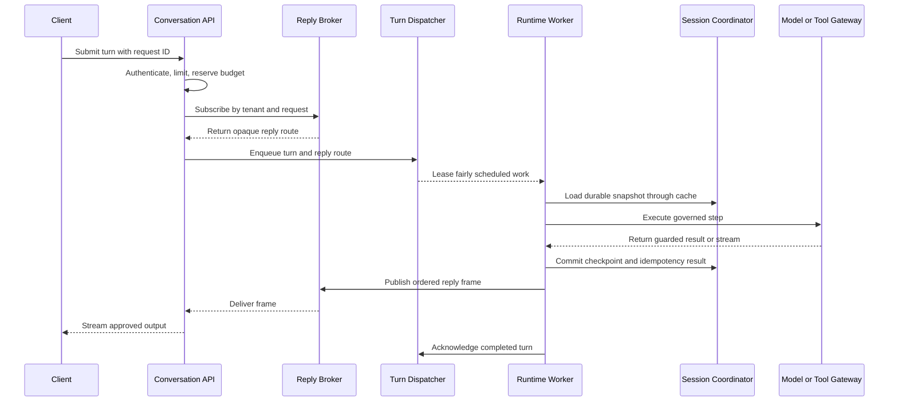

# Scout

Scout is a shared Go foundation for building multi-tenant agent platforms. It defines provider-neutral domain types, application interfaces, reusable services, and a portable keel schema. Downstream applications supply product behavior, adapters, and deployable binaries.

Scout implements product-neutral behavior behind its public contracts, including reusable Studio HTTP handlers and MCP protocol adapters. It contains no deployable binary, product workflow, model provider, queue, cache, or frontend.

Scout is licensed under the [Apache License 2.0](LICENSE).

## Repository contract

| Path | Purpose |
|---|---|
| `api/` | Versioned HTTP compatibility DTOs |
| `domain/` | Provider-neutral values exchanged across platform boundaries |
| `contract/` | Interfaces implemented or composed by downstream applications |
| `service/` | Product-neutral implementations of Scout contracts |
| `handler/` | HTTP-only Agent Studio compatibility adapter |
| `mcp/` | MCP server, provider, envelope, resource, and conformance helpers |
| `schema/` | Database-neutral table definitions compiled by keel |
| `STUDIO_API.md` | Agent Studio HTTP compatibility reference |
| `go.mod` | Module identity and the pinned keel schema compiler tool |

Scout owns agent-platform vocabulary and invariants. [keel](https://github.com/nauticana/keel) owns horizontal infrastructure.

| Concern | Owner |
|---|---|
| Agent definitions, Studio drafts, prompt inheritance, releases, execution graphs, turns, usage, tools, knowledge, guardrails | Scout domain and contracts |
| Product-specific behavior, prompt content, baseline selection, workflows, and approval rules | Downstream application |
| Database repository, named query service, transactions, ID generation | keel |
| HTTP server, authentication, authorization, envelopes, generic REST | keel |
| Agent Studio lifecycle service, handler contract, and `studio-v1` adapter | Scout |
| Worker lifecycle, polling, leases, health endpoints | keel |
| MCP server, transports, protocol DTO projection, envelopes, and provider registration | Scout |
| MCP authentication, authorization, quota, client IP, secrets, and HTTP infrastructure | keel |
| MCP product definitions, caller context, and tool/resource/prompt operations | Scout domain and contracts |
| Flags, runtime configuration, secret providers, storage, cache | keel |
| Provider adapters and composition factories | Downstream application |

Do not add a Scout abstraction that duplicates a keel primitive. Add reusable horizontal behavior to keel; add agent-domain behavior to Scout; keep product behavior downstream.

## Architecture

Use separate control and data planes even when an initial deployment runs them in one process.

- The control plane publishes immutable agent, tool, guardrail, knowledge, policy, and rollout versions.
- The data plane admits turns, reserves budget, dispatches durable work, restores state, executes pinned graphs, and returns guarded output.
- Model, embedding, retrieval, and tool access pass through governed application interfaces.
- Workers checkpoint durable state before acknowledging work or refreshing a cache.
- Agent-version canaries and platform-release rings remain independent.

Recommended deployable roles:

| Binary | Responsibility | Scale signal |
|---|---|---|
| `control-api` | Agent Studio administration and immutable publication | Administrative request rate |
| `conversation-api` | Authentication, admission, reply subscription, client streaming | Connections and admitted turns |
| `runtime-worker` | Fair turn execution and durable checkpoints | Queue depth and execution latency |
| `platform-worker` | Compilation, compatibility runs, rollout advancement | Pending control-plane jobs |
| `model-gateway` | Provider routing, quotas, capacity, output streaming | Tokens and provider latency |
| `tool-gateway` | Authorization, credentials, egress, retries, validation | Tool calls and dependency health |
| `mcp-server` | MCP tools/resources backed by application services | MCP sessions and calls |

A small installation may combine API roles, but background work remains in worker binaries. Never start durable or long-running goroutines from an HTTP handler.

## Core invariants

1. Every operation is tenant-scoped at the API, service, persistence, queue, cache, vector, and audit boundaries.
2. Published definitions are immutable; edits create a new version.
3. Draft and shared prompt edits use independent, explicit optimistic revisions.
4. Runtime reads only immutable definitions selected through an alias and deployment.
5. A conversation pins its agent, guardrail, tool, and knowledge versions.
6. The durable session store is authoritative; cache loss affects latency, not correctness.
7. Queue delivery is at least once; stable idempotency keys make step effects replay-safe.
8. Raw model or tool output never reaches a client before guardrail approval.
9. Model and tool credentials come from keel secret providers and never from agent definitions.
10. Cost is stored as `int64` minor units with an explicit currency and currency exponent.
11. Large inputs, outputs, state, and audit payloads live in object storage; relational rows store a URI and digest.
12. Provider selection occurs in composition factories controlled by `flag` values.

## Interface map

The interfaces are deliberately smaller than a complete runtime. Implement only the contracts required by a downstream vertical slice.

| File | Main contracts | Downstream responsibility |
|---|---|---|
| `contract/control_plane.go` | `AgentVersionRepository`, `AgentCompiler`, `AgentPublisher`, registries, traffic manager | Validate, compile, publish, and activate immutable definitions |
| `contract/studio.go` | Prompt compiler, baseline selector, draft validator/tester, kind/model catalogs, published resolver | Inject product rules and governed test execution |
| `contract/studio_http.go` | `AgentStudioHTTPBackend` | Extend the shared service only where product behavior is required |
| `contract/mcp.go` | Server description, tool/resource/prompt operations, field catalog | Expose product capabilities through Scout MCP adapters |
| `contract/data_plane.go` | `ConversationIngress`, `ConversationRuntime`, dispatcher, scheduler, session, reply, step ports | Admit and execute turns with replay and streaming |
| `contract/model_runtime.go` | Router, gateway, provider registry, stream, capacity | Govern provider selection and inference |
| `contract/tool_gateway.go` | Authorization, credentials, egress, transport, retry, circuit breaker | Govern every external tool effect |
| `contract/guardrail.go` | `GuardrailEnforcer` | Apply pinned policy at model and tool boundaries |
| `contract/knowledge.go` | Ingestor, document store, embedding, vector index, retriever | Build and query immutable tenant knowledge versions |
| `contract/isolation.go` | Rate, budget, execution, loop, cost, concurrency controls | Enforce tenant and fleet limits |
| `contract/release_and_observability.go` | Compatibility runs, rollout, audit, runtime metrics | Protect platform releases and record outcomes |
| `contract/health.go` | `HealthProbe` | Expose dependency readiness to composition code |

The `domain/` package contains transport- and provider-neutral DTOs. Provider SDK types must not cross these interfaces.

## Shared service implementations

The `contract` package remains flat so consumers use one stable import path. Concrete implementations are grouped by responsibility:

| Package | Implementations | Injected boundaries |
|---|---|---|
| `service/controlplane` | `StudioService`, `KeelPromptSourceRepository`, `AgentPublisher`, `PromptCompiler`, `PromptDraftAssembler` | Keel database, baseline selection, product validation/testing, kind/model catalogs |
| `service/isolation` | `ExecutionGovernor` and per-turn execution permits | Loop detection and cost circuit breaking |
| `service/modelgateway` | `Gateway`, `ProviderRegistry`, and lease-owning streams | Rate limiting, capacity scheduling, and model providers |
| `service/release` | `ContractTestRunner` | Governed test execution and assertion evaluation |
| `service/runtime` | `PublishedAgentResolver`, `DefinitionResolver`, `SessionCoordinator`, `StepExecutorRegistry` | Keel database, durable stores, non-authoritative caches, metrics, and step executors |
| `service/toolgateway` | `GovernedGateway` and bounded `RetryPolicy` | Tool registry, authorization, credentials, egress, circuit breaking, transport, and result validation |

These services enforce ordering and failure semantics but do not provide no-op infrastructure. Cache failures fall back to durable storage and are reported through `RuntimeMetrics`; durable writes complete before cache invalidation; model capacity is released on every unary or streaming terminal path; and tool calls cannot bypass authorization, egress, circuit, credential, or result validation boundaries.

Tests share focused fakes under `service/internal/fake`. Provider adapters, distributed queues, caches, secret stores, and product transports remain separate implementations behind injected contracts.

## Agent Studio contract

Studio separates mutable authoring state from immutable runtime state:

1. `agent_profile` owns identity, logical kind, display name, and the operational kill switch.
2. `agent_draft` owns revisioned model, approval, enabled, and product-extension settings.
3. Prompt compilation resolves platform baseline, tenant-kind default, and agent override rows.
4. `agent_alias` maps a logical tenant role to one named agent and carries the shared prompt-profile revision.
5. Publication freezes compiled prompts and provenance into canonical `agent_version.definition` JSON.
6. `agent_deployment` selects stable and optional canary versions for the aliased agent.

`controlplane.StudioService` implements `AgentStudioHTTPBackend`. It owns named SQL, prompt resolution, common validation, optimistic revisions, kill-switch updates, publication, restore, reset, history, release sections, and lifecycle audit. `handler.StudioHandler` authenticates through keel, derives `domain.StudioActor`, calls one backend method, and maps `studio-v1` DTOs and errors.

Product applications implement `PromptBaselineSelector`, `AgentDraftValidator`, `AgentDraftTestExecutor`, `AgentKindCatalog`, and `StudioModelCatalog`, and may implement `AgentActivityReporter`. Scout owns the inheritance vocabulary and lifecycle contract but never hard-codes product agent kinds, prompt text, capability catalogs, or provider construction.

`AgentDraftValidator` receives a `domain.ValidationPhase`: `ValidateDraft` for an ordinary save, `ValidateRelease` before a test or publish. Requirements that only executable state must satisfy — provider credentials, entitlements — belong to the release phase so authoring is never blocked by them.

`AgentActivityReporter` supplies product-owned last-successful-run times per agent id. `ListAgents` merges them with Scout's own Studio test events and reports the newer of the two. Products report only their own executions; Scout records the `TEST` lifecycle event around `AgentDraftTestExecutor.Execute` itself.

### Provisioning and deployment reads

Two services cover the generic control-plane access a product would otherwise re-implement in its own SQL:

- `controlplane.AgentProvisioner` idempotently registers the tenant and seeds agent profiles, drafts, and aliases from `[]domain.AgentSeed`. Which agents to seed, and whether the resulting set is usable, stay product decisions.
- `runtime.DeployedAgentIndex` returns each alias with its operational state and deployed definition, so products can derive readiness views without querying `agent_alias`, `agent_profile`, `agent_draft`, `agent_deployment`, or `agent_version` directly.

See [STUDIO_API.md](STUDIO_API.md) for the initial HTTP compatibility profile.

### Shared prompt compiler

`controlplane.PromptCompiler` and `controlplane.PromptDraftAssembler` merge resolved prompt rows, combine source provenance with effective Studio content, produce immutable language snapshots, and create versioned SHA-256 digests without database or provider dependencies.

For each prompt section, the compiler applies these rules:

1. The platform baseline is retained when present.
2. The tenant default appends to the baseline.
3. An agent override with `Overwrite` removes the tenant-default instruction but retains the baseline.
4. An agent override without `Overwrite` appends after the other levels.
5. The most specific non-empty output contract wins.
6. Sections are ordered by display order and then prompt-section id.

`DefinitionDigest` includes agent kind, model provider/model pairs, enabled and approval policy, canonical extension JSON, and sorted compiled-language digests. Identity, version, revision, publication, and release-note fields are excluded because they do not change runtime behavior. Stored language digests are verified before a definition digest is produced.

```go
compiler := &controlplane.PromptCompiler{}

compiled, err := compiler.Compile(languageCode, resolved.Rows)
if err != nil {
    return err
}

definition.Languages = append(definition.Languages, compiled)
definition.DefinitionDigest, err = compiler.DefinitionDigest(definition)
```

`controlplane.KeelPromptSourceRepository` implements `PromptSourceRepository` over `prompt_baseline`, `tenant_prompt_default`, and `agent_prompt_override`. The injected `PromptBaselineSelector` supplies ordered product keys; Scout selects the first matching baseline per section and never embeds product precedence.

`runtime.PublishedAgentResolver` resolves an active alias to its immutable stable or sticky canary definition, enforces the operational kill switch, and validates the requested language.

## Agent runtime

Between an immutable definition and a provider call sit two shared pieces.

`runtime.PromptRenderer` implements `contract.PromptRenderer`: it turns a definition's `[]domain.CompiledPromptSection` plus a `domain.AgentTask` (task, context, input, output format, past performance) into the payload string a provider receives. Its layout is part of published behavior — an agent validated under one layout produces different output under another — so the renderer is frozen and pinned by a byte-for-byte test. Introduce a second renderer rather than editing it. `runtime.StyleHint` condenses the same sections for media prompts, which take no structured configuration.

`runtime.PublishedAgentRuntime` composes `PublishedAgentResolver`, `AgentProviderFactory`, and `PromptRenderer`. It selects the requested compiled language with an explicit fallback, binds text/image/video executors, and returns immutable release provenance. The live profile state enforced by `PublishedAgentResolver` is the only runtime kill switch; a historical definition's `Enabled` value is never re-applied. `runtime.ProviderAgent` is the reusable executable binding and can be embedded by products that add billing or quota concerns.

`service/provider` holds the concrete inference adapters behind `contract.ModelProvider` and `contract.MediaProvider`:

| Adapter | Text | Image | Video |
|---|---|---|---|
| `provider.Anthropic` | Messages API | — | — |
| `provider.OpenAI` | Chat Completions | Images API | — |
| `provider.Google` | Gemini (Vertex ADC or Developer API) | Imagen | Veo |

Credentials, endpoints, and sampling defaults are injected at construction; an adapter never reads configuration and never prices a call — it reports `domain.Usage` in tokens and leaves cost to the product. Adapters without a native streaming path satisfy `ModelProvider.Stream` by delivering the completion as one frame followed by `io.EOF`, so `modelgateway.Gateway` works uniformly without any adapter pretending to emit incremental tokens.

```go
renderer := runtime.PromptRenderer{}
prompt := renderer.Render(definition.AgentID, compiled.Sections, domain.AgentTask{Task: task, InputData: input})

adapter := &provider.Anthropic{APIKey: key, Temperature: provider.DefaultTemperature}
result, err := adapter.Generate(ctx, domain.ModelSelection{Provider: provider.AnthropicProviderID, Model: definition.Models.Text.ModelID},
    domain.ModelRequest{Prompt: []byte(prompt), MaxOutputTokens: provider.DefaultMaxOutputTokens})
```

`runtime.AgentRunStore` records successful executions only after the tenant, agent, version, and digest match `agent_version`, and implements `AgentActivityReporter` for Studio's last-run display. `runtime.AgentOpsEventStore` records tenant-scoped operational failures that can happen before an agent profile exists. Products supply open task/event names while Scout owns persistence.

`domain.DeployedAgent.Readiness()` derives `disabled` / `unpublished` / `missing_model` / `ready` from control-plane state alone. Products layer their own checks — model-catalog availability, provider credentials, quota — on top of a `Ready` result instead of re-deriving the base states.

## MCP extension contract

Scout separates product MCP behavior from the MCP protocol implementation:

- `domain.MCPServerDefinition`, `MCPCaller`, and the tool, resource, prompt, result, evidence, and task-reference types contain no `mcp-go` values.
- `contract.MCPToolBackend` combines caller-specific discovery and bounded execution shared with HTTP services and workers.
- `contract.MCPResourceBackend` combines discovery and reads for browsable or URI-addressed product data.
- `contract.MCPPromptBackend` combines discovery and rendering for client-guidance templates; rendering never executes tools.
- `contract.MCPServerDescriber` supplies product values mapped into Scout `mcp.ServerConfig`.

The MCP adapter derives `MCPCaller` from authenticated Keel context. Tenant, actor, credential, scopes, client IP, session, transport, and trust state are never accepted as tool arguments. Remote calls fail closed without authentication; host trust is explicit and limited to a locally executed `stdio` composition. The adapter enforces `MCPToolPolicy` with Keel authorization, quota, secret, and audit infrastructure; standard annotations are client hints and never authorization rules. A long-running operation returns `MCPTaskReference` after durable dispatch and completes in a worker.

Scout owns `mcp.BaseServer`, `ToolProvider`, `ResourceProvider`, stdio/SSE/Streamable HTTP setup, envelopes, resources, text bundles, field discovery, and manifest conformance checks. Keel remains responsible for authentication middleware, authorization, quota, secrets, trusted client-IP context, and HTTP infrastructure. Scout does not define MCP HTTP DTOs in `api/`; MCP wire values remain in `mcp-go` at the protocol boundary.

## Turn lifecycle



Subscribe before enqueueing so a fast worker cannot publish before the response route exists. Reply frames carry tenant, request, conversation, route, and sequence identity. The reply broker may retain frames briefly for reconnect, while the final result remains durable.

### Starting latency budget

Treat these values as an initial measurement plan, not a universal guarantee.

| Stage | p95 target |
|---|---:|
| Edge, authentication, admission, budget | 20–40 ms |
| Reply subscription and durable dispatch | 10–30 ms |
| Fair scheduling and worker lease | 20–50 ms |
| Session and graph cache reads | 5–20 ms |
| Prompt construction and optional retrieval | 50–150 ms |
| Model time to first token | 600–900 ms |
| Output guardrail and reply delivery | 20–60 ms |
| Expected first approved response | 725–1,250 ms |

Measure accepted client bytes through the first approved frame written to the socket. Record admission, queue, state load, retrieval, provider, guardrail, and reply spans separately by tenant tier, model, region, and outcome.

## Create a downstream platform

### 1. Add Scout and keel

Use released module coordinates; never use a local `replace` or filesystem dependency.

```bash
go get github.com/nauticana/scout@<version>
go get github.com/nauticana/keel@v1.2.46
```

Import Scout contracts and keel infrastructure directly:

```go
import (
    keelport "github.com/nauticana/keel/port"
    scoutcontract "github.com/nauticana/scout/contract"
)
```

### 2. Start with a layered layout

```text
cmd/
  httpsrv/                 HTTP composition root
  runtime/                 runtime worker composition root
  platform/                compilation and rollout worker
  mcpsrv/                  MCP composition root
internal/
  common/                  flags and application configuration
  handler/                 HTTP-only adapters and controller wiring
  mcp/                     MCP tool and resource providers
  model/                   product-specific DTOs
  port/                    product-specific interfaces
  service/                 business logic and persistence
  worker/                  keel worker implementations
```

Add only the binaries the product needs. Each `cmd/<binary>/main.go` parses flags, constructs dependencies, and starts one keel runtime. Composition roots contain no business logic.

### 3. Implement services behind interfaces

Choose one vertical slice, such as agent publication or conversation admission, and implement the smallest Scout contract set it requires.

```go
type AgentPublishingService struct {
    DB       keelport.DatabaseRepository
    Versions scoutcontract.AgentVersionRepository
    Compiler scoutcontract.AgentCompiler
}

var _ scoutcontract.AgentPublisher = (*AgentPublishingService)(nil)
```

Services own repositories and query services. Use keel's named SQL pattern: constants name every query, one package-level map holds SQL, and the query service is initialized once. Use keel transactions for multi-statement atomic changes. Never add a database repository interface to Scout.

Return typed sentinel errors from services. HTTP and MCP adapters map those errors at their boundary.

### 4. Add HTTP handlers

Handlers parse and authenticate a request, call one service operation, and shape the response. They do not query tables, construct SQL, enforce business transitions, or start background work.

Prefer keel's handler adapters and `service.HttpBackend` for routing, authentication, authorization, CORS, health, and shutdown:

```go
backend := keelservice.HttpBackend{
    Journal:      journal,
    DB:           db,
    Secrets:      secrets,
    UserService:  users,
    QuotaService: quotas,
}
backend.Handle(controller.GetPublicHandlers(ctx))
backend.Handle(controller.GetAuthenticatedHandlers(ctx))
backend.Run(ctx)
```

Keep `controller.go` as wiring only. If an operation is meaningful without `http.ResponseWriter`, it belongs in a service. Use keel's metadata-driven REST support for ordinary table CRUD; write a custom handler only for a business operation.

For Agent Studio, construct `controlplane.StudioService`, then mount every route returned by `handler.StudioHandler.Routes()`. The handler owns no SQL or lifecycle rule. Products retaining a legacy display-credit scale set the handler's model and test-result mappers. Scout seeds the `AGENT_STUDIO` verbs and the `AGENT_ADMIN` and `AGENT_OPER` roles; the application assigns those roles to users.

### 5. Add workers

Embed `worker.AbstractWorker` and implement either keel's `worker.QueueWorker` for a standard claim/process loop or `worker.JobWorker` for a custom periodic pass. Use `worker.LeasedQueueWorker` when stale workers must be unable to commit after lease expiry.

```go
w := &appworker.RuntimeWorker{
    AbstractWorker: keelworker.AbstractWorker{
        Caption:    "runtime",
        Interval:   1,
        HCPort:     8101,
        LoadConfig: common.LoadConfig,
    },
}
if err := w.Run(context.Background(), w); err != nil {
    log.Fatal(err)
}
```

A queue worker supplies named pending, claim, and reclaim queries plus one-job logic. Its service calls still own business state changes. Add a compile-time assertion for every worker contract.

For runtime turns, preserve this order:

1. Claim with a lease token.
2. Load the pinned graph and newest durable snapshot.
3. Acquire tenant concurrency and execution permits.
4. Begin the step idempotency record.
5. Execute through governed model, knowledge, or tool interfaces.
6. Commit the idempotency result and durable checkpoint atomically where possible.
7. Refresh cache and publish approved reply frames.
8. Acknowledge the queue message.

### 6. Add an MCP server

Implement the applicable Scout MCP catalogs and operations on a product service. Keep transport decoding out of that service so HTTP, MCP, workers, and tests can call the same behavior. A thin product provider maps Scout definitions and results to Scout's SDK-facing MCP types.

The composition root constructs `github.com/nauticana/scout/mcp.BaseServer` from `MCPServerDescriber`, wraps product operations as Scout `mcp.ToolProvider` and `mcp.ResourceProvider` values, and registers them:

```go
srv := scoutmcp.NewServer(scoutmcp.ServerConfig{
    Name:         "example-agents",
    Version:      version,
    Instructions: instructions,
    Source:       "example",
})
srv.Register(searchTool, publishTool)
srv.RegisterResource(agentCatalogResource)
```

The adapter performs only boundary work:

1. Convert Keel request context into `domain.MCPCaller`; never read tenant identity from arguments.
2. Map JSON schemas and annotations from `MCPToolDefinition` into the Scout provider definition.
3. Enforce required scopes, quota, approval, audit, credential, and egress policy before delegation.
4. Call one `MCPToolExecutor`, `MCPResourceReader`, or `MCPPromptRenderer` method.
5. Project `MCPToolResult` through Scout envelopes and attach evidence resource links or a durable task reference.
6. Map typed domain errors to protocol errors at the adapter boundary.

Tool annotations describe expected behavior to clients but do not grant access. Keep read and write scopes distinct, fail closed when caller context or required provenance is unavailable, and dispatch long-running work to a worker instead of holding an MCP request open.

Select transport in the binary:

- `stdio` is appropriate for a locally executed client under host trust.
- Streamable HTTP or SSE requires authentication, quota middleware, trusted proxy configuration, and a public health endpoint.
- OAuth-protected MCP routes should use keel's OAuth resource middleware.

Run `mcp/mcptest` manifest and tool-text conformance checks before publishing a server.

## Database schema

Scout's schema is the relational source of truth. Do not maintain handwritten DDL beside it.

The schema uses portable types supported by keel's PostgreSQL and MySQL dialects. Structured definitions are canonical JSON stored as `TEXT` and validated at service or compilation boundaries. Timestamps use `TIMESTAMP`; large data stays outside the relational database behind URI and digest columns.

Every deployment installs keel `tenant_management` because `agent_tenant` is a child of keel's `business_partner`. Keel declares `tenant_management` as depending on both `core` and `geo`, so all three groups must be generated and installed in dependency order: `core`, `geo`, `tenant_management`, then Scout. Scout does not copy or fork those infrastructure tables. See [DATABASE.md](DATABASE.md) for the dependency boundary and Scout-only ER diagrams.

### Schema groups

| Group | Tables | Purpose |
|---|---:|---|
| `catalog` | 7 | Currency, priority, lifecycle, and usage catalogs |
| `tenancy` | 4 | Tenant identity, active policies, and quotas |
| `control_plane` | 28 | Studio drafts, prompts, lifecycle audit, agents, tools, compiled graphs, knowledge, models, pricing |
| `runtime` | 9 | Conversations, turns, checkpoints, replay, budgets, usage, agent activity and operations |
| `release` | 8 | Platform artifacts, rings, compatibility results, audit |

`schema/dependency.yml` orders Scout-owned groups. Keel's own dependency manifest orders its groups, while the generator input below selects the required Keel groups explicitly. Each Scout group has an `ab_meta.yml` that lists its tables in dependency order. Every table lives in its own `<table>.yml` file.

Surrogate-ID tables declare explicit sequence metadata and rely on keel's core `table_sequence_usage` registry. Clients never choose surrogate IDs.

### Generate dialect-specific DDL

The Go tool declaration pins keel's compiler. Resolve the matching keel schema through its module coordinate and generate one ordered build artifact:

```bash
keel_schema_dir="$(go list -m -f '{{.Dir}}' github.com/nauticana/keel)/schema"
go tool schemagen -dialect pgsql -input "${keel_schema_dir}/core,${keel_schema_dir}/geo,${keel_schema_dir}/tenant_management,schema" -seed schema/seed -out build/scout_pgsql.sql
go tool schemagen -dialect mysql -input "${keel_schema_dir}/core,${keel_schema_dir}/geo,${keel_schema_dir}/tenant_management,schema" -out build/scout_mysql.sql
```

The combined schema currently contains 38 selected keel tables and 56 Scout tables. The explicit input order respects keel's declaration that `tenant_management` depends on `core` and `geo`, then adds Scout. Run both commands in CI. The compiler validates table order, foreign-key targets, primary keys, sequences, indexes, and duplicate constraint names before producing DDL. Never commit a dialect-specific SQL file as another schema source.

`schema/seed/control_plane.yml` seeds execution kinds, supported language codes, Studio authorization verbs, Agent Studio roles, page/table permissions, REST headers, and foreign-key lookup metadata. `schema/seed/tenancy.yml` seeds `capacity_class` with `shared` and `dedicated`. Each constant domain maps its consuming column through `constant_lookup`. The seed YAML is authoritative. The pinned keel seed emitter currently produces PostgreSQL `ON CONFLICT` syntax, so the MySQL command validates DDL without appending seed DML; revisit seed emission if MySQL becomes a deployment target.

### Persistence rules

- Use keel `DatabaseRepository`, `QueryService`, `TxQueryService`, and table services.
- Keep named SQL in services, not handlers or workers.
- Treat `TableService.Update` as a full-row update; use read-modify-write or targeted named SQL.
- Use composite foreign keys to preserve tenant ownership through every relation.
- Treat every foreign-key constraint name as a public keel REST relation name: use the child collection name for its owning parent and a role-qualified collection name for additional parents.
- Never rename a foreign key casually; update `foreign_key_lookup`, `rest_api_child`, generated clients, and compatibility contracts together.
- Store accounting values in minor units and derive display precision from `currency.exponent`.
- Use object storage for definition payloads, conversation content, checkpoints, and audit payloads that can grow without bound.
- Treat vector storage, caches, queues, and reply brokers as external provider concerns behind Scout contracts.

## Configuration and providers

Every deployable setting is a Go `flag` declared in the downstream `internal/common/variables.go`. Load application configuration through keel after the database is available. Do not read environment variables directly.

Secrets contain only secret material and come from keel's configured secret provider. Schema rows store secret references, never secret values or credentials embedded in URLs.

For each pluggable concern:

1. Depend on a Scout or downstream interface.
2. Put each provider in its own `internal/service/<concern>_<provider>.go` file.
3. Select it in a composition factory using `--<concern>_mode`.
4. Fail startup when the selected provider lacks required configuration.
5. Add `var _ Interface = (*Provider)(nil)`.

Typical provider concerns include model inference, embeddings, vector search, durable dispatch, reply delivery, hot session cache, object storage, and tool transport.

## Reliability and isolation

### Durable dispatch and fairness

Use a fixed partition pool rather than one physical queue per tenant. Deterministically shuffle-shard tenants over a small partition subset, preserve conversation ordering, and schedule bounded tenant-local ready queues by weight and concurrency availability.

The queue supplies durability and backpressure. Fairness belongs in `FairTurnScheduler`, not in an assumption about broker behavior. Dedicated tenants may receive isolated partitions and worker pools without changing the contract.

### Checkpoint and replay

Persist each completed step before beginning the next. A replacement worker loads the latest revision and uses `StepIdempotencyStore.Begin` to reuse a committed result or replay only unfinished work. External tools receive the same stable idempotency key when supported.

Write the durable checkpoint before refreshing the hot cache. Reject optimistic revision conflicts and invalidate stale cache entries. Never acknowledge work from cache state alone.

### Guardrails

Apply input policy before model submission, tool policy before arguments leave the platform, tool-output policy before results re-enter the graph, and output policy before each reply frame is published. Policies that require wider context may buffer output at an explicit latency cost.

### Tenant controls

Admission limits, token and cost reservations, weighted scheduling, concurrency leases, provider quotas, bounded queues, and cost circuit breakers must all use tenant identity. Regulated or high-volume tenants can opt into dedicated capacity through policy rather than provider-specific branches in business services.

## Knowledge and tools

Knowledge is versioned independently because it requires ingestion, immutable document bindings, embeddings, tenant-filtered vector search, and source attribution. Revalidate relational document bindings after vector search before loading content.

The model never calls a destination directly. A governed tool path resolves the registered immutable version, authorizes tenant and agent access, retrieves scoped credentials, validates egress, applies timeout/retry/circuit-breaker policy, validates output, and records a redacted audit event.

## Release safety

Agent rollout and platform rollout solve different problems:

- `AgentVersionTrafficManager` routes one tenant's conversations between immutable agent versions.
- `PlatformReleaseRolloutController` advances a platform artifact through tenant rings.

Before advancing a platform ring, run a risk-stratified corpus through `AgentContractTestRunner` and evaluate latency, errors, cost, quality, and compatibility. Roll back platform code without changing tenant agent versions.

## Testing strategy

| Layer | Required coverage |
|---|---|
| Domain and services | Pure unit tests without HTTP scaffolding |
| Persistence | Named-query argument order, transaction rollback, tenant scoping, FK behavior |
| Handlers | Authentication, request decoding, one service call, sentinel error mapping |
| Workers | Claim/reclaim, lease loss, retry, idempotency, crash after each durable boundary |
| MCP | Manifest parity, schemas, annotations, caller derivation, scope and quota enforcement, envelopes, provenance, prompt purity |
| Schema | Parse and generate both PostgreSQL and MySQL DDL |
| Runtime | Duplicate delivery, stale cache, provider timeout, partial stream, reconnect |
| Scale | Queue fairness, tenant isolation, first-approved-response latency, cost ceilings |

Use fakes for Scout contracts and keel ports. Test service logic directly; an HTTP test should not be the only proof of a business rule.

## Recommended implementation order

1. Pin Scout and keel versions and generate both schema dialects.
2. Implement Studio draft reads, prompt resolution, compilation, and publication.
3. Add Agent Studio handlers through keel `HttpBackend`.
4. Implement tenant policy, graph persistence, and deployment resolution.
5. Implement durable turn records, idempotency, and session coordination.
6. Add a queue-backed runtime worker with one deterministic step kind.
7. Add model routing and one provider adapter.
8. Add guarded reply streaming and reconnect behavior.
9. Add tool governance and one transport adapter.
10. Add knowledge ingestion and retrieval if the product needs it.
11. Add MCP providers backed by the same services.
12. Add compatibility runs, rollout rings, load tests, and failure injection.

This order proves durable execution before expanding provider breadth.

## Contribution checklist

- The change adds only shared agent-domain contracts, DTOs, reusable services, schema, or documentation.
- No keel infrastructure primitive is duplicated.
- Public interfaces use provider-neutral domain types.
- Comments are one concise line per exported type or method.
- Tenant identity is present at every storage and provider boundary.
- Money uses minor units and an explicit currency.
- New surrogate tables declare explicit sequences and foreign keys.
- Schema generation succeeds for PostgreSQL and MySQL.
- Handlers remain HTTP-only and workers delegate business logic to services.
- New provider implementations stay downstream and include interface assertions.
- `README.md` remains the single developer guide; API and database files remain references only.

## License

Copyright 2026 Mustafa Karli and Scout contributors.

Licensed under the Apache License, Version 2.0. See [LICENSE](LICENSE).
