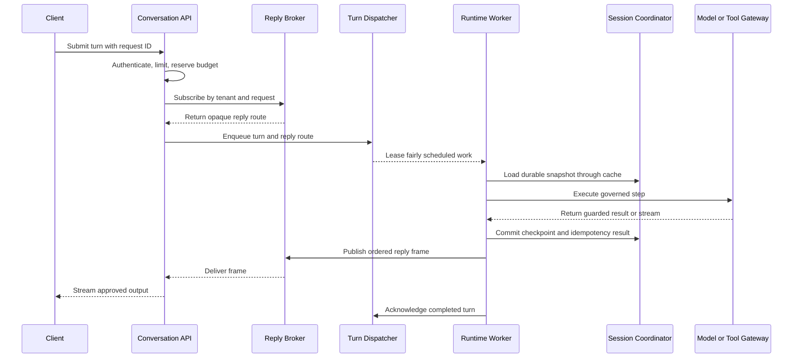

# Scout

Scout is a shared Go foundation for building multi-tenant agent platforms. It defines provider-neutral domain types, application interfaces, reusable services, and a portable keel schema. Downstream applications supply product behavior, adapters, and deployable binaries.

Scout implements product-neutral behavior behind its public contracts, including reusable Studio HTTP handlers and MCP protocol adapters. It contains no deployable binary, product workflow, model provider, queue, cache, or frontend.

Scout is licensed under the [Apache License 2.0](LICENSE).

## Repository contract

| Path | Purpose |
|---|---|
| `api/` | Versioned wire DTOs for the `studio-v1` HTTP and `mcp-v1` envelope profiles |
| `domain/` | Provider-neutral values exchanged across platform boundaries |
| `contract/` | Interfaces implemented or composed by downstream applications |
| `service/` | Product-neutral implementations of Scout contracts, injected by downstream composition |
| `handler/` | HTTP-only Agent Studio compatibility adapter |
| `mcp/` | MCP server, provider, envelope, resource, and conformance helpers |
| `provider/` | Outbound model and media vendor adapters behind `contract.ModelProvider` |
| `schema/` | Database-neutral table definitions compiled by keel, split into selectable modules |
| `internal/` | Mechanisms with no downstream call site, including shared test fakes |
| `doc/` | Database reference and one design reference per mechanism, linked from this guide |
| `STUDIO_API.md` | Agent Studio HTTP compatibility reference |
| `IDEAS.md` / `TODO.md` | Gap analysis against the design study set, and the task lists it produced |
| `IDEAS.DWF.md` / `TODO_DWF.md` | Digital Work Force gap analysis: the shared building blocks an enterprise agent-organization control plane needs, and their work plan |
| `migration_guide.json` | Versioned upgrade history; this guide documents only the current state |
| `go.mod` | Module identity and the pinned keel schema compiler tool |

Placement follows two questions. A package sits at the repository root when it crosses a boundary — inbound (`handler/`, `mcp/`), outbound (`provider/`) — or when it is shared language (`domain/`, `contract/`, `api/`, `schema/`). A package sits under `service/` when a downstream constructs and injects it; if no downstream ever names the type, it belongs in `internal/` instead. Each `service/` package maps to one `contract/` file.

Scout owns agent-platform vocabulary and invariants. [keel](https://github.com/nauticana/keel) owns horizontal infrastructure.

| Concern | Owner |
|---|---|
| Agent definitions, Studio drafts, prompt inheritance, releases, execution graphs, turns, usage, tools, knowledge, guardrails | Scout domain and contracts |
| Product-specific behavior, prompt content, baseline selection, workflows, and approval rules | Downstream application |
| Database repository, named query service, transactions, ID generation | keel |
| HTTP server, authentication, authorization, envelopes, generic REST | keel |
| Agent Studio lifecycle service, handler contract, and `studio-v1` adapter | Scout |
| Worker lifecycle, polling, leases, health endpoints | keel |
| MCP server, transports, protocol DTO projection, envelopes, and provider registration | Scout |
| MCP authentication, authorization, quota, client IP, secrets, and HTTP infrastructure | keel |
| MCP product definitions, caller context, and tool/resource/prompt operations | Scout domain and contracts |
| Flags, runtime configuration, secret providers, storage, cache | keel |
| Provider adapters and composition factories | Downstream application |

Do not add a Scout abstraction that duplicates a keel primitive. Add reusable horizontal behavior to keel; add agent-domain behavior to Scout; keep product behavior downstream.

## Architecture

Use separate control and data planes even when an initial deployment runs them in one process.

- The control plane publishes immutable agent, tool, guardrail, knowledge, policy, and rollout versions.
- The data plane admits turns, reserves budget, dispatches durable work, restores state, executes pinned graphs, and returns guarded output.
- Model, embedding, retrieval, and tool access pass through governed application interfaces.
- Workers checkpoint durable state before acknowledging work or refreshing a cache.
- Agent-version canaries and platform-release rings remain independent.

Recommended deployable roles:

| Binary | Responsibility | Scale signal |
|---|---|---|
| `control-api` | Agent Studio administration and immutable publication | Administrative request rate |
| `conversation-api` | Authentication, admission, reply subscription, client streaming | Connections and admitted turns |
| `runtime-worker` | Fair turn execution and durable checkpoints | Queue depth and execution latency |
| `platform-worker` | Compilation, compatibility runs, rollout advancement | Pending control-plane jobs |
| `model-gateway` | Provider routing, quotas, capacity, output streaming | Tokens and provider latency |
| `tool-gateway` | Authorization, credentials, egress, retries, validation | Tool calls and dependency health |
| `mcp-server` | MCP tools/resources backed by application services | MCP sessions and calls |

A small installation may combine API roles, but background work remains in worker binaries. Never start durable or long-running goroutines from an HTTP handler.

## Core invariants

1. Every operation is tenant-scoped at the API, service, persistence, queue, cache, vector, and audit boundaries.
2. Published definitions are immutable; edits create a new version.
3. Draft and shared prompt edits use independent, explicit optimistic revisions.
4. Runtime reads only immutable definitions selected through an alias and deployment.
5. A conversation pins its agent, guardrail, tool, and knowledge versions.
6. The durable session store is authoritative; cache loss affects latency, not correctness.
7. Queue delivery is at least once; stable idempotency keys make step effects replay-safe.
8. Raw model or tool output never reaches a client before guardrail approval.
9. Model and tool credentials come from keel secret providers and never from agent definitions.
10. Every governed operation carries a resolved `domain.Principal`; the zero value is never authorized.
11. Inherited configuration may only narrow: a child scope that broadens what it inherits fails publication.
12. Policy fails closed: no match, no policy, or an evaluator error is a deny, and an obligation with no enforcer fails the call.
13. Work needing a human suspends and resumes; it never fails for lack of an approver, and never proceeds without one.
14. Credentials resolve per principal just in time; two agents on one tool version never share an identity.
15. An instance is never born broader than its type, and a running instance is never auto-upgraded.
16. Delegation only narrows: depth, budget, and scope shrink each hop, and a target already in the chain is refused.
17. Cost is stored as `int64` minor units with an explicit currency and currency exponent, attributed to a principal and scope.
18. Large inputs, outputs, state, and audit payloads live in object storage; relational rows store a URI and digest.
19. Provider selection occurs in composition factories controlled by `flag` values.

## Interface map

The interfaces are deliberately smaller than a complete runtime. Implement only the contracts required by a downstream vertical slice.

| File | Main contracts | Downstream responsibility |
|---|---|---|
| `contract/control_plane.go` | `AgentVersionRepository`, `AgentCompiler`, `AgentPublisher`, registries, traffic manager | Validate, compile, publish, and activate immutable definitions |
| `contract/studio.go` | Prompt compiler, baseline selector, draft validator/tester, kind/model catalogs, published resolver | Inject product rules and governed test execution |
| `contract/studio_http.go` | `AgentStudioHTTPBackend` | Extend the shared service only where product behavior is required |
| `contract/agent_runtime.go` | `AgentExecutor`, `PricedAgent`, `ModelPricer`, provider factory, prompt renderer, run recorder/purger | Execute, price, and record one published agent's work |
| `contract/mcp.go` | Server description, tool/resource/prompt operations, field catalog | Expose product capabilities through Scout MCP adapters |
| `contract/data_plane.go` | `ConversationIngress`, `ConversationRuntime`, dispatcher, scheduler, weights, session, reply, step, record ports | Admit and execute turns with replay and streaming |
| `contract/model_runtime.go` | Router, candidate catalog, capacity snapshots, gateway, provider registry, stream, serving signals | Govern provider selection and inference |
| `contract/tool_gateway.go` | Authorization, credentials, egress, transport, retry, fenced circuit breaker | Govern every external tool effect |
| `contract/guardrail.go` | `GuardrailEnforcer`, streaming sessions, classifiers, rule compiler, approval gate | Apply pinned policy at model and tool boundaries |
| `contract/knowledge.go` | Ingestor, loader/decoder/chunker, embedding, vector index, retriever, manifest, alias, CDC | Build and query immutable tenant knowledge versions |
| `contract/isolation.go` | Rate, budget, execution, loop, cost, concurrency, latency-budget controls | Enforce tenant and fleet limits |
| `contract/release.go` | Compatibility runs, rollout state, leases, pins, bundles, drain, drills | Protect platform releases |
| `contract/evaluation.go` | Manifests, golden sets, evaluators, gate decisions, sampling, calibration | Supply rubrics, truth, and business outcomes |
| `contract/observability.go` | Audit sink, runtime metrics, observation recorder, label sink, tenant ledger | Export bounded fleet metrics and exact tenant accounting |
| `contract/principal.go` | `PrincipalResolver`, `PrincipalAuthorizer`, `DelegationVerifier`, external principal source | Resolve the acting subject and evaluate it against keel authorization objects |
| `contract/scope.go` | `ScopeRepository`, `ResourceMerger`, `NarrowingChecker`, `EffectiveConfigCompiler`, `PrincipalLimits`, release repository | Bind versioned configuration to a scope and freeze its compiled result |
| `contract/policy.go` | `PolicyDecisionPoint`, `PolicyResolver`, `ObligationEnforcer` | Decide whether a governed action is allowed, and enforce what rides along |
| `contract/approval.go` | `ApprovalStore`, `ApprovalInbox`, `EscalationPolicy`, `Notifier` | Park work a human owes, route it, and resume on the verdict |
| `contract/agent_type.go` | `AgentTypeRepository`, `AgentTypeService`, `AgentLifecycle`, `AgentVersionQuarantine`, capability packages | Publish templates, instantiate agents from them, and own their state |
| `contract/delegation.go` | `DelegationGrantRepository`, `DelegationAuthorizer`, `AgentInvoker`, `WorkItemStore` | Bound who may hand work to whom, and address work to a principal |
| `contract/health.go` | `HealthProbe` | Expose dependency readiness to composition code |

The `domain/` package contains transport- and provider-neutral DTOs. Provider SDK types must not cross these interfaces. `domain/` holds values only: no functions and no methods. Behavior belongs to `service/`, `handler/`, or `mcp/`, where it can be injected and replaced.

## Shared service implementations

The `contract` package remains flat so consumers use one stable import path. Concrete implementations are grouped by responsibility, one package per contract file:

| Package | Contract | Implementations | Injected boundaries |
|---|---|---|---|
| `service/controlplane` | `control_plane.go`, `studio*.go`, `agent_type.go` | `StudioService`, `PromptRepository`, `AgentPublisher`, `PromptCompiler`, `PromptDraftAssembler`, `ModelCatalog`, `AgentProvisioner`, `AgentTypeStore` | Keel database, baseline selection, product validation/testing, kind/model catalogs |
| `service/dataplane` | `data_plane.go` | `TurnRuntime`, `TurnIngress`, `QueueTurnDispatcher`, `FairTurnScheduler`, `DurableSessionStore`, `StepIdempotencyStore`, `ObjectStateStore`, `SessionCoordinator`, `DefinitionResolver`, `StepExecutorRegistry`, `AgentStepExecutor`, `TableWorkItemStore`, memory caches, `MemoryReplyHub`, `StreamPump`, `MemoryTurnCanceller`, `TurnLedger` | Durable stores, object storage, non-authoritative caches, metrics, guardrails, and step executors |
| `service/isolation` | `isolation.go` | `ExecutionGovernor`, rate-limiter factory, `DistributedTenantRateLimiter`, `LatencyBudgetAllocator`, `BudgetLedger`, `WindowedCostBreaker`, `MemoryLoopDetector`, `ReleaseLimits` | Keel database and cache, admission policy, budget policy, stage latency model, loop detection, and cost circuit breaking |
| `service/knowledge` | `knowledge.go` | `IngestPipeline`, `SectionChunker`, `PlainTextDecoder`, `ObjectStorageLoader`, `PolicyRedactor`, `ManifestStore`, `VersionAliaser`, `GarbageCollector`, `PgVectorIndex`, `CachedRetriever`, `ShardedRetriever`, `BatchingEmbedder`, `HybridRetriever`, `ReleaseEntitlements` | Object storage, vector database, batch embedding providers, retrieval legs, and rerankers |
| `service/modelgateway` | `model_runtime.go` | `PolicyRouter`, `TableCandidateCatalog`, `MemoryCapacitySnapshotSource`, `SnapshotCache`, `Gateway`, `ResilientGateway`, `HedgingGateway`, `ServingSignalCollector`, `ProviderRegistry`, `AdaptiveCapacityScheduler`, lease-owning streams | Rate limiting, capacity scheduling, model providers, and serving-signal export |
| `service/guardrail` | `guardrail.go` | `LayeredEnforcer`, `RuleSetCompiler`, bounded output sessions | Classifier providers, approval gates, and safety event sinks |
| `service/release` | `release.go` | `RolloutController`, `TableRolloutStateStore`, `PinnedTrafficManager`, `TableConversationReleaseStore`, `SessionDrainer`, `BoundedShadowSampler`, `RollbackDrillHarness`, `ContractTestRunner` | Governed test execution, health evidence, alias switching, and capacity restoration |
| `service/evaluation` | `evaluation.go` | `Runner`, `ManifestBuilder`, `PairedScorer`, `GatewayJudge`, heuristic evaluators, `GateIssuer`, `GateHealthEvaluator`, `RetrievalScorer`, samplers and calibration | Golden sets, rubrics, judge models, human review, and business outcomes |
| `service/observability` | `observability.go` | `BoundedRuntimeMetrics`, `LabelPolicy`, `TenantHeavyHitters`, `AuditingObservationRecorder`, `TableAuditSink`, `KeelMetricSink` | Metric backends, tenant ledger, and audit sink |
| `service/runtime` | `agent_runtime.go` | `PublishedAgentRuntime`, `PublishedAgentResolver`, `PromptRenderer`, `ProviderAgent`, `PricedAgent`, `MultimodalGenerator`, `AgentRunStore`, `Registry` | Keel database, model pricing, provider factories, and quota accounting |
| `service/policy` | `policy.go` | `SetEvaluator`, `ReleaseResolver` | Optional external evaluators behind the decision point |
| `service/approval` | `approval.go` | `TableStore`, `Gate`, `Resumer`, `BackupEscalation`, `Sweeper` | Keel database, notification transport, turn dispatch |
| `service/principal` | `principal.go`, `delegation.go` | `RoleAuthorizer`, `TableResolver`, `ChainVerifier`, `TableGrants`, `GrantAuthorizer` | Keel database, external identity planes |
| `service/scope` | `scope.go` | `Compiler`, `MergerRegistry`, `LatticeChecker`, `TableScopeRepository`, `TableEffectiveReleaseStore`, `Explainer` | Keel database and product-registered resource mergers |
| `service/toolgateway` | `tool_gateway.go` | `GovernedGateway`, `BindingAuthorizer`, `BoundCredentialProvider`, `TableCredentialBindings`, and jittered bounded `RetryPolicy` | Tool registry, authorization, credentials, egress, circuit breaking, transport, and result validation |

These services enforce ordering and failure semantics but do not provide no-op infrastructure. Cache failures fall back to durable storage and are reported through `RuntimeMetrics`; durable writes complete before cache invalidation; model capacity is released on every unary or streaming terminal path; and tool calls cannot bypass authorization, egress, circuit, credential, or result validation boundaries.

`dataplane.NewMemorySessionCache` and `NewMemoryGraphCache` expose the bounded internal adapters through public contracts. The owning composition supplies explicit capacity and TTL values and closes the cache at shutdown.

Tests share focused fakes under `internal/fake`, reachable from every package in the module. Provider adapters, distributed queues, caches, secret stores, and product transports remain separate implementations behind injected contracts.

## Agent Studio contract

Studio separates mutable authoring state from immutable runtime state:

1. `agent_profile` owns identity, logical kind, display name, and the operational kill switch.
2. `agent_draft` owns revisioned model, approval, enabled, and product-extension settings.
3. Prompt compilation resolves platform baseline, tenant-kind default, and agent override rows.
4. `agent_alias` maps a logical tenant role to one named agent and carries the shared prompt-profile revision.
5. Publication freezes compiled prompts and provenance into canonical `agent_version.definition` JSON.
6. `agent_deployment` selects stable and optional canary versions for the aliased agent.

`controlplane.StudioService` implements `AgentStudioHTTPBackend`. It owns named SQL, prompt resolution, common validation, optimistic revisions, kill-switch updates, publication, restore, reset, history, release sections, and lifecycle audit. `handler.StudioHandler` authenticates through keel, derives `domain.StudioActor`, calls one backend method, and maps `studio-v1` DTOs and errors.

Product applications implement `PromptBaselineSelector`, `AgentDraftValidator`, `AgentDraftTestExecutor`, `AgentTypeCatalog`, and `StudioModelCatalog`, and may implement `AgentActivityReporter`. Scout owns the inheritance vocabulary and lifecycle contract but never hard-codes product agent types, prompt text, capability catalogs, or provider construction.

`AgentDraftValidator` receives a `domain.ValidationPhase`: `ValidateDraft` for an ordinary save, `ValidateRelease` before a test or publish. Requirements that only executable state must satisfy — provider credentials, entitlements — belong to the release phase so authoring is never blocked by them.

`controlplane.ModelCatalog` implements `StudioModelCatalog` over `model_definition`, `model_capability`, and `model_price`, so a product only implements that port when it needs tenant scoping or a display scale of its own — decorate the shared catalog rather than replacing it. Modality lives in `model_capability` (one row per modality; a model may serve several) and pricing in `model_price`, which covers tokens, images, and video seconds in currency minor units. Validation rejects a model that is unknown, withdrawn, or does not declare the modality its slot needs.

`AgentActivityReporter` supplies product-owned last-successful-run times per agent id. `ListAgents` merges them with Scout's own Studio test events and reports the newer of the two. Products report only their own executions; Scout records the `TEST` lifecycle event around `AgentDraftTestExecutor.Execute` itself.

### Provisioning and deployment reads

Two services cover the generic control-plane access a product would otherwise re-implement in its own SQL:

- `controlplane.AgentProvisioner` idempotently registers the tenant and seeds agent profiles, drafts, and aliases from `[]domain.AgentSeed`. Which agents to seed, and whether the resulting set is usable, stay product decisions.
- `runtime.DeployedAgentIndex` returns each alias with its operational state and deployed definition, so products can derive readiness views without querying `agent_alias`, `agent_profile`, `agent_draft`, `agent_deployment`, or `agent_version` directly.

See [STUDIO_API.md](STUDIO_API.md) for the initial HTTP compatibility profile.

### Shared prompt compiler

`controlplane.PromptCompiler` and `controlplane.PromptDraftAssembler` merge resolved prompt rows, combine source provenance with effective Studio content, produce immutable language snapshots, and create versioned SHA-256 digests without database or provider dependencies.

For each prompt section, the compiler applies these rules:

1. The platform baseline is retained when present.
2. The tenant default appends to the baseline.
3. An agent override with `Overwrite` removes the tenant-default instruction but retains the baseline.
4. An agent override without `Overwrite` appends after the other levels.
5. The most specific non-empty output contract wins.
6. Sections are ordered by display order and then prompt-section id.

`DefinitionDigest` includes agent kind, model provider/model pairs, enabled and approval policy, canonical extension JSON, and sorted compiled-language digests. Identity, version, revision, publication, and release-note fields are excluded because they do not change runtime behavior. Stored language digests are verified before a definition digest is produced.

```go
compiler := &controlplane.PromptCompiler{}

compiled, err := compiler.Compile(languageCode, resolved.Rows)
if err != nil {
    return err
}

definition.Languages = append(definition.Languages, compiled)
definition.DefinitionDigest, err = compiler.DefinitionDigest(definition)
```

`controlplane.KeelPromptSourceRepository` implements `PromptSourceRepository` over `prompt_baseline`, `tenant_prompt_default`, and `agent_prompt_override`. The injected `PromptBaselineSelector` supplies ordered product keys; Scout selects the first matching baseline per section and never embeds product precedence.

`runtime.PublishedAgentResolver` resolves an active alias to its immutable stable or sticky canary definition, enforces the operational kill switch, and validates the requested language.

## Agent runtime

Between an immutable definition and a provider call sit two shared pieces.

`runtime.PromptRenderer` implements `contract.PromptRenderer`: it turns a definition's `[]domain.CompiledPromptSection` plus a `domain.AgentTask` (task, context, input, output format, past performance) into the payload string a provider receives. Its layout is part of published behavior — an agent validated under one layout produces different output under another — so the renderer is frozen and pinned by a byte-for-byte test. Introduce a second renderer rather than editing it. `runtime.StyleHint` condenses the same sections for media prompts, which take no structured configuration.

`runtime.PublishedAgentRuntime` composes `PublishedAgentResolver`, `AgentProviderFactory`, and `PromptRenderer`. It selects the requested compiled language with an explicit fallback, binds text/image/video executors, and returns immutable release provenance. The live profile state enforced by `PublishedAgentResolver` is the only runtime kill switch; a historical definition's `Enabled` value is never re-applied. `runtime.ProviderAgent` is the reusable executable binding and can be embedded by products that add billing or quota concerns.

`runtime.MultimodalGenerator` composes those executors into one turn: it runs the text executor, then any requested media, and styles the media prompts from the agent's own compiled sections so illustrations match its configured voice. A nil `Image` or `Video` on the `domain.MultimodalTask` means that modality is not requested; requesting one the release has no model for is `ErrNotReady` rather than a silently text-only result, and a media failure fails the whole turn. Products supply `OutputFormat` and `AssetBaseName`; Scout returns `domain.NamedMedia` with an extension derived from the provider's content type, plus the billable `ImageCount` and `VideoSeconds`.

```go
result, err := runtime.MultimodalGenerator{
    Text: agents.Text(), Image: agents.Image(), Video: agents.Video(),
}.Generate(ctx, domain.MultimodalTask{
    AgentTask:     domain.AgentTask{Task: topic, OutputFormat: "Please generate a blog post in HTML format."},
    Image:         &domain.ImageRequest{Count: 1, AspectRatio: "16:9"},
    AssetBaseName: slug,
})
```

`provider/` holds the concrete inference adapters behind `contract.ModelProvider` and `contract.MediaProvider`. It sits at the repository root because it is an outbound boundary adapter, not an injectable service:

| Adapter | Text | Image | Video |
|---|---|---|---|
| `provider.Anthropic` | Messages API | — | — |
| `provider.OpenAI` | Chat Completions | Images API | — |
| `provider.Google` | Gemini (Vertex ADC or Developer API) | Imagen | Veo |

Credentials, endpoints, and sampling defaults are injected at construction; an adapter never reads configuration and never prices a call — it reports `domain.Usage` in tokens and leaves cost to the product. Adapters without a native streaming path satisfy `ModelProvider.Stream` by delivering the completion as one frame followed by `io.EOF`, so `modelgateway.Gateway` works uniformly without any adapter pretending to emit incremental tokens.

```go
renderer := runtime.PromptRenderer{}
prompt := renderer.Render(definition.AgentID, compiled.Sections, domain.AgentTask{Task: task, InputData: input})

adapter := &provider.Anthropic{APIKey: key, Temperature: provider.DefaultTemperature}
result, err := adapter.Generate(ctx, domain.ModelSelection{Provider: provider.AnthropicProviderID, Model: definition.Models.Text.ModelID},
    domain.ModelRequest{Prompt: []byte(prompt), MaxOutputTokens: provider.DefaultMaxOutputTokens})
```

`runtime.AgentRunStore` records successful executions only after the tenant, agent, version, and digest match `agent_version`, and implements `AgentActivityReporter` for Studio's last-run display. Its `Purge` accepts the app-loaded `agent_run_retention_days` value and deletes in bounded batches, so a periodic worker can drain a backlog across ticks instead of one long delete; zero retains activity forever. `runtime.AgentOpsEventStore` records tenant-scoped operational failures that can happen before an agent profile exists. Products supply open task/event names while Scout owns persistence.

`controlplane.ModelCatalog.Cost` prices a `domain.ModelUsage` — input and output tokens, generated images, whole video seconds — against `model_price`, returning integer minor units and the catalog currency. Token rates are per million and divide last, so rounding error stays below one minor unit; an unpriced model is an error rather than a free one. Never price usage in floating point: these are money amounts, and the currency exponent belongs to the currency, not the caller.

`runtime.PricedAgent` decorates any `AgentExecutor` with a `ModelPricer` so a task surface can quote work before running it and bill exact usage afterwards, without resolving the catalog itself. Its `GenerateText` returns output text with token counts for callers that do not need the full `ModelResult`, and `Cost` returns minor units with the currency they are denominated in. `PublishedAgentRuntime.ResolvePriced` applies that decoration to all three modalities of a resolved alias at once.

`runtime.For(db)` returns the `Registry` of long-lived services bound to one database — definitions, run store, ops events, deployed index, model catalog — each cached so its named-SQL QueryService compiles once. Hold the registry rather than re-caching services downstream.

`runtime.BaseDraftTester` is a complete `AgentDraftTestExecutor`: quota gate, language selection, execution, pricing, and usage accounting. Products supply the metered resource name and an agent builder, not a subclass. A pricing failure aborts the test — billing at zero is never the safe default — while a ledger write failure is reported through `OnAccountingError` and survived, because an accounting fault must not discard work the owner already saw.

`runtime.ReadinessResolver` narrows `DeployedAgent.Readiness()` with the two checks that live outside Agent Studio: whether the published model is still offered by the catalog, and whether its provider credential exists. Each is evaluated once per tenant and per provider rather than once per agent. A model the catalog does not list is unavailable, never silently ready.

`domain.DeployedAgent.Readiness()` derives `disabled` / `unpublished` / `missing_model` / `ready` from control-plane state alone. Products layer their own checks — model-catalog availability, provider credentials, quota — on top of a `Ready` result instead of re-deriving the base states.

## MCP extension contract

Scout separates product MCP behavior from the MCP protocol implementation:

- `domain.MCPServerDefinition`, `MCPCaller`, and the tool, resource, prompt, result, evidence, and task-reference types contain no `mcp-go` values.
- `contract.MCPToolBackend` combines caller-specific discovery and bounded execution shared with HTTP services and workers.
- `contract.MCPResourceBackend` combines discovery and reads for browsable or URI-addressed product data.
- `contract.MCPPromptBackend` combines discovery and rendering for client-guidance templates; rendering never executes tools.
- `contract.MCPServerDescriber` supplies product values mapped into Scout `mcp.ServerConfig`.

`mcp.BaseCallerResolver` derives `MCPCaller` from authenticated Keel context. Tenant, actor, credential, scopes, client IP, session, transport, and trust state are never accepted as tool arguments. Each `Serve*` method stamps its transport into the request context; an unstamped context is treated as remote, so remote calls fail closed without authentication. Host trust is opt-in through `BaseCallerResolver.TrustHost` and applies only to a locally executed `stdio` composition. `mcp.Authorize` enforces `MCPToolPolicy` scopes before the backend is reached, and the same check hides unusable tools from `tools/list`; standard annotations are client hints and never authorization rules. A long-running operation returns `MCPTaskReference` after durable dispatch and completes in a worker.

Registering a backend binds an SDK-neutral contract to the protocol in one call:

```go
srv := scoutmcp.NewServerFor(productDescriber, scoutmcp.BaseCallerResolver{})
if err := srv.RegisterToolBackend(ctx, productToolBackend); err != nil { ... }
if err := srv.RegisterResourceBackend(ctx, productResourceBackend); err != nil { ... }
```

Catalogs are enumerated once at composition time with `mcp.HostCaller()`, so `ListTools` must return the full catalog for a host-trusted caller and the caller's visible subset for anyone else. A resource entry carrying `URITemplate` registers as a template; otherwise it registers as a fixed URI.

Scout owns `mcp.BaseServer`, `ToolProvider`, `ResourceProvider`, caller resolution, policy authorization, protocol projection, stdio/SSE/Streamable HTTP setup, envelopes, resources, text bundles, field discovery, and manifest conformance checks. Keel remains responsible for authentication middleware, authorization, quota, secrets, trusted client-IP context, and HTTP infrastructure.

Protocol frames and manifest entries belong to `mcp-go`; Scout defines only what a frame carries. That payload is the `mcp-v1` profile in `api/` — `Envelope`, `EnvelopeMeta`, `ProvenanceMeta`, `SourceAttrib`, `PaginationMeta`, and `FieldDescriptor` — projected from the tag-free `domain/` values by `mcp/wire.go`, exactly as `handler/` projects `studio-v1`.

### Migrating an existing MCP server

| Replaced | Use |
|---|---|
| `domain.Envelope` | `api.Envelope`, built by `Envelopes.Wrap` |
| JSON tags on `domain.EnvelopeMeta`, `ProvenanceMeta`, `SourceAttrib`, `PaginationMeta` | The `api/` twins; pass domain values to `Envelopes.*` and let the adapter project |
| JSON tags on `domain.FieldDescriptor` | `mcp.WireField` / `mcp.WireFields` before marshaling |
| A per-product `ToolProvider` struct wrapping a definition and handler | `mcp.Tool(definition, handle)`, or `RegisterToolBackend` for a full catalog |
| A per-product scope guard inside each tool handler | `MCPToolPolicy.RequiredScopes`, enforced by `mcp.Authorize` |
| A per-product caller or client-IP lookup | `mcp.BaseCallerResolver` |

A value marshaled straight from `domain/` now emits Go field names. Route it through the `api/` projection before it reaches a client.

## Turn lifecycle



Subscribe before enqueueing so a fast worker cannot publish before the response route exists. Reply frames carry tenant, request, conversation, route, and sequence identity. The reply broker may retain frames briefly for reconnect, while the final result remains durable.

The order of durability inside a turn is fixed: the step idempotency result, then the checkpoint, then guarded intermediate frames, then the terminal result and its settlement, and only then the final frame and the queue acknowledgement. Intermediate frames are deduplicated by sequence, so a replay republishes identical sequences rather than re-executing a step, and the final frame is never client-visible before the record that makes it replayable exists.

### Starting latency budget

Treat these values as an initial measurement plan, not a universal guarantee.

| Stage | p95 target |
|---|---:|
| Edge, authentication, admission, budget | 20–40 ms |
| Reply subscription and durable dispatch | 10–30 ms |
| Fair scheduling and worker lease | 20–50 ms |
| Session and graph cache reads | 5–20 ms |
| Prompt construction and optional retrieval | 50–150 ms |
| Model time to first token | 600–900 ms |
| Output guardrail and reply delivery | 20–60 ms |
| Expected first approved response | 725–1,250 ms |

Measure accepted client bytes through the first approved frame written to the socket. Record admission, queue, state load, retrieval, provider, guardrail, and reply spans separately by tenant tier, model, region, and outcome.

## Create a downstream platform

### 1. Add Scout and keel

Use released module coordinates; never use a local `replace` or filesystem dependency.

```bash
go get github.com/nauticana/scout@<version>
go get github.com/nauticana/keel@v1.2.51
```

Import Scout contracts and keel infrastructure directly:

```go
import (
    keelport "github.com/nauticana/keel/port"
    scoutcontract "github.com/nauticana/scout/contract"
)
```

### 2. Start with a layered layout

```text
cmd/
  httpsrv/                 HTTP composition root
  runtime/                 runtime worker composition root
  platform/                compilation and rollout worker
  mcpsrv/                  MCP composition root
internal/
  common/                  flags and application configuration
  handler/                 HTTP-only adapters and controller wiring
  mcp/                     MCP tool and resource providers
  model/                   product-specific DTOs
  port/                    product-specific interfaces
  service/                 business logic and persistence
  worker/                  keel worker implementations
```

Add only the binaries the product needs. Each `cmd/<binary>/main.go` parses flags, constructs dependencies, and starts one keel runtime. Composition roots contain no business logic.

### 3. Implement services behind interfaces

Choose one vertical slice, such as agent publication or conversation admission, and implement the smallest Scout contract set it requires.

```go
type AgentPublishingService struct {
    DB       keelport.DatabaseRepository
    Versions scoutcontract.AgentVersionRepository
    Compiler scoutcontract.AgentCompiler
}

var _ scoutcontract.AgentPublisher = (*AgentPublishingService)(nil)
```

Services own repositories and query services. Use keel's named SQL pattern: constants name every query, one package-level map holds SQL, and the query service is initialized once. Use keel transactions for multi-statement atomic changes. Never add a database repository interface to Scout.

Return typed sentinel errors from services. HTTP and MCP adapters map those errors at their boundary.

### 4. Add HTTP handlers

Handlers parse and authenticate a request, call one service operation, and shape the response. They do not query tables, construct SQL, enforce business transitions, or start background work.

Prefer keel's handler adapters and `service.HttpBackend` for routing, authentication, authorization, CORS, health, and shutdown:

```go
backend := keelservice.HttpBackend{
    Journal:      journal,
    DB:           db,
    Secrets:      secrets,
    UserService:  users,
    QuotaService: quotas,
}
backend.Handle(controller.GetPublicHandlers(ctx))
backend.Handle(controller.GetAuthenticatedHandlers(ctx))
backend.Run(ctx)
```

Keep `controller.go` as wiring only. If an operation is meaningful without `http.ResponseWriter`, it belongs in a service. Use keel's metadata-driven REST support for ordinary table CRUD; write a custom handler only for a business operation.

For Agent Studio, construct `controlplane.StudioService`, then mount every route returned by `handler.StudioHandler.Routes()`. The handler owns no SQL or lifecycle rule. Products retaining a legacy display-credit scale set the handler's model and test-result mappers. Scout seeds the `AGENT_STUDIO` verbs and the `AGENT_ADMIN` and `AGENT_OPER` roles; the application assigns those roles to users.

### 5. Add workers

Embed `worker.AbstractWorker` and implement either keel's `worker.QueueWorker` for a standard claim/process loop or `worker.JobWorker` for a custom periodic pass. Use `worker.LeasedQueueWorker` when stale workers must be unable to commit after lease expiry.

```go
w := &appworker.RuntimeWorker{
    AbstractWorker: keelworker.AbstractWorker{
        Caption:    "runtime",
        Interval:   1,
        HCPort:     8101,
        LoadConfig: common.LoadConfig,
    },
}
if err := w.Run(context.Background(), w); err != nil {
    log.Fatal(err)
}
```

A queue worker supplies named pending, claim, and reclaim queries plus one-job logic. Its service calls still own business state changes. Add a compile-time assertion for every worker contract.

For runtime turns, preserve this order:

1. Claim with a lease token.
2. Load the pinned graph and newest durable snapshot.
3. Acquire tenant concurrency and execution permits.
4. Begin the step idempotency record.
5. Execute through governed model, knowledge, or tool interfaces.
6. Commit the idempotency result and durable checkpoint atomically where possible.
7. Refresh cache and publish approved reply frames.
8. Acknowledge the queue message.

### 6. Add an MCP server

Implement `contract.MCPToolBackend`, `MCPResourceBackend`, or `MCPPromptBackend` on a product service, plus `MCPServerDescriber` for the server identity. Keep transport decoding out of that service so HTTP, MCP, workers, and tests can call the same behavior. The product writes no protocol code: `domain.MCPToolDefinition` declares the tool, and `domain.MCPToolResult` returns the data, evidence, and any task reference.

The composition root builds the server and hands it the backends:

```go
srv := scoutmcp.NewServerFor(catalogService, scoutmcp.BaseCallerResolver{})
if err := srv.RegisterToolBackend(ctx, catalogService); err != nil {
    return err
}
```

Scout then performs every boundary step: resolving `domain.MCPCaller` from Keel context, projecting schemas and annotations into the protocol manifest, authorizing declared scopes, calling one `MCPToolExecutor`, `MCPResourceReader`, or `MCPPromptRenderer` method, and projecting the result through the `mcp-v1` envelope with evidence resource links. Quota, approval, audit, credential, and egress policy remain the backend's own responsibility, declared on `MCPToolPolicy` and enforced with Keel infrastructure.

A server that needs direct control over protocol values keeps using `srv.Register` and `srv.RegisterResource`; `mcp.Tool` and `mcp.Resource` bind a definition to its handler without a per-product provider type.

Tool annotations describe expected behavior to clients but do not grant access. Keep read and write scopes distinct, fail closed when caller context or required provenance is unavailable, and dispatch long-running work to a worker instead of holding an MCP request open.

Select transport in the binary:

- `stdio` is appropriate for a locally executed client under host trust.
- Streamable HTTP or SSE requires authentication, quota middleware, trusted proxy configuration, and a public health endpoint.
- OAuth-protected MCP routes should use keel's OAuth resource middleware.

Run `mcp/mcptest` manifest and tool-text conformance checks before publishing a server.

## Database schema

Scout's schema is the relational source of truth. Do not maintain handwritten DDL beside it. It is modular: a downstream generates only the modules its product uses, so a Studio-only installation creates 40 Scout tables rather than all 104.

The schema uses portable types supported by keel's PostgreSQL and MySQL dialects. Structured definitions are canonical JSON stored as `TEXT` and validated at service or compilation boundaries. Timestamps use `TIMESTAMP`; large data stays outside the relational database behind URI and digest columns.

Two tables are deliberately PostgreSQL-only and pass their native types through the dialect mapper: `conversation_turn_detail` uses `JSONB`, and `knowledge_chunk_vector` uses `VECTOR`, `TSVECTOR`, and `JSONB` because entitlement predicates and approximate nearest-neighbor search must run inside the query. Deployments that need MySQL run vector retrieval on a separate index behind `contract.KnowledgeVectorIndex`. The `vector` extension and per-width HNSW indexes are a deployment step: install the extension, then call `PgVectorIndex.EnsureIndexes` once per embedding dimension.

Every deployment installs keel `tenant_management` because `agent_tenant` is a child of keel's `business_partner`. Keel declares `tenant_management` as depending on both `core` and `geo`, so all three groups must be generated and installed in dependency order: `core`, `geo`, `tenant_management`, then Scout. Scout does not copy or fork those infrastructure tables. See [doc/database.md](doc/database.md) for the dependency boundary and Scout-only ER diagrams.

### Schema modules

Scout's schema is fifteen modules so a downstream installs only what its product uses. Each module is a directory under `schema/` with an `ab_meta.yml` listing its tables in dependency order, and every table lives in its own `<table>.yml`.

| Module | Tables | Purpose | Depends on |
|---|---:|---|---|
| `catalog` | 15 | Currency, priority, lifecycle, usage, scope, resource-kind, merge-mode, decision, approval, risk, output-class, and agent-state catalogs | — |
| `tenancy` | 4 | Tenant identity, active policies, and quotas | `catalog` |
| `prompt` | 2 | Prompt sections and platform baselines | — |
| `model` | 5 | Providers, model definitions, capabilities, pricing, tenant access | `catalog`, `tenancy` |
| `agent` | 14 | Types and type versions, capability packages, profiles, drafts, aliases, prompt overrides, guardrail config, published versions, deployments, version quarantine, Studio audit | `tenancy`, `prompt`, `model` |
| `tool` | 5 | Tool profiles, immutable versions, egress rules, agent bindings, principal credential bindings | `tenancy`, `agent`, `agent_authorization` |
| `execution_graph` | 4 | Compiled execution graphs, steps, entries, transitions | `agent` |
| `knowledge` | 8 | Knowledge bases, versions, documents, chunks, agent bindings, manifests, aliases, source events | `tenancy`, `agent` |
| `knowledge_vector` | 1 | PostgreSQL-resident chunk embeddings and full-text vectors | `knowledge` |
| `runtime` | 13 | Conversations, turns, checkpoints, replay, durable turn queue and dead letters, budgets, usage, activity, principal-addressed work items | `catalog`, `tenancy`, `agent`, `execution_graph`, `agent_authorization`, `configuration` |
| `release` | 16 | Platform artifacts, bundles, rings, rollout state and transitions, version pins, cohorts, conversation release identity, compatibility results, governed decision records | `catalog`, `tenancy`, `agent`, `runtime`, `configuration` |
| `evaluation` | 10 | Manifests, golden sets and queries, runs, results, gate decisions, review queue, production samples | `catalog`, `tenancy`, `agent`, `knowledge`, `release` |
| `agent_authorization` | 2 | Agent-to-role assignments and typed delegation grants | `catalog`, `agent` |
| `configuration` | 3 | Configuration hierarchy, scoped bindings, compiled effective releases | `catalog`, `tenancy`, `agent` |
| `approval` | 2 | Durable approval requests and their verdicts | `catalog`, `tenancy`, `agent`, `configuration`, `agent_authorization` |

`schema/dependency.yml` declares those modules, their dependencies, and their seed files; [doc/database.md](doc/database.md#module-dependency-graph) draws the graph. `agent` is the common core every other module reaches through; `catalog` and `tenancy` sit under it. Module boundaries follow the `contract/` and `service/` boundaries, so a downstream picks modules by the Scout packages it actually constructs.

Surrogate-ID tables declare explicit sequence metadata and rely on keel's core `table_sequence_usage` registry. Clients never choose surrogate IDs.

### Generate dialect-specific DDL

The Go tool declaration pins keel's compiler. Pass the keel groups first, then the Scout modules the product needs, and pass the matching seed directories:

```bash
keel="$(go list -m -f '{{.Dir}}' github.com/nauticana/keel)/schema"
keel_in="${keel}/core,${keel}/geo,${keel}/tenant_management"
scout_in="schema/catalog,schema/tenancy,schema/prompt,schema/model,schema/agent,schema/agent_authorization,schema/configuration,schema/approval,schema/tool,schema/execution_graph,schema/knowledge,schema/knowledge_vector,schema/runtime,schema/release,schema/evaluation"
scout_seed="schema/seed/catalog,schema/seed/tenancy,schema/seed/prompt,schema/seed/model,schema/seed/agent,schema/seed/execution_graph,schema/seed/runtime,schema/seed/release"

go tool schemagen -dialect pgsql -input "${keel_in},${scout_in}" -seed "${scout_seed}" -out build/scout_pgsql.sql
go tool schemagen -dialect mysql -input "${keel_in},${scout_in}" -out build/scout_mysql.sql
```

That full set is 38 selected keel tables and 104 Scout tables. Drop the modules the product does not use:

| Downstream profile | Scout modules | Scout tables |
|---|---|---:|
| Agent Studio authoring and publication | `catalog`, `tenancy`, `prompt`, `model`, `agent` | 40 |
| … plus agent principals, delegation, and scoped configuration | `+ agent_authorization`, `configuration` | 45 |
| … plus compiled execution graphs | `+ execution_graph` | 49 |
| … plus governed tools and credential bindings | `+ tool` | 54 |
| … plus durable human approvals | `+ approval` | 56 |
| … plus knowledge and retrieval | `+ knowledge`, `knowledge_vector` | 65 |
| … plus the durable turn runtime | `+ runtime` | 78 |
| Everything, including rollout and evaluation | `+ release`, `evaluation` | 104 |

Seed directories mirror module directories, and only the modules with reference data have one: `catalog`, `tenancy`, `prompt`, `model`, `agent`, `execution_graph`, `runtime`, and `release`. Pass only the seed directories whose modules you installed — a seed file inserts into its own module's tables, so seeding a module you did not install produces DDL that fails on apply. Pointing `-seed` at the parent `schema/seed` directory silently seeds nothing, because the generator does not descend into subdirectories.

The explicit input order respects keel's declaration that `tenant_management` depends on `core` and `geo`. Run both commands in CI for whichever profile you ship. The compiler validates table order, foreign-key targets, primary keys, sequences, indexes, and duplicate constraint names before producing DDL. Never commit a dialect-specific SQL file as another schema source.

The seed YAML is authoritative: `catalog` seeds currencies and the lifecycle catalogs, `prompt` the platform prompt sections and language codes, `model` the stock providers and capability constants, `agent` the Studio authorization verbs, roles, menu entry, config flags and REST metadata, `execution_graph` the execution-step kinds, `runtime` and `model` their foreign-key lookup rows, and `release` the ordered `rollout_stage` catalog. Each constant domain maps its consuming column through `constant_lookup`. The pinned keel seed emitter currently produces PostgreSQL `ON CONFLICT` syntax, so the MySQL command validates DDL without appending seed DML; revisit seed emission if MySQL becomes a deployment target.

### Persistence rules

- Use keel `DatabaseRepository`, `QueryService`, `TxQueryService`, and table services.
- Keep named SQL in services, not handlers or workers.
- Treat `TableService.Update` as a full-row update; use read-modify-write or targeted named SQL.
- Use composite foreign keys to preserve tenant ownership through every relation.
- Treat every foreign-key constraint name as a public keel REST relation name: use the child collection name for its owning parent and a role-qualified collection name for additional parents.
- Never rename a foreign key casually; update `foreign_key_lookup`, `rest_api_child`, generated clients, and compatibility contracts together.
- Store accounting values in minor units and derive display precision from `currency.exponent`.
- Use object storage for definition payloads, conversation content, checkpoints, and audit payloads that can grow without bound.
- Treat vector storage, caches, queues, and reply brokers as external provider concerns behind Scout contracts.

## Configuration and providers

Only bootstrap settings needed before the database is available are Go `flag`s declared in the downstream `internal/common/variables.go`. Runtime settings live in `application_config_flag` and `application_config_value`; do not read environment variables directly.

`scout.ScoutConfig` implements keel's `config.ApplicationConfig` for the flags seeded by Scout. A downstream loader calls `config.LoadRows` once, applies fresh keel, Scout, and application config sections, then publishes all three only after every section succeeds:

```go
rows, err := config.LoadRows(ctx, db, *common.NodeId)
if err != nil {
    return err
}
kc, sc, ac := &config.KeelConfig{}, &scout.ScoutConfig{}, &AppConfig{}
for _, section := range []config.ApplicationConfig{kc, sc, ac} {
    if err := section.Apply(rows); err != nil {
        return err
    }
}
config.SetConfig(kc)
scout.SetConfig(sc)
setAppConfig(ac)
```

For a binary with no application-specific config section, use `scout.LoadConfig(ctx, db, nodeID)` directly.

Use that same loader for startup, `config.ReloadFunc`, and every worker's `LoadConfig` hook so a failed reload leaves all previously published snapshots active.

Secrets contain only secret material and come from keel's configured secret provider. Schema rows store secret references, never secret values or credentials embedded in URLs.

Every Scout limit is a validated constructor or struct field, never a package global or an environment read, and an unsafe zero or negative combination is rejected at construction rather than at the first request. [doc/configuration.md](doc/configuration.md) maps each one to the `flag` a downstream binary should declare. Every service that owns timers or goroutines exposes an idempotent `Close` the composing binary calls at shutdown, and every clock is an injected `Now func() time.Time` so a downstream test drives windows, TTLs, leases, and budgets deterministically.

For each pluggable concern:

1. Depend on a Scout or downstream interface.
2. Put each provider in its own `internal/service/<concern>_<provider>.go` file.
3. Select it in a composition factory using `--<concern>_mode`.
4. Fail startup when the selected provider lacks required configuration.
5. Add `var _ Interface = (*Provider)(nil)`.

Typical provider concerns include model inference, embeddings, vector search, durable dispatch, reply delivery, hot session cache, object storage, and tool transport.

## Model routing and inference

`modelgateway.PolicyRouter` is the reference `ModelRouter`. It decides from immutable injected evidence only: a `ModelCandidateCatalog` of the routes a tenant may use, a `CapacitySnapshotSource` carrying health, drain state, predicted queue delay, and freshness, and the tenant's `RoutingPolicy`. Candidates are filtered by required capabilities, prompt and output size against the model's limits, `AllowedRegions`, and capacity — an unhealthy, draining, stale, or unknown route is ineligible — then ranked by quality class, session affinity, warmth, locality against `TenantContext.Region`, estimated minor-unit cost from `ModelPricer`, and predicted latency, with deadline-infeasible routes dropping out first. Degradation is never implicit: when no preferred route is feasible the router walks `RoutingPolicy.Fallbacks` in order and otherwise returns `domain.ErrNoRoute`. Every selection carries `ModelVersion`, `Region`, `RouteID`, a `RoutingGeneration` folded deterministically from the catalog and snapshot generations, and an auditable `Reason`; an `AuditSink` records the same with both raw generations.

`modelgateway.ResilientGateway` decorates any `ModelGateway` with three independent streaming budgets — time to first token, idle-token gap, and total — each surfacing as a typed `StreamDeadlineError` attributed to `StageModel`. A bounded, jittered retry runs only *before* the first token; once a token has been delivered, an interrupted stream ends with `FinishReason` `interrupted` and a partial completion, never a restart or spliced output. `SnapshotCache` keeps the last good candidate set, routing policy, and quota policy under an HMAC signature and a TTL, so routing survives a control-plane outage and then fails closed with `domain.ErrStaleEvidence`. `HedgingGateway` adds one delayed second attempt on a different route for idempotent requests only, behind a per-tenant hedge budget and a kill switch; every started attempt holds its own fenced reservation and settles against provider-confirmed usage, because a cancelled loser is still billable.

```go
router, _ := modelgateway.NewPolicyRouter(catalog, snapshots, policies, 30*time.Second)
router.Pricer, router.Audit = catalog, auditSink
gateway, _ := modelgateway.NewGateway(rateLimiter, providers, capacity)
gateway.Observer, gateway.Signals = metrics, collector
resilient, _ := modelgateway.NewResilientGateway(gateway, modelgateway.StreamDeadlines{
    FirstToken: 2 * time.Second, Idle: 5 * time.Second, Total: 90 * time.Second,
}, 2, 50*time.Millisecond)
```

Scout is not a GPU scheduler. It closes the loop with the serving control plane instead: `ServingSignalCollector` aggregates queued prefill tokens, decode token-seconds, queue-wait percentiles, TTFT and TPOT percentiles, admission rejections, and capacity outcomes per route, and `Flush` hands them to a `ServingSignalExporter` an external autoscaler consumes. A draining route admits nothing new and its running streams end with an explicit partial completion at `DrainDeadline`. See [doc/serving_signals.md](doc/serving_signals.md).

## Observability

Streaming and retrieval measure themselves through `internal/stage`: a span opens at stage start and closes into a `domain.Observation` carrying stage, component versions, timing including TTFT and TPOT, usage, outcome, and an error class derived from the `domain/errors.go` sentinels with `errors.Is` — never from error text. A wrapped stage error re-attributes the observation to the stage that actually failed, so a publication failure during generation is reported against `publish`, not `model`. `StreamPump` and `HybridRetriever` take an optional `Observer contract.ObservationRecorder`; leaving it nil skips measurement entirely.

`service/observability` is the safe default sink chain. `BoundedRuntimeMetrics` implements both `contract.RuntimeMetrics` and `contract.ObservationRecorder` and writes only names from its fixed catalog, always through `LabelPolicy`: `tenant_id`, `request_id`, `conversation_id`, prompt and document keys are refused, and label values are bounded in length and charset so free text cannot enter through a value. A sample that violates the policy is dropped and counted, never exported. Exact per-tenant accounting is the optional `contract.TenantLedger` — the only consumer allowed to key on tenant identity — and a ledger failure is counted without suppressing the fleet series. For operational top-N, `TenantHeavyHitters` decorates the recorder with a Count-Min sketch and a bounded top-K heap over a rolling window, exporting exactly K stable `tenant_rank` slots with identity resolved outside the metrics backend. See [doc/observability.md](doc/observability.md).

```go
metrics, err := observability.NewBoundedRuntimeMetrics(observability.BoundedRuntimeMetricsConfig{
    Sink: sink, Release: "2026.08.1", Ledger: ledger,
})
pump := &dataplane.StreamPump{Guardrails: guardrails, Publisher: publisher, Observer: metrics}
```

## Reliability and isolation

### Durable dispatch and fairness

Use a fixed partition pool rather than one physical queue per tenant. Deterministically shuffle-shard tenants over a small partition subset, preserve conversation ordering, and schedule bounded tenant-local ready queues by weight and concurrency availability.

The queue supplies durability and backpressure. Fairness belongs in `FairTurnScheduler`, not in an assumption about broker behavior. Dedicated tenants may receive isolated partitions and worker pools without changing the contract.

`dataplane.QueueTurnDispatcher` accepts an admitted turn into `turn_queue`: the tenant is shuffle-sharded over a fixed partition subset, the partition is keyed on tenant and conversation so a conversation's turns stay ordered, and the request ID deduplicates redeliveries — identical input is a no-op, different input is `domain.ErrConflict`. `dataplane.QueueTurnScheduler` leases from that queue: expired leases are reclaimed, tenants are ordered by leased work per `contract.TenantWeightPolicy` weight and capped by their concurrency ceiling, and every claim carries a lease token that fences `Extend`, `Ack`, and `Nack`. Retry exhaustion marks the row `dead` and publishes to `TableDeadLetterQueue` in one transaction, including when the exhausted entry is found through an expired lease rather than an explicit `Nack`.

`dataplane.TurnIngress` admits a turn in the only safe order — rate limit, durable turn record, budget reservation, reply subscription, durable dispatch — and refunds the reservation, fails the record, and closes the subscription if dispatch fails. A client that disconnects only ends delivery: usage is metered from provider-confirmed results, never from frames delivered. `dataplane.TurnRuntime` executes one delivery: per step it claims or replays the idempotency result, executes, commits, guards, checkpoints, then publishes the frame; after the last step it settles the reservation, writes one usage event, persists the terminal result, and only then publishes the final frame. A crash after terminal persistence replays that frame at the same sequence and never re-executes. A failed or cancelled turn settles the work already performed rather than refunding it — only a hold with no usage behind it is released — so provider work is never given away because the turn ended badly.

Reference adapters ship for in-process use (`dataplane.NewMemoryTurnQueue`, `MemoryReplyHub`), and vendor adapters prove themselves with the same conformance suites Scout runs: `dataplanetest.RunDispatcherSuite`, `RunSchedulerSuite`, `RunIdempotencySuite`, and `RunReplySuite`.

```go
// runtime-worker: a keel LeasedQueueWorker driving the scheduler and the runtime.
func (w *RuntimeWorker) LeaseClaim() bool { return true }

func (w *RuntimeWorker) QueueQueries() (pending, claim, reclaim, name string) {
    return w.pending, w.claim, w.reclaim, "runtime"
}

func (w *RuntimeWorker) HandleJob(ctx context.Context, journal logger.ApplicationLogger,
    db keelport.DatabaseRepository, quota keelport.QuotaService, qs keelport.QueryService, jobID int64, row []any) error {
    lease, err := w.Scheduler.LeaseFromClaimRow(ctx, row)
    if err != nil {
        return err
    }
    if _, err = w.Runtime.HandleTurn(ctx, lease.Message.Dispatch); err != nil {
        return w.Scheduler.Nack(ctx, lease.Message.MessageID, w.WorkerID, err.Error())
    }
    return w.Scheduler.Ack(ctx, lease.Message.MessageID, w.WorkerID)
}
```

Build the query set with `dataplane.TurnQueueWorkerQueries(workerID, leaseDuration, batch, maxAttempts)`. Call `Scheduler.Claim` directly instead of the keel loop when weighted fairness, not just priority and age, must decide the order.

### Limits, retry advice, and stage attribution

Limiters with a known retry time return `isolation.LimitError`, which preserves the domain sentinel and implements the optional `contract.RetryAfterError` capability. Hard budget denials do not invent a reset time. Streaming and retrieval use internal stage wrappers; durable fleet attribution belongs in structured observations rather than behavior in the value-only `domain/` package.

`isolation.BudgetLedger` implements attempt-aware reserve-then-settle. A live attempt replays idempotently; a nonterminal turn may replace an expired attempt after fencing it. `Commit` records actual usage, including overruns, and `Expire` reclaims dead holds. Cost-breaker tracking capacity rejects in `Allow`; `Record` preserves completed work and counts records with an untracked scope. `isolation.NewTenantRateLimiter` builds the shared process limiter used by turn, tool, and model gateways; `modelgateway.NewFairCapacityScheduler` builds the tenant-fair model capacity pool.

### Distributed admission and latency budgets

`isolation.NewDistributedTenantRateLimiter` enforces tenant and fleet admission across every replica using fixed-window counters in a keel `cache.CacheService`. Each lane charges the tenant window first and the fleet window second, compensating the tenant counter when the fleet refuses, and coalesces concurrent callers on one hot key into a single increment so a busy tenant costs one round trip per batch rather than one per request. When the store errors or exceeds `StoreTimeout`, the limiter degrades to a local token bucket carrying `FallbackFraction` of each limit — worst-case fleet overshoot `replicas × fraction × limit` — reports the outage through `RuntimeMetrics`, and exposes `Degraded()`. One probe per `RecoveryProbe` restores shared admission, and a stale in-flight success can never clear a newer failure.

`isolation.NewLatencyBudgetAllocator` turns the caller's deadline, or `TenantRuntimePolicy.TurnTimeout` when it is shorter, into a `domain.TurnBudget`. Generation is reserved first from an injected `contract.StageLatencyModel` — `StaticStageLatencyModel` ships the starting p95 table above — then prompt build and guardrail take their configured slices, and embedding, retrieval, and rerank receive what remains above their floors. A deadline that cannot cover admission, prompt build, minimum generation, and guardrail is rejected with `domain.ErrDeadlineInfeasible` before any work starts. `isolation.ApplyBudget` stamps the retrieval slice onto a `domain.KnowledgeQuery` so retrieval and reranking stop inside their share instead of eating generation time.

```go
budget, err := allocator.Allocate(ctx, request, policy)
if errors.Is(err, domain.ErrDeadlineInfeasible) {
    return reject(err) // never start a turn that cannot finish
}
query, err = isolation.ApplyBudget(query, budget)
```

Every limit in both services is a validated constructor input; [doc/configuration.md](doc/configuration.md) maps each one to the `flag` a downstream binary should declare.

### Streaming, cancellation, and reconnect

`dataplane.StreamPump` guards every emitted payload, cancels generation after publication failure, and stops after the observed output budget. Non-publication failures get one bounded terminal-publish attempt. `dataplane.MemoryReplyHub` disconnects slow subscribers and supports retained replay through `SubscribeFrom`; a retained sequence retries only when its content matches, while divergent or trimmed retries fail. A publisher treats `ErrReplayExpired` from an older sequence retry as success-equivalent because the stream has advanced beyond verification. `MemoryTurnCanceller.Watch` lets cancellation stop a turn without ending its conversation.

### Checkpoint and replay

Persist each completed step before beginning the next. A replacement worker loads the latest revision and uses `StepIdempotencyStore.Begin` to reuse a committed result or replay only unfinished work. External tools receive the same stable idempotency key when supported.

Write the durable checkpoint before refreshing the hot cache. Reject optimistic revision conflicts and invalidate stale cache entries. Never acknowledge work from cache state alone.

`dataplane.DurableSessionStore` is the authoritative store over `conversation_turn`, `step_checkpoint`, and `session_snapshot`. State bytes never enter a row: an injected `ObjectStateCodec` — `dataplane.ObjectStateStore` over keel object storage — dehydrates them to a content-addressed object and the row commits only URI and SHA-256 digest, which `Load` verifies before returning state. `Checkpoint` uploads first, then runs one transaction that inserts the checkpoint and compare-and-swaps `session_snapshot.revision` from the expected value to expected+1, where expected 0 creates it; a moved revision is `domain.ErrRevisionConflict` and the upload is discarded unless a durable row already references the same digest. The store never invents a missing fingerprint, currency, or digest — an incomplete checkpoint is `domain.ErrValidation`.

`dataplane.StepIdempotencyStore` makes interrupted steps replayable over `step_idempotency` with a configured `ClaimLease`. `Begin` claims an unknown step, replays a committed result from object storage, rejects a live claim with `domain.ErrConflict`, and re-claims a lease-expired or abandoned row. A worker that crashes after `Commit` but before acknowledgement replays the stored result, never the side effect; duplicate delivery of the same result is a no-op.

`SessionCoordinator` keeps the cache subordinate to durable state: the durable write completes first, cache entries carry `Revision`, a revision older than one this process wrote is never served, an in-flight read overlapping a write invalidates instead of repopulating, and `MemoryCacheConfig.RemoteTTL` bounds the local TTL so a local entry never outlives the shared one. [doc/persistence.md](doc/persistence.md) states the transaction boundaries, order of durability, and orphan cleanup in full.

```go
store := &dataplane.DurableSessionStore{
    DB: db,
    Objects: &dataplane.ObjectStateStore{
        Storage: objects, Bucket: "scout-sessions", KeyPrefix: "state", MaxBytes: 8 << 20,
    },
}
coordinator := &dataplane.SessionCoordinator{Store: store, Cache: sessions, Metrics: metrics}
```

### Guardrails

Apply input policy before model submission, tool policy before arguments leave the platform, tool-output policy before results re-enter the graph, and output policy before each reply frame is published. Policies that require wider context may buffer output at an explicit latency cost.

`guardrail.LayeredEnforcer` composes a release-independent baseline with the tenant's pinned `GuardrailConfig`. Both layers run at every stage and their hits are unioned, so release rules may strengthen policy but can never disable a baseline rule. Rules are a typed, versioned envelope validated at publication by `RuleSetCompiler` and compiled once per `RulesDigest`; runtime recomputes the digest and fails closed on mismatch. Structural rules — sizes, small JSON schemas, tool and destination allowlists, phrases, bounded regex, untrusted-content fencing, irreversible-tool approval — are deterministic and shipped, while PII, toxicity, malware, prompt-injection, and jailbreak rules call injected `ClassifierProvider`s and fail closed when a provider is missing. Every hit produces a redacted `SafetyEvent` carrying rule ids, layer, action, severity, versions, and duration, never the inspected content.

Streamed output uses the optional `StreamingGuardrail.OpenOutputSession` capability instead of per-chunk inspection: the session holds back one lookback window so a phrase or bounded regex spanning chunk boundaries is caught before either half is published, and after a violation it releases nothing further. `TerminalFrame` builds the payload-free policy-safe final reply. See [doc/guardrails.md](doc/guardrails.md).

The tool path is unavoidable rather than optional: `GovernedGateway` runs `BeforeTool` after authorization and before credentials, egress, and transport, so blocked arguments never leave the platform, and `AfterTool` after output validation. `toolgateway.NewCircuitBreaker` is the default `ToolCircuitBreaker` — closed → open → half-open with one generation-fenced recovery probe, LRU-bounded tenant × tool state, and optional shared destination health — with an injected failure classifier so cancellation, tenant input errors, and authorization rejections never trip a dependency breaker.

```go
gateway, err := toolgateway.NewGovernedGateway(toolgateway.GovernedGatewayConfig{
    Registry: registry, RateLimiter: limits, Authorizer: authz, Credentials: creds,
    Egress: egress, Transport: transport, Validator: validator,
    Guardrails: enforcer, GuardrailConfigs: configs,
    RetryAttempts: 3, RetryBaseDelay: 50 * time.Millisecond, Timeout: 5 * time.Second,
})
```

### Tenant controls

Admission limits, token and cost reservations, weighted scheduling, concurrency leases, provider quotas, bounded queues, and cost circuit breakers must all use tenant identity. Regulated or high-volume tenants can opt into dedicated capacity through policy rather than provider-specific branches in business services.

## Knowledge and tools

Knowledge is versioned independently because it requires ingestion, immutable document bindings, embeddings, tenant-filtered vector search, and source attribution. Revalidate relational document bindings after vector search before loading content.

### Ingestion

`knowledge.IngestPipeline` is a bounded synchronous batch executor behind `contract.BulkKnowledgeIngestor`: load and verify the SHA-256 source digest, decode, chunk deterministically, optionally redact, embed, then publish. Stages hand off through buffered channels with independent worker counts, so a slow index applies real backpressure instead of growing a queue, and every stage closes only after its writers exit. Results come back correlated in input order: a systemic failure — canceled context, provider outage, invalid configuration — cancels the batch and returns an error, while an isolated bad document records a terminal item result. Chunk content goes to object storage first, vectors next, and relational `knowledge_document` and `knowledge_chunk` rows last in one transaction; a failed transaction removes the vectors it just wrote. `SectionChunker`, `PlainTextDecoder`, `ObjectStorageLoader`, and `PolicyRedactor` are the reference ports, and product-specific decoders stay downstream.

Immutability is enforced by versioning services rather than in-place edits. `ManifestStore` builds a document's new version fully, switches the active pointer, and marks the old one for garbage collection; `Tombstone` hides a deleted document from retrieval long before its rows are reclaimed. `VersionAliaser.Swap` is a compare-and-set on the knowledge-base generation pointer, so a rechunk or re-embed lands as a side-by-side version that becomes visible atomically. `TableSourceChangeSource` is the CDC/outbox port producers write to inside their own transaction, `Reconciler` reports freshness lag and orphan chunks, and `GarbageCollector.Sweep` drains superseded and tombstoned versions in bounded batches. Scout ships no ingestion binary: compose these into a keel `worker.JobWorker` as shown in [doc/knowledge_ingestion.md](doc/knowledge_ingestion.md).

### Retrieval

`knowledge.PgVectorIndex` is the reference `KnowledgeVectorIndex` over `knowledge_chunk_vector`. It compiles the whole visibility scope into the query — tenant partition, immutable knowledge version, entitlement labels, and an existence check that the chunk's version is still the document manifest's active, untombstoned version — so a forbidden or superseded chunk is never a nearest neighbor the application has to discard afterwards. A document with no manifest row is invisible rather than unfiltered. Chunks carry a JSON array of grant labels, a `KnowledgeQuery` carries the labels its principal holds plus `EntitlementsDigest`, and the index fails closed with `domain.ErrForbidden` when either is missing, malformed, or stale. Deployment installs the `vector` extension and calls `EnsureIndexes(ctx, dimensions)` once per embedding width; `PgVectorRetriever` and `PgTextRetriever` are the cosine and `tsvector` legs a `HybridRetriever` fuses.

`NewCachedRetriever` decorates any retriever with a bounded LRU keyed by tenant, knowledge base and version, TopK, entitlements digest, query digest, and the `RetrievalCacheKeyer` scope of embedding model version, index generation, and policy version; call `Invalidate` after an entitlement or index-generation change. `NewShardedRetriever` fans one query out to shard retrievers under a concurrency bound and k-way merges their sorted results with score-bound early termination.

```go
index := &knowledge.PgVectorIndex{DB: db, Embedder: embedder}
hybrid := &knowledge.HybridRetriever{Legs: []contract.KnowledgeRetriever{
    &knowledge.PgVectorRetriever{Index: index}, &knowledge.PgTextRetriever{Index: index},
}}
cached, err := knowledge.NewCachedRetriever(hybrid, keyer, knowledge.CachedRetrieverConfig{
    Capacity: 10_000, TTL: 5 * time.Minute, LoadTimeout: 10 * time.Second,
})
```

The model never calls a destination directly. A governed tool path resolves the registered immutable version, authorizes tenant and agent access, retrieves scoped credentials, validates egress, applies timeout/retry/circuit-breaker policy, validates output, and records a redacted audit event.

## Principals and scoped configuration

Every governed operation names its acting subject. `domain.Principal` carries kind, id, tenant, scope, the release it is pinned to, its entitlements digest, and an authority chain, and it travels from `TurnRequest` through `StepInput`, `ToolCall`, and `KnowledgeQuery`. `GovernedGateway` rejects a zero principal and a principal whose tenant does not own the call, and `toolgateway.BindingAuthorizer` enforces the calling principal's `agent_tool_binding` at invoke time — tenant ownership of a tool grants nothing on its own.

Agents and humans resolve through **one** authorization model. Keel's authorization objects, actions, roles, and `low_limit`/`high_limit` bounds are subject-agnostic, so Scout adds only the subject side: `agent_permission` mirrors keel's `user_permission`, and `principal.RoleAuthorizer` runs the same grant query against whichever assignment table the principal kind selects. Agents are deliberately not rows in `user_account`, which is a store of interactive credentials no machine identity should inherit.

`service/scope` compiles configuration instead of resolving it per request. `configuration` is a per-tenant tree whose kinds Scout never interprets, `config_scope_binding` attaches one effective-dated, versioned value per resource kind, and `Compiler` folds the chain widest scope first into an `effective_agent_release` that `AgentPublisher` freezes. Two rules make the result safe: a `sealed` binding — set by its own scope, not by the child — cannot be overridden at all, and `LatticeChecker` compares each **merged** result against what it inherited, so a `replace` that grants more and an `append` that widens a set fail the same subset comparison. Every effective value keeps the provenance of the binding that won and of each binding it superseded. See [doc/authority.md](doc/authority.md).

## Governed decisions, approvals, and credentials

`service/policy` is the decision point. `SetEvaluator` reads the policy statements frozen into the principal's effective release and fails closed three ways: deny beats allow regardless of order, no match is a deny, and an evaluator failure is a deny with an auditable reason. Patterns match exactly or with one trailing `*`, and the `policy` narrowing rule lets a child drop an allow or add a deny but never add an allow.

An allow may carry obligations — `require_approval`, `redact`, `cap_spend`, `record_evidence`, `notify`. `GovernedGateway` applies them before egress, and an obligation with no registered enforcer fails the call: silently skipping one would turn a conditional allow into an unconditional one. The operating modes from an agent's configuration are enforced here, never in prompt text.

`service/approval` makes human review durable. `Gate` opens an `approval_request` and returns pending; `TurnRuntime` then **suspends** the turn instead of failing it, holding the budget reservation and acking the delivery. `ProposalDigest` binds a verdict to the exact call, and the resolve statement matches on it, so approving a changed action updates nothing. `Resumer` records the verdict, returns the turn to `queued`, and re-dispatches it — all three, because resolving without re-dispatching would park the turn forever. `Sweeper` with `BackupEscalation` routes overdue work to a backup and expires it when none is configured; a backup needs its own grant.

`ToolCredentialProvider` is keyed on the principal, not the tenant. `tool_credential_binding` maps `(tenant, principal, tool, purpose)` to a reference into keel's secret or OAuth-connection store — never secret material — and `BoundCredentialProvider` resolves it just in time, after policy, guardrails, egress, and admission. Two agents on one tool version therefore resolve different identities, and the returned `AuthorityRef` records whose authority was exercised while the secret is recorded nowhere.

`domain.DecisionRecord` replaces the opaque audit event: principal, authority, scope, action, resource, release, policy, outcome, obligations, reason, and a reference to redacted evidence. `observability.TableAuditSink` is both sides — `Record` writes, `Decisions` reads exactly one tenant, or with `TenantID` zero only the platform-wide records that name no tenant. Reading across tenants is not expressible. Evidence is not telemetry and never derives from it. `usage_event` carries the principal and scope that spent it, so cost is reportable per agent and per organizational unit. See [doc/governance.md](doc/governance.md).

## Agent types, lifecycle, and delegation

`agent_type` and `agent_type_version` make the template a first-class, publishable resource: `agent_profile.agent_type_id` is now a real foreign key where `agent_kind` was a bare string referencing nothing. `agent_capability_package` is a named bundle of resource values a type version requires, and `controlplane.AgentTypeStore.Instantiate` expands it into scope bindings — narrowing-checked, so an instance can never be born broader than its type. `Conformance` reports instances pinned to an older type version and never upgrades one: the pinned version is the contract that already-approved work was allowed under.

`agent_profile.is_active` is now `state_code` over the `agent_state` catalog with a reason, actor, and timestamp. `Transition` refuses an illegal move, compare-and-swaps on the current state so a concurrent change cannot be lost, and emits a decision record. `agent_version_quarantine` withdraws one version from all traffic while leaving the deployment pointers a team will want back after the incident untouched.

`delegation_grant` bounds who may hand work to whom: action scope, depth, budget, approval, validity. `GrantAuthorizer` verifies the grantor **still holds** what it is passing on, evaluated through the same authorization objects both principal kinds use, so a revoked role stops flowing through an older grant. `principal.Narrow` shrinks every bound at each hop — depth decrements, budget takes the tighter value, scope and currency may not change, and a required approval is sticky.

`dataplane.AgentStepExecutor` is the `agent` graph step: authorize, narrow, refuse cycles, record a `agent_work_item`, then hand off to an injected `contract.AgentInvoker`, so an in-process runtime and an A2A client compose identically while Scout keeps the authority. `knowledge.ReleaseEntitlements` derives retrieval labels from the frozen release instead of trusting the request path, and `scope.Explainer` answers "why is this the value?" and diffs two releases from the provenance kept at publication. See [doc/organization.md](doc/organization.md).

## Release safety

Agent rollout and platform rollout solve different problems, and each keeps its own persisted identity per conversation:

- `AgentVersionTrafficManager` routes one tenant's conversations between immutable agent versions. `release.PinnedTrafficManager` is the reference implementation and resolves compliance pin → approved tenant pin → experiment cohort → deployment canary or stable. `runtime.PublishedAgentResolver` delegates to it; without one it applies the same stable/canary hash directly. An incompatible pinned request is rejected with `domain.ErrConflict` rather than drifting, and `PinAwareGarbageCollector` never drops a version that is deployed, pinned, in a cohort, or held by an open conversation.
- `PlatformReleaseRolloutController` advances a platform artifact through `build → offline_replay → shadow → internal_canary → tenant_canary → regional_ramp → global_default → retired`, with `rolled_back` and `quarantined` reachable from any live stage. `release.RolloutController` takes a per-release lease, advances only on `RolloutHealthy` past the stage's minimum samples and duration, pauses on `RolloutInconclusive` or evaluator error, rolls back and quarantines immediately on a hard guardrail breach, requires consecutive breached windows plus cooldown for a soft one, and writes every transition under a monotonic generation CAS with an audit record.

Before advancing a platform ring, run a risk-stratified corpus through `AgentContractTestRunner` and evaluate latency, errors, cost, quality, and compatibility. Roll back platform code without changing tenant agent versions.

The optional `DetailedRolloutHealthEvaluator.Evaluate` capability returns a three-state `domain.RolloutHealth`: `healthy` advances, `unhealthy` rolls back, and `inconclusive` — stale telemetry, insufficient samples — pauses promotion without declaring either. Loss of trustworthy metrics is never a promotion signal.

Each platform release also carries a signed `release_bundle`: the model, provider, tokenizer, runtime, decoding defaults, prompt, embedding and reranker with index generation, tools, safety policy, migration set, residency policy, provenance, compatibility constraints, and rollback target it certifies. Nothing routes on the bundle — it is the manifest that makes "roll back to the previous release" name what it restores. Put that identity in `domain.ComponentVersions.Release` on every observation, usage event, and audit record, beside `Agent`: a regression that cannot be attributed to a release cannot be rolled back with confidence.

Rollback changes only new assignments. Live conversations keep the release they were created on until `SessionDrainPolicy.Window` elapses; a quarantined release migrates them at the next turn and, with `CancelOnCriticalSafety`, cancels the running turn through `TurnCanceller` with an explicit partial status. Tokens are never spliced across releases mid-stream. [doc/rollout.md](doc/rollout.md) covers the state machine, pin precedence, and drain semantics in full.

## Quality evaluation and rollout gates

`service/evaluation` produces the evidence a rollout gate needs. An `EvaluationManifest` is content-addressed over the candidate and baseline agent, model, prompt, knowledge, index, tool, guardrail, decoding settings, dataset revision, evaluator versions, and safety policy, so a decision can always be reproduced. `Runner` replays both arms on identical golden examples — preserving the baseline's retrieval when both pin the same index — scores them with heuristics and a blinded pairwise judge, routes low-confidence, disagreeing, or high-risk pairs to a `HumanReviewQueue`, and stops early once `PairedScorer` reports the primary effect decided. Golden sets are scoped: hidden gate examples are unreadable from the dev scope, so prompt authors cannot tune against them.

`GateIssuer` signs an expiring `GateDecision` through a pluggable `GateSigner`, and `GateHealthEvaluator` implements `DetailedRolloutHealthEvaluator` over it: a missing, expired, or tampered decision, stale telemetry, or too few online samples all return `RolloutInconclusive`, never healthy. Evaluation runs in its own keel Worker, never on the serving path; production sampling is policy-bounded per tenant and payloads are sealed with keel crypto into object storage. Retrieval is evaluated separately by `RetrievalScorer` — recall@K, MRR, nDCG, citation precision, abstention quality, ingestion and tombstone lag — and any match outside the golden principal's entitlements is a critical failure. See [doc/evaluation.md](doc/evaluation.md).

```go
runner := &evaluation.Runner{
    Executor:   caseExecutor,
    Heuristics: []contract.HeuristicEvaluator{schemaHeuristic, citationHeuristic},
    Judge:      &evaluation.GatewayJudge{Gateway: gateway, Selection: judgeRoute, PromptVersion: "judge-v3", Seed: seed},
    Review:     reviewQueue,
    Scorer:     &evaluation.PairedScorer{Seed: seed, Resamples: 1000, Policy: promotionPolicy},
    Scope:      domain.GoldenScopeGate,
    Concurrency: 4, EarlyStopBatch: 25,
}
summary, err := runner.Run(ctx, manifest, examples)
```

## Testing strategy

| Layer | Required coverage |
|---|---|
| Domain and services | Pure unit tests without HTTP scaffolding |
| Persistence | Named-query argument order, transaction rollback, tenant scoping, FK behavior |
| Handlers | Authentication, request decoding, one service call, sentinel error mapping |
| Workers | Claim/reclaim, lease loss, retry, idempotency, crash after each durable boundary |
| MCP | Manifest parity, schemas, annotations, caller derivation, scope and quota enforcement, envelopes, provenance, prompt purity |
| Schema | Parse and generate both PostgreSQL and MySQL DDL |
| Runtime | Duplicate delivery, stale cache, provider timeout, partial stream, reconnect |
| Scale | Queue fairness, tenant isolation, first-approved-response latency, cost ceilings |
| Lifecycle | Blocks until cancellation, early worker failure, empty input, invalid worker count, idempotent `Close`, no leaked goroutines |
| Conformance | Vendor queue, reply, and idempotency adapters pass the `dataplanetest` suites Scout's own references pass |

Use fakes for Scout contracts and keel ports. Test service logic directly; an HTTP test should not be the only proof of a business rule.

## Recommended implementation order

1. Pin Scout and keel versions and generate both schema dialects.
2. Implement Studio draft reads, prompt resolution, compilation, and publication.
3. Add Agent Studio handlers through keel `HttpBackend`.
4. Implement tenant policy, graph persistence, and deployment resolution.
5. Implement durable turn records, idempotency, and session coordination.
6. Add a queue-backed runtime worker with one deterministic step kind.
7. Add model routing with `PolicyRouter` and one provider adapter.
8. Add guarded reply streaming and reconnect behavior.
9. Add tool governance and one transport adapter.
10. Add knowledge ingestion and retrieval if the product needs it.
11. Add MCP providers backed by the same services.
12. Add compatibility runs, rollout rings, load tests, and failure injection.

This order proves durable execution before expanding provider breadth.

## Contribution checklist

- The change adds only shared agent-domain contracts, DTOs, reusable services, schema, or documentation.
- No keel infrastructure primitive is duplicated.
- Time comes from an injected `Now func() time.Time`, and anything owning goroutines or timers has an idempotent `Close` and a documented owner for calling it.
- Every new limit is a validated constructor input and appears in `doc/configuration.md`.
- Public interfaces use provider-neutral domain types.
- Comments are one concise line per exported type or method.
- Tenant identity is present at every storage and provider boundary.
- Money uses minor units and an explicit currency.
- New surrogate tables declare explicit sequences and foreign keys.
- Schema generation succeeds for PostgreSQL and MySQL.
- Handlers remain HTTP-only and workers delegate business logic to services.
- New provider implementations stay downstream and include interface assertions.
- `README.md` remains the single developer guide; `STUDIO_API.md` and everything under `doc/` remain references only.

## License

Copyright 2026 Mustafa Karli and Scout contributors.

Licensed under the Apache License, Version 2.0. See [LICENSE](LICENSE).
