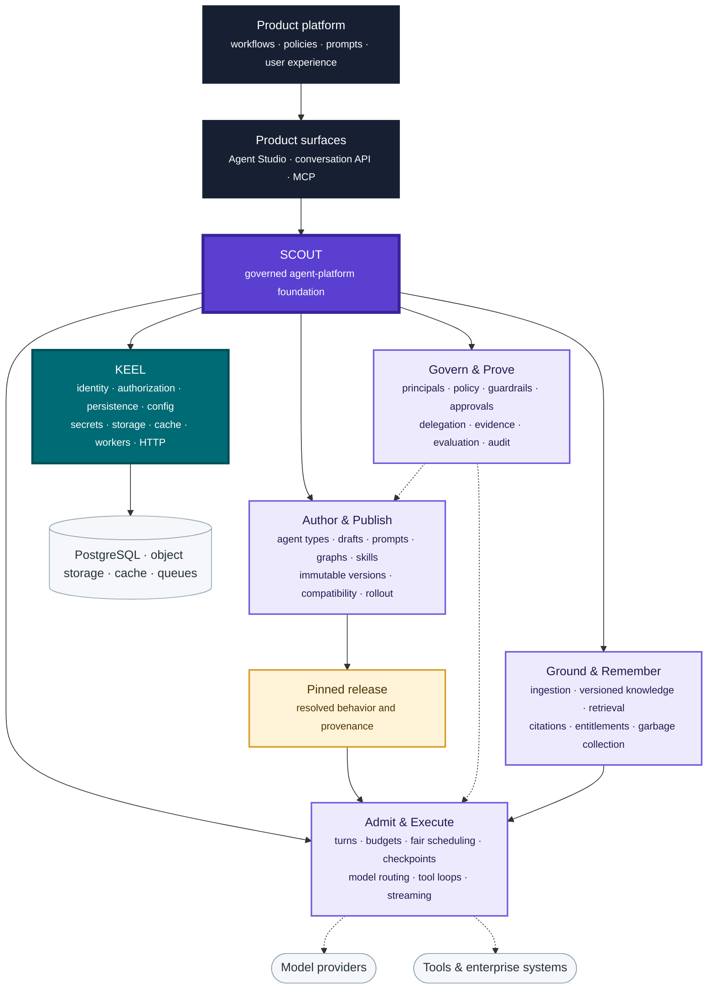

# Scout

Scout is Nauticana's shared Go foundation for secure, multi-tenant agent platforms. It provides provider-neutral contracts, reusable control- and data-plane services, MCP and Agent Studio adapters, and a portable schema. Products supply their workflows, policies, providers, user experience, and deployable binaries.

## Architecture


```mermaid
flowchart TB
    PRODUCT["Product platform<br/><small>workflows · policies · prompts · user experience</small>"]
    SURFACES["Product surfaces<br/><small>Agent Studio · conversation API · MCP</small>"]
    SCOUT["SCOUT<br/><small>governed agent-platform foundation</small>"]

    PRODUCT --> SURFACES --> SCOUT

    SCOUT --> CONTROL["Author & Publish<br/><small>agent types · drafts · prompts · graphs · skills<br/>immutable versions · compatibility · rollout</small>"]
    SCOUT --> RUNTIME["Admit & Execute<br/><small>turns · budgets · fair scheduling · checkpoints<br/>model routing · tool loops · streaming</small>"]
    SCOUT --> GOVERN["Govern & Prove<br/><small>principals · policy · guardrails · approvals<br/>delegation · evidence · evaluation · audit</small>"]
    SCOUT --> KNOWLEDGE["Ground & Remember<br/><small>ingestion · versioned knowledge · retrieval<br/>citations · entitlements · garbage collection</small>"]

    CONTROL --> RELEASE["Pinned release<br/><small>resolved behavior and provenance</small>"]
    RELEASE --> RUNTIME
    GOVERN -.-> CONTROL
    GOVERN -.-> RUNTIME
    KNOWLEDGE --> RUNTIME

    RUNTIME -.-> MODELS(["Model providers"])
    RUNTIME -.-> TOOLS(["Tools & enterprise systems"])
    SCOUT --> KEEL["KEEL<br/><small>identity · authorization · persistence · config<br/>secrets · storage · cache · workers · HTTP</small>"]
    KEEL --> STATE[("PostgreSQL · object storage · cache · queues")]

    classDef product fill:#172033,color:#ffffff,stroke:#172033,stroke-width:2px
    classDef scout fill:#5b3fd1,color:#ffffff,stroke:#39239b,stroke-width:4px
    classDef capability fill:#eeeafd,color:#24194f,stroke:#7559dd,stroke-width:2px
    classDef release fill:#fff3d8,color:#4c3500,stroke:#d59b22,stroke-width:2px
    classDef keel fill:#006b75,color:#ffffff,stroke:#004f57,stroke-width:3px
    classDef adapter fill:#f5f7fa,color:#263238,stroke:#90a4ae,stroke-width:1px
    class PRODUCT,SURFACES product
    class SCOUT scout
    class CONTROL,RUNTIME,GOVERN,KNOWLEDGE capability
    class RELEASE release
    class KEEL keel
    class MODELS,TOOLS,STATE adapter
```

Scout separates mutable authoring from immutable runtime releases. Every turn runs under a resolved principal and tenant, against pinned behavior, through bounded model and tool gateways. Durable state remains authoritative; policy, guardrails, approvals, evidence, and usage accounting surround execution rather than being optional adapters.

Scout is a library, not a deployable product. A downstream composes its API and worker binaries and selects concrete model, storage, cache, queue, and tool providers.

## Start here

Add released module versions; never use local filesystem replacements:

```bash
go get github.com/nauticana/scout@<version>
go get github.com/nauticana/keel@v1.2.106
```

Continue with [Create a downstream platform](doc/engineering-reference.md#create-a-downstream-platform) for composition, HTTP handlers, workers, MCP, and schema generation. Agent Studio clients use the [Studio API surface](doc/api_surface.md).

## Ownership boundary

| Owner | Responsibility |
|---|---|
| Scout | Agent definitions and releases, Studio, execution graphs, turns, tools, skills, knowledge, model routing, guardrails, approvals, delegation, evaluation, usage, and audit |
| [Keel](https://github.com/nauticana/keel) | Persistence, identity, authorization, tenancy, configuration, secrets, storage, cache, messaging, workers, HTTP infrastructure, quotas, and other product-neutral backend mechanisms |
| Downstream product | Business vocabulary, workflows, prompts, policies, provider composition, adapters, customer experience, and deployable binaries |

The detailed [repository contract](doc/engineering-reference.md#repository-contract) and [interface map](doc/engineering-reference.md#interface-map) explain where extensions belong.

## Documentation

| Topic | Contents |
|---|---|
| [Agent Studio API](doc/api_surface.md) | Authenticated routes, payload mappings, mutation contracts, responses, and errors |
| [Engineering reference](doc/engineering-reference.md) | Package map, services, Studio, runtime, MCP, schema, providers, reliability, composition, and testing |
| [Database reference](doc/database.md) | Module dependencies, ER diagrams, tables, relationships, and storage boundaries |
| [Configuration](doc/configuration.md) | Flags, limits, admission, budgets, latency, and data-plane settings |
| [Authority](doc/authority.md) | Principals, authorization, scope inheritance, compilation, and limits |
| [Governance](doc/governance.md) | Policy, restriction layers, approvals, credentials, decision records, and evidence |
| [Agent organization](doc/organization.md) | Agent types, lifecycle, entitlements, delegation, and release explanation |
| [Persistence](doc/persistence.md) | Durable turns, checkpoints, idempotency, cache discipline, and transaction order |
| [Guardrails](doc/guardrails.md) | Layered inspection, streaming enforcement, stages, and composition |
| [Knowledge ingestion](doc/knowledge_ingestion.md) | Versioned ingestion, manifests, aliases, CDC, garbage collection, and backpressure |
| [Evaluation](doc/evaluation.md) | Evidence, scoring, gates, sampling, calibration, and retrieval evaluation |
| [Rollout](doc/rollout.md) | Release bundles, rollout states, version pins, draining, and rollback |
| [Observability](doc/observability.md) | Stage attribution, bounded metric labels, heavy hitters, and audit separation |
| [Serving signals](doc/serving_signals.md) | Autoscaler inputs, capacity feedback, and drain semantics |

Release-to-release changes are recorded in [`migration_guide.json`](migration_guide.json). Open work is tracked in [`TODO.md`](TODO.md). Schema sources live under [`schema/`](schema/); generated SQL is derived from them.

## License

See [LICENSE](LICENSE).
