# Scout database reference

Scout requires keel `tenant_management`, which declares direct dependencies on keel `core` and `geo`. Install the groups from the same pinned `github.com/nauticana/keel` module in dependency order: `core`, `geo`, `tenant_management`, then Scout. Keel supplies `business_partner`, users and sessions, authorization, consent, metadata-driven REST, and `table_sequence_usage`. `agent_tenant` is a one-to-one child of `business_partner`, and Studio actor fields reference `user_account`; Scout does not copy either YAML definition.

The diagrams below show Scout-owned tables. A keel-owned table appears only as a bare stub when a Scout relation points at it — `business_partner` and `user_account` — because it is a dependency rather than part of the agent domain. Generate both layers together as documented in [README.md](../README.md#generate-dialect-specific-ddl).

The YAML files under `schema/` are authoritative. This document explains ownership and relationships; it is not another schema source.

## Module dependency graph

Scout's schema is fifteen selectable modules declared in `schema/dependency.yml`. A downstream generates only the modules its product uses; selecting a module means selecting every module it points to, transitively.

- Every node is a schema module, labeled with the number of tables it owns.
- An arrow points from a module to a module it depends on because at least one foreign key crosses that boundary.
- Only direct dependencies are drawn. An edge already implied by a longer path is omitted — `release` also holds foreign keys into `agent`, `catalog`, and `tenancy`, but reaches all three through `runtime`, so drawing them again would say nothing new. `schema/dependency.yml` keeps the complete list.
- `agent` is the waist of the platform: `catalog`, `tenancy`, `prompt`, and `model` sit under it, and every product-facing module above reaches them through it.
- `agent_authorization` and `configuration` carry the principal and configuration-inheritance primitives; both sit directly on `agent` because they key on `agent_profile` and `agent_version`.
- `approval` holds the durable human-in-the-loop record, and `release` reaches `configuration` because every decision record is attributable to a scope.

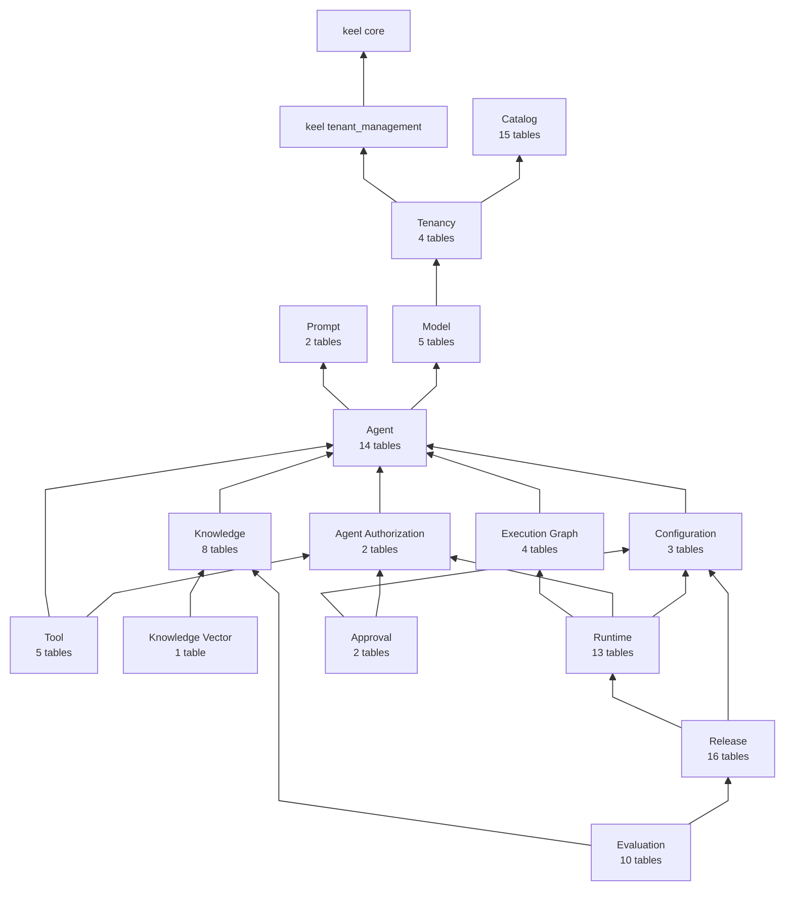
```mermaid
%%{init: {"flowchart": {"curve": "linear", "nodeSpacing": 30, "rankSpacing": 55, "diagramPadding": 12}, "themeVariables": {"fontSize": "12px"}}}%%
flowchart BT

    tenant_management --> core
    tenancy --> tenant_management
    tenancy --> catalog
    model --> tenancy
    agent --> prompt
    agent --> model
    tool --> agent
    tool --> agent_authorization_module
    knowledge --> agent
    configuration_module --> agent
    execution_graph_module --> agent
    agent_authorization_module --> agent
    knowledge_vector --> knowledge
    runtime --> execution_graph_module
    runtime --> agent_authorization_module
    runtime --> configuration_module
    release --> runtime
    release --> configuration_module
    evaluation --> knowledge
    evaluation --> release
    approval --> configuration_module
    approval --> agent_authorization_module

    core["keel core"]
    tenant_management["keel tenant_management"]
    catalog["Catalog<br/>15 tables"]
    tenancy["Tenancy<br/>4 tables"]
    prompt["Prompt<br/>2 tables"]
    model["Model<br/>5 tables"]
    agent["Agent<br/>14 tables"]
    tool["Tool<br/>5 tables"]
    execution_graph_module["Execution Graph<br/>4 tables"]
    knowledge["Knowledge<br/>8 tables"]
    knowledge_vector["Knowledge Vector<br/>1 table"]
    runtime["Runtime<br/>13 tables"]
    release["Release<br/>16 tables"]
    evaluation["Evaluation<br/>10 tables"]
    agent_authorization_module["Agent Authorization<br/>2 tables"]
    configuration_module["Configuration<br/>3 tables"]
    approval["Approval<br/>2 tables"]
```

Every module that ships reference data also writes seed rows into keel `core` tables — constants, REST metadata, authorization objects, and configuration flags — which is an application-level dependency rather than a foreign key, so it is not drawn.

Selecting modules is how a deployment stays small: Agent Studio authoring and publication needs `catalog`, `tenancy`, `prompt`, `model`, and `agent` — 40 Scout tables — while the full platform is 104. The profile table in [README.md](../README.md#generate-dialect-specific-ddl) lists the common combinations and the exact generator invocation.

`knowledge_vector` is separable for a second reason: it is the only module whose table uses PostgreSQL `VECTOR` and `TSVECTOR`. A MySQL deployment, or one running retrieval on an external vector store behind `contract.KnowledgeVectorIndex`, simply omits the module.

## Module contents

The same modules with their tables and the foreign keys inside each one, again with transitively implied edges omitted. Columns are left out here; the ER diagrams further down carry columns and relationship names, and are organized by concept rather than by module.

```mermaid
%%{init: {"flowchart": {"curve": "linear", "nodeSpacing": 30, "rankSpacing": 55, "diagramPadding": 12}, "themeVariables": {"fontSize": "12px"}}}%%
flowchart RL
    subgraph catalog["Catalog"]
        direction BT
        currency["currency"]
        priority_class["priority_class"]
        turn_status["turn_status"]
        idempotency_status["idempotency_status"]
        reservation_status["reservation_status"]
        rollout_status["rollout_status"]
        usage_category["usage_category"]
        config_scope_kind["config_scope_kind"]
        config_resource_kind["config_resource_kind"]
        config_merge_mode["config_merge_mode"]
        audit_decision_outcome["audit_decision_outcome"]
        approval_status["approval_status"]
        approval_risk_tier["approval_risk_tier"]
        agent_output_class["agent_output_class"]
        agent_state["agent_state"]
    end

    subgraph tenancy["Tenancy"]
        direction BT
        agent_tenant["agent_tenant"]
        tenant_runtime_policy["tenant_runtime_policy"]
        tenant_current_policy["tenant_current_policy"]
        tenant_quota["tenant_quota"]
    end
    tenant_runtime_policy --> agent_tenant
    tenant_current_policy --> tenant_runtime_policy
    tenant_quota --> agent_tenant

    subgraph prompt["Prompt"]
        direction BT
        prompt_section["prompt_section"]
        prompt_baseline["prompt_baseline"]
    end
    prompt_baseline --> prompt_section

    subgraph model["Model"]
        direction BT
        model_provider["model_provider"]
        model_definition["model_definition"]
        model_capability["model_capability"]
        model_price["model_price"]
        tenant_model_access["tenant_model_access"]
    end
    tenant_model_access --> model_definition
    model_definition --> model_provider
    model_price --> model_definition
    model_capability --> model_definition

    subgraph agent["Agent"]
        direction BT
        agent_type["agent_type"]
        agent_type_version["agent_type_version"]
        agent_capability_package["agent_capability_package"]
        agent_type_capability["agent_type_capability"]
        agent_version_quarantine["agent_version_quarantine"]
        agent_profile["agent_profile"]
        guardrail_config["guardrail_config"]
        agent_draft["agent_draft"]
        agent_alias["agent_alias"]
        agent_studio_event["agent_studio_event"]
        agent_prompt_override["agent_prompt_override"]
        tenant_prompt_default["tenant_prompt_default"]
        agent_version["agent_version"]
        agent_deployment["agent_deployment"]
    end
    agent_type_version --> agent_type
    agent_type_capability --> agent_type_version
    agent_type_capability --> agent_capability_package
    agent_profile --> agent_type
    agent_version_quarantine --> agent_version
    agent_version --> guardrail_config
    agent_studio_event --> agent_profile
    agent_alias --> agent_profile
    agent_draft --> agent_profile
    tenant_prompt_default --> agent_alias
    agent_deployment --> agent_version
    agent_prompt_override --> agent_draft
    guardrail_config --> agent_profile

    subgraph agent_authorization_module["Agent Authorization"]
        direction BT
        agent_permission["agent_permission"]
        delegation_grant["delegation_grant"]
    end
    agent_permission --> agent_profile
    delegation_grant --> agent_profile

    subgraph configuration_module["Configuration"]
        direction BT
        scope["scope"]
        config_scope_binding["config_scope_binding"]
        effective_agent_release["effective_agent_release"]
    end
    config_scope_binding --> scope
    effective_agent_release --> scope
    effective_agent_release --> agent_version

    subgraph approval["Approval"]
        direction BT
        approval_request["approval_request"]
        approval_decision["approval_decision"]
    end
    approval_request --> scope
    approval_decision --> approval_request
    approval_decision --> delegation_grant

    subgraph tool["Tool"]
        direction BT
        tool_profile["tool_profile"]
        tool_version["tool_version"]
        tool_egress_rule["tool_egress_rule"]
        agent_tool_binding["agent_tool_binding"]
        tool_credential_binding["tool_credential_binding"]
    end
    tool_credential_binding --> tool_profile
    tool_credential_binding --> delegation_grant
    tool_version --> tool_profile
    agent_tool_binding --> tool_version
    tool_egress_rule --> tool_version

    subgraph execution_graph_module["Execution Graph"]
        direction BT
        execution_graph["execution_graph"]
        execution_step["execution_step"]
        execution_graph_entry["execution_graph_entry"]
        execution_transition["execution_transition"]
    end
    execution_graph_entry --> execution_step
    execution_step --> execution_graph
    execution_transition --> execution_step

    subgraph knowledge["Knowledge"]
        direction BT
        knowledge_base["knowledge_base"]
        knowledge_base_version["knowledge_base_version"]
        knowledge_document["knowledge_document"]
        knowledge_chunk["knowledge_chunk"]
        agent_knowledge_binding["agent_knowledge_binding"]
        knowledge_document_manifest["knowledge_document_manifest"]
        knowledge_base_alias["knowledge_base_alias"]
        knowledge_source_event["knowledge_source_event"]
    end
    knowledge_base_version --> knowledge_base
    knowledge_document --> knowledge_base_version
    knowledge_source_event --> knowledge_base
    knowledge_base_alias --> knowledge_base_version
    knowledge_document_manifest --> knowledge_document
    knowledge_chunk --> knowledge_document
    agent_knowledge_binding --> knowledge_base_version

    subgraph knowledge_vector["Knowledge Vector"]
        direction BT
        knowledge_chunk_vector["knowledge_chunk_vector"]
    end

    subgraph runtime["Runtime"]
        direction BT
        agent_conversation["agent_conversation"]
        conversation_turn["conversation_turn"]
        conversation_turn_detail["conversation_turn_detail"]
        step_checkpoint["step_checkpoint"]
        session_snapshot["session_snapshot"]
        step_idempotency["step_idempotency"]
        turn_queue["turn_queue"]
        turn_dead_letter["turn_dead_letter"]
        budget_reservation["budget_reservation"]
        usage_event["usage_event"]
        agent_run["agent_run"]
        agent_ops_event["agent_ops_event"]
        agent_work_item["agent_work_item"]
    end
    session_snapshot --> step_checkpoint
    turn_dead_letter --> turn_queue
    turn_queue --> conversation_turn
    conversation_turn_detail --> budget_reservation
    conversation_turn --> agent_conversation
    step_checkpoint --> conversation_turn
    usage_event --> conversation_turn
    usage_event --> scope
    agent_work_item --> delegation_grant
    agent_work_item --> agent_work_item
    step_idempotency --> conversation_turn
    budget_reservation --> conversation_turn

    subgraph release["Release"]
        direction RL
        rollout_stage["rollout_stage"]
        platform_release["platform_release"]
        release_bundle["release_bundle"]
        tenant_ring["tenant_ring"]
        tenant_ring_member["tenant_ring_member"]
        contract_test_case["contract_test_case"]
        contract_test_run["contract_test_run"]
        contract_test_result["contract_test_result"]
        platform_rollout["platform_rollout"]
        platform_rollout_state["platform_rollout_state"]
        platform_rollout_transition["platform_rollout_transition"]
        platform_rollout_bypass["platform_rollout_bypass"]
        agent_version_pin["agent_version_pin"]
        experiment_cohort["experiment_cohort"]
        conversation_release["conversation_release"]
        audit_event["audit_event"]
    end
    contract_test_run --> platform_release
    conversation_release --> platform_release
    tenant_ring_member --> tenant_ring
    platform_rollout_transition --> platform_rollout_state
    platform_rollout --> platform_release
    platform_rollout --> tenant_ring
    platform_rollout_state --> platform_release
    platform_rollout_state --> rollout_stage
    platform_rollout_state --> tenant_ring
    platform_rollout_bypass --> platform_rollout_state
    contract_test_result --> contract_test_case
    contract_test_result --> contract_test_run
    release_bundle --> platform_release

    subgraph evaluation["Evaluation"]
        direction BT
        golden_set["golden_set"]
        golden_set_version["golden_set_version"]
        golden_example["golden_example"]
        golden_query["golden_query"]
        evaluation_manifest["evaluation_manifest"]
        evaluation_run["evaluation_run"]
        evaluation_result["evaluation_result"]
        gate_decision["gate_decision"]
        human_review_item["human_review_item"]
        evaluation_sample["evaluation_sample"]
    end
    evaluation_result --> evaluation_run
    evaluation_result --> golden_example
    human_review_item --> evaluation_run
    human_review_item --> golden_example
    golden_set_version --> golden_set
    evaluation_manifest --> golden_set_version
    golden_query --> golden_set_version
    golden_example --> golden_set_version
    gate_decision --> evaluation_manifest
    evaluation_run --> evaluation_manifest

```

## Storage boundaries

| State | Authoritative location |
|---|---|
| Tenants, policies, immutable definitions, graph metadata, usage, rollout, audit indexes | Relational database |
| Large definitions, turn content, checkpoints, and audit payloads | Object storage by URI and digest |
| Hot session and graph entries | Cache backed by durable relational/object state |
| Turn dispatch and reply frames | Durable queue and short-lived reply broker |
| Embedding vectors | Tenant-partitioned vector index |
| Compiled effective configuration | `effective_agent_release`, frozen at publication |
| Governed decisions and their evidence | `audit_event` typed columns; redacted payloads in object storage |
| Pending human decisions | `approval_request` / `approval_decision` |
| Compiled effective configuration | `effective_agent_release`, frozen at publication |
| Governed decisions and their evidence | `audit_event` typed columns; redacted payloads in object storage |
| Pending human decisions | `approval_request` / `approval_decision` |
| Provider credentials | keel secret provider |

All relational identifiers are lowercase. Tenant-owned relations carry `tenant_id` through their primary or foreign keys. Portable structured payloads use canonical JSON stored as `TEXT`; runtime result cards deliberately use PostgreSQL `JSONB` because the durable ledger already relies on PostgreSQL transaction and locking primitives.

`execution_step.step_kind_code`, `tenant_runtime_policy.capacity_class_code`, and Studio prompt language columns use keel constant domains through `constant_lookup`; none is a foreign key or a Scout-owned table. The execution kinds are `model`, `tool`, and `knowledge`; the capacity classes are `shared` and `dedicated`.

## REST relationship names

Keel uses each foreign-key constraint name as the generated parent-side relation field, and `rest_api_child.constraint_name` selects that exact relation. These names are therefore API contracts. An owning relationship uses the plural child collection; a second path to another parent adds a role that explains the collection from that parent's perspective.

| Parent | Foreign key / relation field | Child objects |
|---|---|---|
| `business_partner` | `agent_tenants` | `agent_tenant[]` |
| `agent_tenant` | `agent_profiles` | `agent_profile[]` |
| `agent_profile` | `agent_versions` | `agent_version[]` |
| `agent_profile` | `agent_studio_events` | `agent_studio_event[]` |
| `agent_version` | `stable_agent_deployments` | `agent_deployment[]` |
| `agent_version` | `canary_agent_deployments` | `agent_deployment[]` |
| `execution_step` | `outgoing_execution_transitions` | `execution_transition[]` |
| `execution_step` | `incoming_execution_transitions` | `execution_transition[]` |
| `configuration` | `child_scopes` | `scope[]` |
| `configuration` | `config_scope_bindings` | `config_scope_binding[]` |
| `agent_type` | `agent_type_versions` | `agent_type_version[]` |
| `agent_type` | `typed_agent_profiles` | `agent_profile[]` |
| `agent_version` | `agent_version_quarantines` | `agent_version_quarantine[]` |
| `delegation_grant` | `grant_work_items` | `agent_work_item[]` |
| `agent_work_item` | `child_work_items` | `agent_work_item[]` |
| `agent_profile` | `agent_permissions` | `agent_permission[]` |
| `authorization_role` | `permitted_agents` | `agent_permission[]` |
| `approval_request` | `approval_decisions` | `approval_decision[]` |
| `tool_profile` | `tool_credential_bindings` | `tool_credential_binding[]` |

The YAML foreign-key definitions are the complete relationship-name registry. Any future `foreign_key_lookup` or `rest_api_child` seed must reference those names verbatim. Renaming one is an API compatibility change even when its columns do not change.

## Tenant and model governance

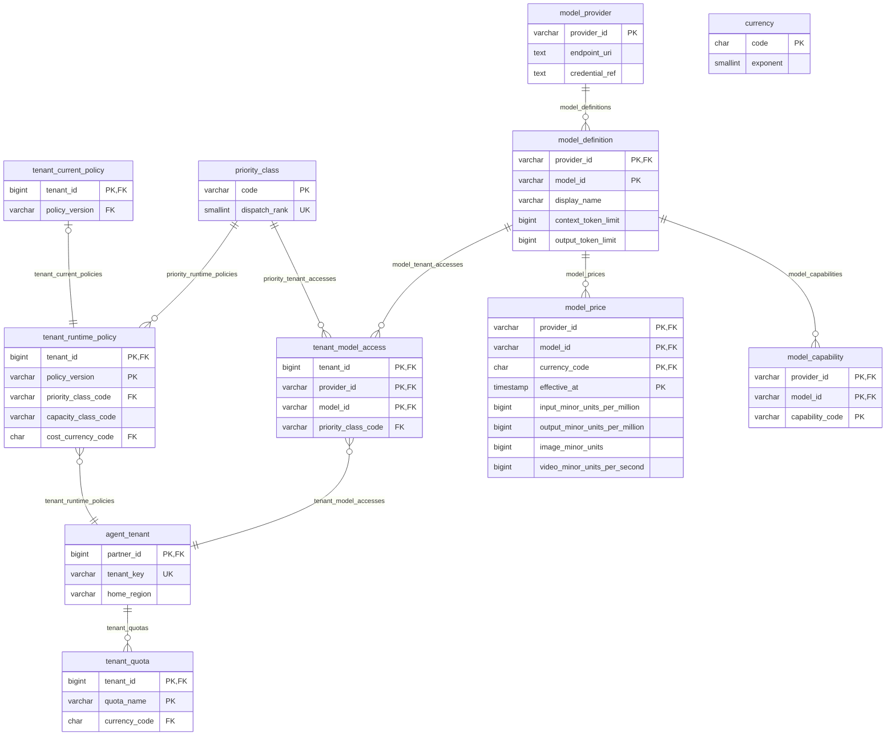
```mermaid
erDiagram
    tenant_current_policy |o--|| tenant_runtime_policy : tenant_current_policies
    priority_class ||--o{ tenant_runtime_policy : priority_runtime_policies
    model_provider ||--o{ model_definition : model_definitions
    model_definition ||--o{ tenant_model_access : model_tenant_accesses
    model_definition ||--o{ model_price : model_prices
    model_definition ||--o{ model_capability : model_capabilities
    priority_class ||--o{ tenant_model_access : priority_tenant_accesses
    tenant_runtime_policy }o--|| agent_tenant : tenant_runtime_policies
    tenant_model_access }o--|| agent_tenant : tenant_model_accesses
    agent_tenant ||--o{ tenant_quota : tenant_quotas

    agent_tenant {
        bigint partner_id PK,FK
        varchar tenant_key UK
        varchar home_region
    }
    tenant_runtime_policy {
        bigint tenant_id PK,FK
        varchar policy_version PK
        varchar priority_class_code FK
        varchar capacity_class_code
        char cost_currency_code FK
    }
    tenant_current_policy {
        bigint tenant_id PK,FK
        varchar policy_version FK
    }
    tenant_quota {
        bigint tenant_id PK,FK
        varchar quota_name PK
        char currency_code FK
    }
    priority_class {
        varchar code PK
        smallint dispatch_rank UK
    }
    currency {
        char code PK
        smallint exponent
    }
    model_provider {
        varchar provider_id PK
        text endpoint_uri
        text credential_ref
    }
    model_definition {
        varchar provider_id PK,FK
        varchar model_id PK
        varchar display_name
        bigint context_token_limit
        bigint output_token_limit
    }
    model_capability {
        varchar provider_id PK,FK
        varchar model_id PK,FK
        varchar capability_code PK
    }
    model_price {
        varchar provider_id PK,FK
        varchar model_id PK,FK
        char currency_code PK,FK
        timestamp effective_at PK
        bigint input_minor_units_per_million
        bigint output_minor_units_per_million
        bigint image_minor_units
        bigint video_minor_units_per_second
    }
    tenant_model_access {
        bigint tenant_id PK,FK
        varchar provider_id PK,FK
        varchar model_id PK,FK
        varchar priority_class_code FK
    }
```

`tenant_runtime_policy`, `tenant_quota`, and `model_price` reference `currency`; those edges are omitted from the diagram to keep the layout readable. Policies are immutable by `(tenant_id, policy_version)`, and `tenant_current_policy` changes only the active pointer.

## Agent, tool, and execution control plane

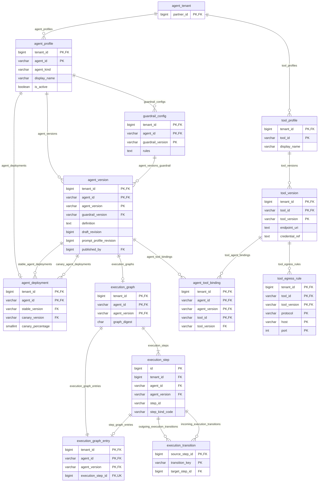
```mermaid
erDiagram
    agent_tenant ||--o{ agent_profile : agent_profiles
    agent_tenant ||--o{ tool_profile : tool_profiles
    agent_profile ||--o{ guardrail_config : guardrail_configs
    agent_profile ||--o{ agent_version : agent_versions
    guardrail_config ||--o{ agent_version : agent_versions_guardrail
    agent_profile ||--o| agent_deployment : agent_deployments
    agent_version ||--o{ agent_deployment : stable_agent_deployments
    agent_version ||--o{ agent_deployment : canary_agent_deployments
    agent_version ||--o| execution_graph : execution_graphs
    agent_version ||--o{ agent_tool_binding : agent_tool_bindings
    tool_profile ||--o{ tool_version : tool_versions
    tool_version ||--o{ tool_egress_rule : tool_egress_rules
    tool_version ||--o{ agent_tool_binding : tool_agent_bindings
    execution_graph ||--|{ execution_step : execution_steps
    execution_graph ||--|| execution_graph_entry : execution_graph_entries
    execution_step ||--o| execution_graph_entry : step_graph_entries
    execution_step ||--o{ execution_transition : outgoing_execution_transitions
    execution_step ||--o{ execution_transition : incoming_execution_transitions

    agent_tenant {
        bigint partner_id PK,FK
    }
    agent_profile {
        bigint tenant_id PK,FK
        varchar agent_id PK
        varchar agent_kind
        varchar display_name
        boolean is_active
    }
    guardrail_config {
        bigint tenant_id PK,FK
        varchar agent_id PK,FK
        varchar guardrail_version PK
        text rules
    }
    agent_version {
        bigint tenant_id PK,FK
        varchar agent_id PK,FK
        varchar agent_version PK
        varchar guardrail_version FK
        text definition
        bigint draft_revision
        bigint prompt_profile_revision
        bigint published_by FK
    }
    agent_deployment {
        bigint tenant_id PK,FK
        varchar agent_id PK,FK
        varchar stable_version FK
        varchar canary_version FK
        smallint canary_percentage
    }
    tool_profile {
        bigint tenant_id PK,FK
        varchar tool_id PK
        varchar display_name
    }
    tool_version {
        bigint tenant_id PK,FK
        varchar tool_id PK,FK
        varchar tool_version PK
        text endpoint_uri
        text credential_ref
    }
    tool_egress_rule {
        bigint tenant_id PK,FK
        varchar tool_id PK,FK
        varchar tool_version PK,FK
        varchar protocol PK
        varchar host PK
        int port PK
    }
    agent_tool_binding {
        bigint tenant_id PK,FK
        varchar agent_id PK,FK
        varchar agent_version PK,FK
        varchar tool_id PK,FK
        varchar tool_version FK
    }
    execution_graph {
        bigint tenant_id PK,FK
        varchar agent_id PK,FK
        varchar agent_version PK,FK
        char graph_digest
    }
    execution_step {
        bigint id PK
        bigint tenant_id FK
        varchar agent_id FK
        varchar agent_version FK
        varchar step_id
        varchar step_kind_code
    }
    execution_graph_entry {
        bigint tenant_id PK,FK
        varchar agent_id PK,FK
        varchar agent_version PK,FK
        bigint execution_step_id FK,UK
    }
    execution_transition {
        bigint source_step_id PK,FK
        varchar transition_key PK
        bigint target_step_id FK
    }
```

Agent, guardrail, and tool versions are immutable. `agent_deployment` holds stable and canary pointers. The compiled graph is normalized into steps, one entry, and directed transitions so publication can validate references before runtime traffic arrives.

## Agent Studio authoring

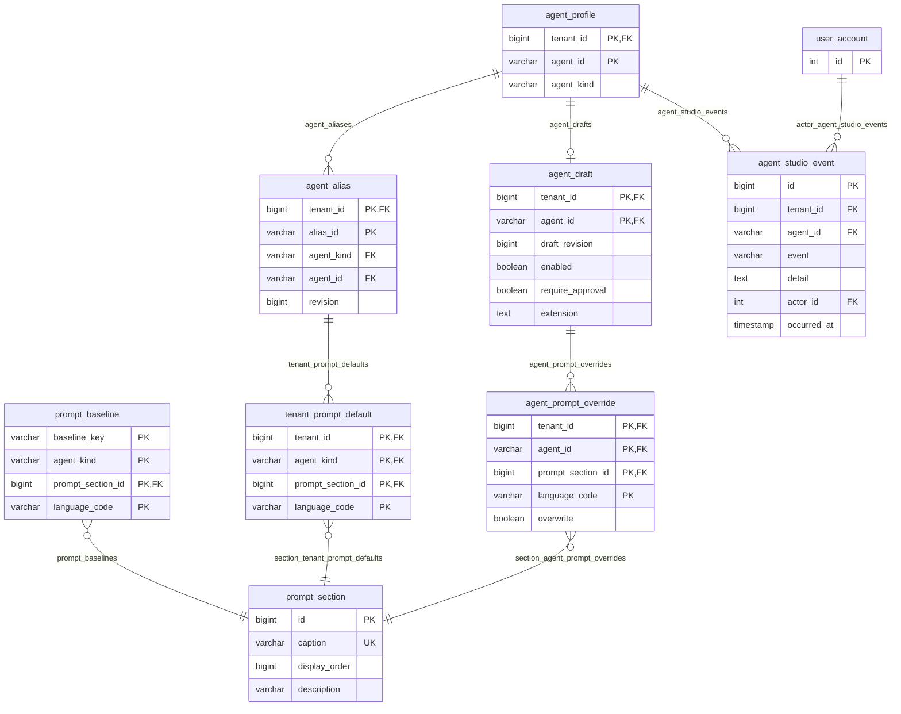
```mermaid
erDiagram
    agent_profile ||--o| agent_draft : agent_drafts
    agent_profile ||--o{ agent_alias : agent_aliases
    agent_draft ||--o{ agent_prompt_override : agent_prompt_overrides
    agent_alias ||--o{ tenant_prompt_default : tenant_prompt_defaults
    prompt_baseline }o--|| prompt_section : prompt_baselines
    tenant_prompt_default }o--|| prompt_section : section_tenant_prompt_defaults
    agent_prompt_override }o--|| prompt_section : section_agent_prompt_overrides
    agent_profile ||--o{ agent_studio_event : agent_studio_events
    user_account ||--o{ agent_studio_event : actor_agent_studio_events

    user_account {
        int id PK
    }
    agent_studio_event {
        bigint id PK
        bigint tenant_id FK
        varchar agent_id FK
        varchar event
        text detail
        int actor_id FK
        timestamp occurred_at
    }
    agent_profile {
        bigint tenant_id PK,FK
        varchar agent_id PK
        varchar agent_kind
    }
    agent_draft {
        bigint tenant_id PK,FK
        varchar agent_id PK,FK
        bigint draft_revision
        boolean enabled
        boolean require_approval
        text extension
    }
    agent_alias {
        bigint tenant_id PK,FK
        varchar alias_id PK
        varchar agent_kind FK
        varchar agent_id FK
        bigint revision
    }
    prompt_section {
        bigint id PK
        varchar caption UK
        bigint display_order
        varchar description
    }
    prompt_baseline {
        varchar baseline_key PK
        varchar agent_kind PK
        bigint prompt_section_id PK,FK
        varchar language_code PK
    }
    tenant_prompt_default {
        bigint tenant_id PK,FK
        varchar agent_kind PK,FK
        bigint prompt_section_id PK,FK
        varchar language_code PK
    }
    agent_prompt_override {
        bigint tenant_id PK,FK
        varchar agent_id PK,FK
        bigint prompt_section_id PK,FK
        varchar language_code PK
        boolean overwrite
    }
```

`agent_alias.revision` guards both alias changes and tenant defaults for that logical kind, preserving one shared optimistic token. Agent overrides are guarded by `agent_draft.draft_revision`. Platform baseline selection is supplied by `PromptBaselineSelector`; baseline data remains product-owned.

Publication freezes compiled languages and source provenance into `agent_version.definition`. Release metadata records the source revisions, change summary, publisher, publication time, and optional restored version without duplicating live draft rows. `agent_studio_event` keeps queryable lifecycle actions and actor/time metadata; it is omitted from the ER layout to preserve the authoring flow.

## Principals, scopes, and effective configuration

### Permission

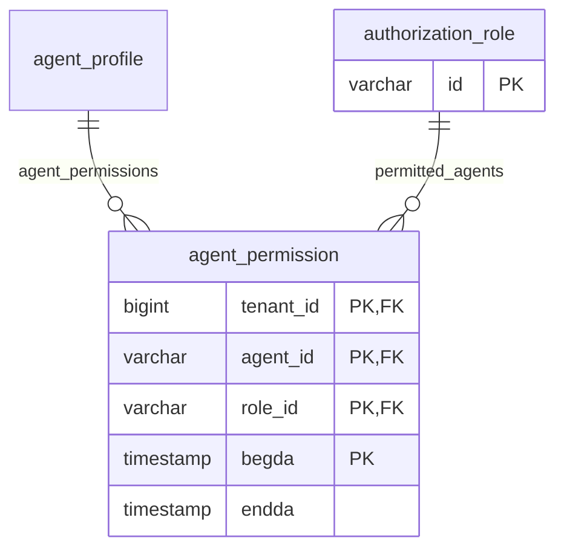
```mermaid
erDiagram
    agent_profile ||--o{ agent_permission : agent_permissions
    authorization_role ||--o{ agent_permission : permitted_agents

    agent_permission {
        bigint tenant_id PK,FK
        varchar agent_id PK,FK
        varchar role_id PK,FK
        timestamp begda PK
        timestamp endda
    }
    authorization_role {
        varchar id PK
    }
```

### Scope

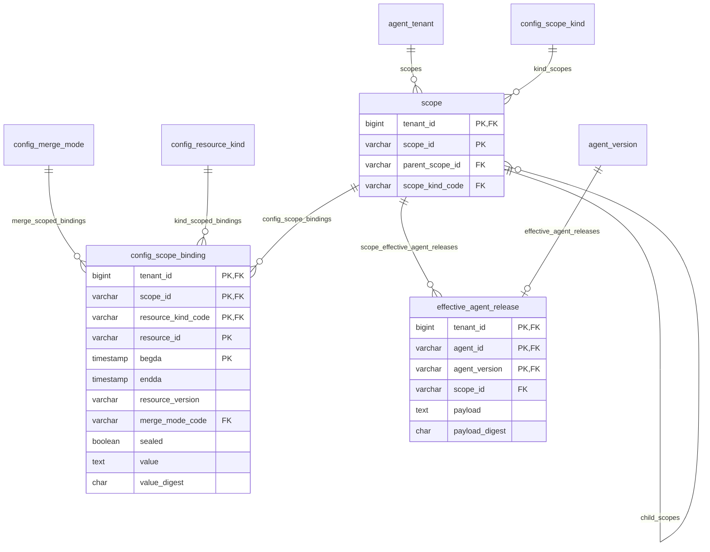
```mermaid
erDiagram
    config_merge_mode ||--o{ config_scope_binding : merge_scoped_bindings
    config_resource_kind ||--o{ config_scope_binding : kind_scoped_bindings
    agent_tenant ||--o{ scope : scopes
    config_scope_kind ||--o{ scope : kind_scopes
    scope ||--o{ scope : child_scopes
    scope ||--o{ config_scope_binding : config_scope_bindings
    scope ||--o{ effective_agent_release : scope_effective_agent_releases
    agent_version ||--o| effective_agent_release : effective_agent_releases

    scope {
        bigint tenant_id PK,FK
        varchar scope_id PK
        varchar parent_scope_id FK
        varchar scope_kind_code FK
    }
    config_scope_binding {
        bigint tenant_id PK,FK
        varchar scope_id PK,FK
        varchar resource_kind_code PK,FK
        varchar resource_id PK
        timestamp begda PK
        timestamp endda
        varchar resource_version
        varchar merge_mode_code FK
        boolean sealed
        text value
        char value_digest
    }
    effective_agent_release {
        bigint tenant_id PK,FK
        varchar agent_id PK,FK
        varchar agent_version PK,FK
        varchar scope_id FK
        text payload
        char payload_digest
    }
```

`configuration` is a per-tenant tree whose `scope_kind_code` Scout never interprets — the product names its
own levels and Scout seeds only the `tenant` root kind. One `config_scope_binding` table serves every
resource kind, so adding a level or a kind adds rows, not tables. `sealed` is set by the binding's
own scope, which is what makes a company clause genuinely non-overridable; a narrower scope that
tries fails with `domain.ErrSealed`.

`effective_agent_release` is the frozen result: `payload` carries every effective value with the
provenance of the binding that won and of each binding it superseded, so the runtime pins one row
instead of walking the chain per request, and an explain view never recompiles.

`agent_permission` mirrors keel's `user_permission`, including `begda`/`endda`, so agents and humans
resolve through the same `authorization_role_permission` grants and the same `low_limit`/`high_limit`
bounds. Agents are deliberately not rows in `user_account`: that table carries interactive
credentials — password, lockout, 2FA, device session — that no machine identity should inherit.
[doc/authority.md](authority.md) records the full rationale and the compilation rules.

## Governed decisions, approvals, and credentials

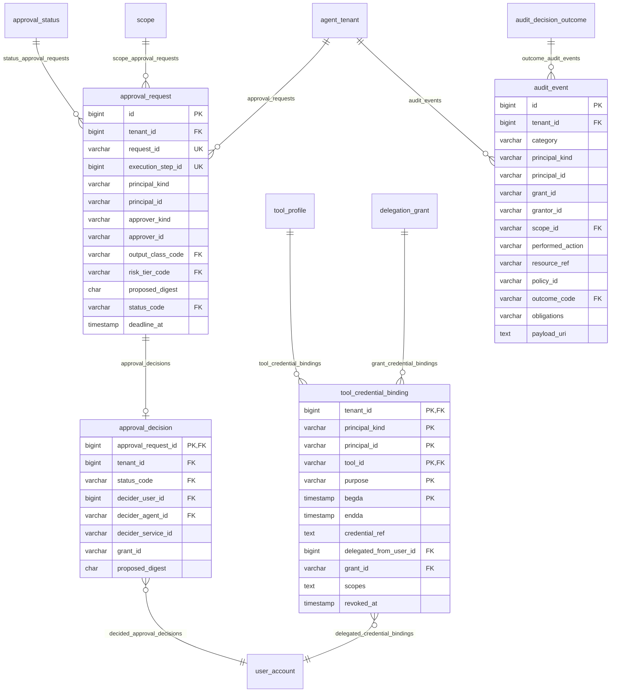
```mermaid
erDiagram
    approval_status ||--o{ approval_request : status_approval_requests
    scope ||--o{ approval_request : scope_approval_requests
    agent_tenant ||--o{ approval_request : approval_requests
    approval_request ||--o| approval_decision : approval_decisions
    tool_profile ||--o{ tool_credential_binding : tool_credential_bindings
    approval_decision }o--|| user_account : decided_approval_decisions
    tool_credential_binding }o--|| user_account : delegated_credential_bindings
    delegation_grant ||--o{ tool_credential_binding : grant_credential_bindings
    agent_tenant ||--o{ audit_event : audit_events
    audit_decision_outcome ||--o{ audit_event : outcome_audit_events

    approval_request {
        bigint id PK
        bigint tenant_id FK
        varchar request_id UK
        bigint execution_step_id UK
        varchar principal_kind
        varchar principal_id
        varchar approver_kind
        varchar approver_id
        varchar output_class_code FK
        varchar risk_tier_code FK
        char proposed_digest
        varchar status_code FK
        timestamp deadline_at
    }
    approval_decision {
        bigint approval_request_id PK,FK
        bigint tenant_id FK
        varchar status_code FK
        bigint decider_user_id FK
        varchar decider_agent_id FK
        varchar decider_service_id
        varchar grant_id
        char proposed_digest
    }
    tool_credential_binding {
        bigint tenant_id PK,FK
        varchar principal_kind PK
        varchar principal_id PK
        varchar tool_id PK,FK
        varchar purpose PK
        timestamp begda PK
        timestamp endda
        text credential_ref
        bigint delegated_from_user_id FK
        varchar grant_id FK
        text scopes
        timestamp revoked_at
    }
    audit_event {
        bigint id PK
        bigint tenant_id FK
        varchar category
        varchar principal_kind
        varchar principal_id
        varchar grant_id
        varchar grantor_id
        varchar scope_id FK
        varchar performed_action
        varchar resource_ref
        varchar policy_id
        varchar outcome_code FK
        varchar obligations
        text payload_uri
    }
```

`approval_request` is unique on `(tenant_id, request_id, execution_step_id)`, so opening a request is
idempotent and a replayed turn re-attaches instead of asking a person the same question twice.
`proposed_digest` binds a verdict to the exact action: resolving matches on it, so approving a
changed action updates nothing. `approval_decision` records the decider through three nullable
identity columns with an exactly-one check; human and agent identities keep real declared foreign
keys, while platform service decisions retain their stable service id.

`tool_credential_binding` maps one principal to a scoped identity for one tool and purpose. It holds a
`credential_ref` into keel's secret or OAuth-connection store — never secret material — so two agents
sharing a tool version never share an identity, and `revoked_at` stops work whose delegation ended.
Delegated bindings name the `delegation_grant` they exercise, so revoking or expiring that grant also
invalidates the credential binding.

`audit_event` is the governed decision itself: who acted, under whose authority, on what, under which
policy, with what outcome and obligations. The payload columns hold only a reference to redacted
evidence in object storage. `audit_decision_outcome` classifies every row, and the query side is
`contract.AuditQuery`, always bound to one tenant. [doc/governance.md](governance.md) has the rules.

## Agent types, delegation, and work items

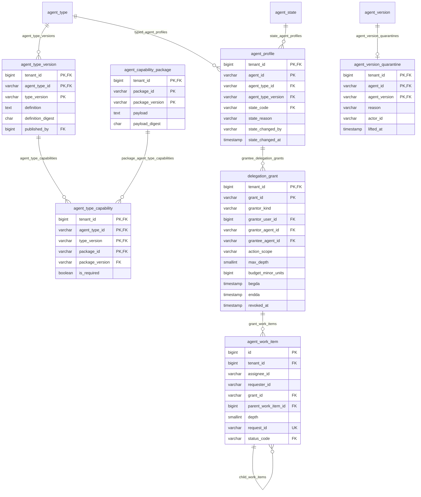
```mermaid
erDiagram
    agent_type ||--o{ agent_type_version : agent_type_versions
    agent_type ||--o{ agent_profile : typed_agent_profiles
    agent_type_version ||--o{ agent_type_capability : agent_type_capabilities
    agent_capability_package ||--o{ agent_type_capability : package_agent_type_capabilities
    agent_state ||--o{ agent_profile : state_agent_profiles
    agent_version ||--o| agent_version_quarantine : agent_version_quarantines
    agent_profile ||--o{ delegation_grant : grantee_delegation_grants
    delegation_grant ||--o{ agent_work_item : grant_work_items
    agent_work_item ||--o{ agent_work_item : child_work_items

    agent_type_version {
        bigint tenant_id PK,FK
        varchar agent_type_id PK,FK
        varchar type_version PK
        text definition
        char definition_digest
        bigint published_by FK
    }
    agent_capability_package {
        bigint tenant_id PK,FK
        varchar package_id PK
        varchar package_version PK
        text payload
        char payload_digest
    }
    agent_type_capability {
        bigint tenant_id PK,FK
        varchar agent_type_id PK,FK
        varchar type_version PK,FK
        varchar package_id PK,FK
        varchar package_version FK
        boolean is_required
    }
    agent_profile {
        bigint tenant_id PK,FK
        varchar agent_id PK
        varchar agent_type_id FK
        varchar agent_type_version FK
        varchar state_code FK
        varchar state_reason
        varchar state_changed_by
        timestamp state_changed_at
    }
    agent_version_quarantine {
        bigint tenant_id PK,FK
        varchar agent_id PK,FK
        varchar agent_version PK,FK
        varchar reason
        varchar actor_id
        timestamp lifted_at
    }
    delegation_grant {
        bigint tenant_id PK,FK
        varchar grant_id PK
        varchar grantor_kind
        bigint grantor_user_id FK
        varchar grantor_agent_id FK
        varchar grantee_agent_id FK
        varchar action_scope
        smallint max_depth
        bigint budget_minor_units
        timestamp begda
        timestamp endda
        timestamp revoked_at
    }
    agent_work_item {
        bigint id PK
        bigint tenant_id FK
        varchar assignee_id
        varchar requester_id
        varchar grant_id FK
        bigint parent_work_item_id FK
        smallint depth
        varchar request_id UK
        varchar status_code FK
    }
```

`agent_profile.agent_type_id` is a real foreign key; it was a bare `VARCHAR` naming nothing. The
column is called `agent_type_id` everywhere now, replacing `agent_kind`, which also matches the
`agent_type` field the studio-v1 wire format already used.

`state_code` replaces the old `is_active` boolean and carries the reason, actor, and time of the last
change. `agent_version_quarantine` withdraws one version from all traffic without editing the
deployment pointers that would otherwise select it.

`delegation_grant` records who may assign or approve what, for how deep, under what budget, and until
when. `agent_work_item` is unique on `(tenant_id, request_id)` so a redelivered delegation re-attaches
rather than fanning out, and `parent_work_item_id` gives the chain that cycle detection walks.
[doc/organization.md](organization.md) has the rules.

## Knowledge

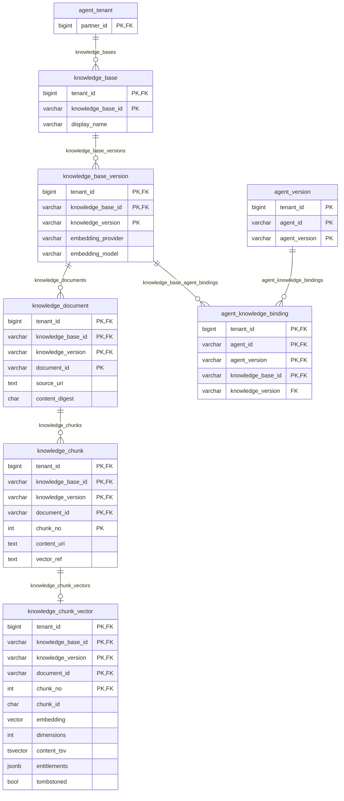
```mermaid
erDiagram
    agent_tenant ||--o{ knowledge_base : knowledge_bases
    knowledge_base ||--o{ knowledge_base_version : knowledge_base_versions
    knowledge_base_version ||--o{ knowledge_document : knowledge_documents
    knowledge_document ||--o{ knowledge_chunk : knowledge_chunks
    knowledge_chunk ||--o| knowledge_chunk_vector : knowledge_chunk_vectors
    agent_version ||--o{ agent_knowledge_binding : agent_knowledge_bindings
    knowledge_base_version ||--o{ agent_knowledge_binding : knowledge_base_agent_bindings

    agent_tenant {
        bigint partner_id PK,FK
    }
    agent_version {
        bigint tenant_id PK
        varchar agent_id PK
        varchar agent_version PK
    }
    knowledge_base {
        bigint tenant_id PK,FK
        varchar knowledge_base_id PK
        varchar display_name
    }
    knowledge_base_version {
        bigint tenant_id PK,FK
        varchar knowledge_base_id PK,FK
        varchar knowledge_version PK
        varchar embedding_provider
        varchar embedding_model
    }
    knowledge_document {
        bigint tenant_id PK,FK
        varchar knowledge_base_id PK,FK
        varchar knowledge_version PK,FK
        varchar document_id PK
        text source_uri
        char content_digest
    }
    knowledge_chunk {
        bigint tenant_id PK,FK
        varchar knowledge_base_id PK,FK
        varchar knowledge_version PK,FK
        varchar document_id PK,FK
        int chunk_no PK
        text content_uri
        text vector_ref
    }
    knowledge_chunk_vector {
        bigint tenant_id PK,FK
        varchar knowledge_base_id PK,FK
        varchar knowledge_version PK,FK
        varchar document_id PK,FK
        int chunk_no PK,FK
        char chunk_id
        vector embedding
        int dimensions
        tsvector content_tsv
        jsonb entitlements
        bool tombstoned
    }
    agent_knowledge_binding {
        bigint tenant_id PK,FK
        varchar agent_id PK,FK
        varchar agent_version PK,FK
        varchar knowledge_base_id PK,FK
        varchar knowledge_version FK
    }
```

Relational rows prove tenant and version ownership. Document and chunk content remain external by URI and digest, while `vector_ref` points to the tenant-partitioned vector index.

`knowledge_chunk_vector` is the optional PostgreSQL-resident index behind `knowledge.PgVectorIndex`: one row per chunk carrying its embedding, `tsvector`, entitlement labels, source version, and offsets, so entitlement predicates and nearest-neighbor ranking run inside one query instead of post-filtering a candidate set. Search joins `knowledge_document_manifest` and keeps only chunks whose knowledge version is still that document's active, untombstoned version, so a superseded generation stops being retrievable the moment the manifest pointer moves — before its rows are collected. It is the only Scout table using `VECTOR` and `TSVECTOR`; deployments on MySQL leave it out and inject a different `contract.KnowledgeVectorIndex`.

### Knowledge versioning and ingestion state

The `knowledge` group holds the state that keeps retrieval consistent while ingestion runs.

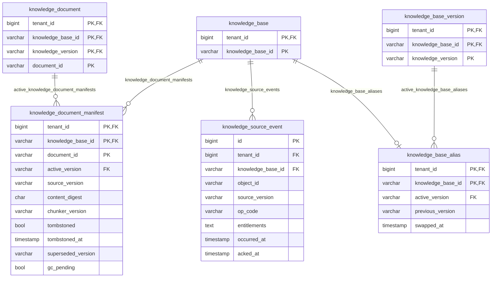
```mermaid
erDiagram
    knowledge_base ||--o{ knowledge_document_manifest : knowledge_document_manifests
    knowledge_document ||--o{ knowledge_document_manifest : active_knowledge_document_manifests
    knowledge_base ||--o{ knowledge_source_event : knowledge_source_events
    knowledge_base ||--o| knowledge_base_alias : knowledge_base_aliases
    knowledge_base_version ||--o{ knowledge_base_alias : active_knowledge_base_aliases

    knowledge_base {
        bigint tenant_id PK,FK
        varchar knowledge_base_id PK
    }
    knowledge_base_version {
        bigint tenant_id PK,FK
        varchar knowledge_base_id PK,FK
        varchar knowledge_version PK
    }
    knowledge_document {
        bigint tenant_id PK,FK
        varchar knowledge_base_id PK,FK
        varchar knowledge_version PK,FK
        varchar document_id PK
    }
    knowledge_document_manifest {
        bigint tenant_id PK,FK
        varchar knowledge_base_id PK,FK
        varchar document_id PK
        varchar active_version FK
        varchar source_version
        char content_digest
        varchar chunker_version
        bool tombstoned
        timestamp tombstoned_at
        varchar superseded_version
        bool gc_pending
    }
    knowledge_base_alias {
        bigint tenant_id PK,FK
        varchar knowledge_base_id PK,FK
        varchar active_version FK
        varchar previous_version
        timestamp swapped_at
    }
    knowledge_source_event {
        bigint id PK
        bigint tenant_id FK
        varchar knowledge_base_id FK
        varchar object_id
        varchar source_version
        varchar op_code
        text entitlements
        timestamp occurred_at
        timestamp acked_at
    }
```

`knowledge_document_manifest` names the active version of each document plus its tombstone and garbage-collection flags. Retrieval reads it on every query, so a deleted document disappears at the tombstone and a rebuilt one stops serving its old generation at the pointer swap, both long before any chunk is reclaimed. `knowledge_base_alias` is the compare-and-set pointer that makes a rebuilt knowledge version visible atomically. `knowledge_source_event` is the CDC/outbox row a producer writes inside its own transaction, carrying tenant, object, source version, operation, and authorization attributes so ingestion can poll upstream changes and reconciliation can measure freshness lag from the oldest unacknowledged row.

## Conversation runtime and metering

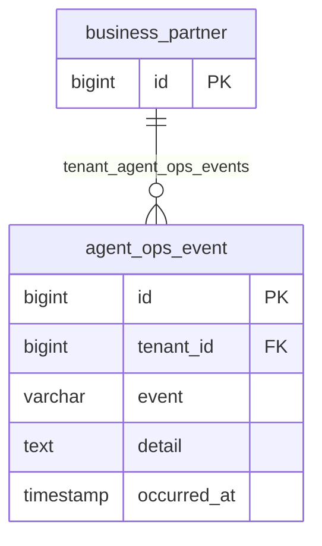
```mermaid
erDiagram
    business_partner ||--o{ agent_ops_event : tenant_agent_ops_events

    agent_ops_event {
        bigint id PK
        bigint tenant_id FK
        varchar event
        text detail
        timestamp occurred_at
    }
    business_partner {
        bigint id PK
    }
```

### Agent Ops Events per partner

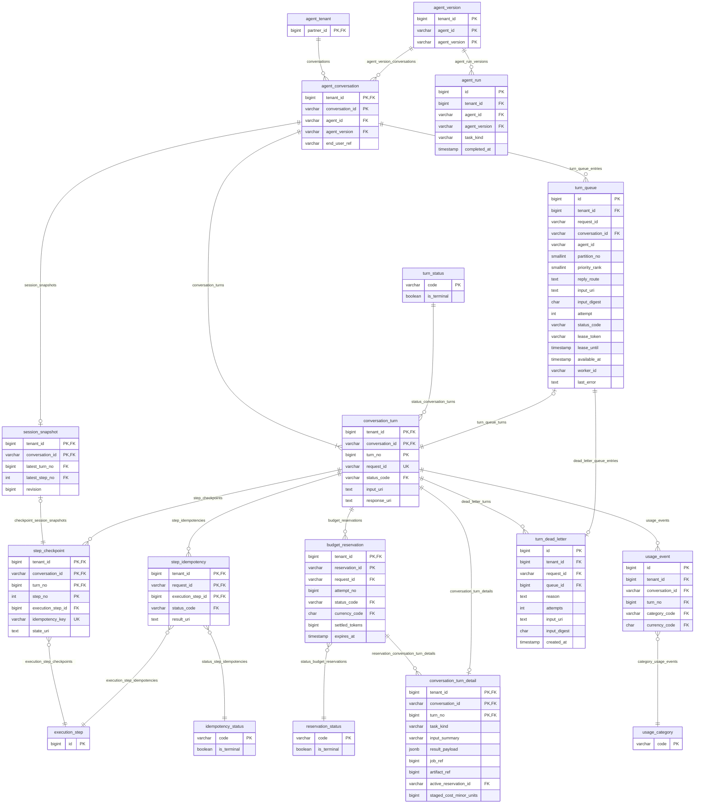
```mermaid
erDiagram
    agent_tenant ||--o{ agent_conversation : conversations
    agent_version ||--o{ agent_conversation : agent_version_conversations
    agent_conversation ||--o| session_snapshot : session_snapshots
    session_snapshot |o--|| step_checkpoint : checkpoint_session_snapshots
    conversation_turn ||--o{ step_checkpoint : step_checkpoints
    conversation_turn ||--o{ step_idempotency : step_idempotencies
    step_checkpoint }o--|| execution_step : execution_step_checkpoints
    step_idempotency }o--|| execution_step : execution_step_idempotencies
    step_idempotency }o--|| idempotency_status : status_step_idempotencies
    conversation_turn ||--o{ budget_reservation : budget_reservations
    budget_reservation }o--|| reservation_status : status_budget_reservations
    budget_reservation ||--o{ conversation_turn_detail : reservation_conversation_turn_details
    conversation_turn ||--o{ usage_event : usage_events
    usage_event }o--|| usage_category : category_usage_events
    agent_conversation ||--|{ conversation_turn : conversation_turns
    turn_status ||--o{ conversation_turn : status_conversation_turns
    conversation_turn ||--o| conversation_turn_detail : conversation_turn_details
    conversation_turn ||--o{ turn_dead_letter : dead_letter_turns
    turn_queue |o--|| conversation_turn : turn_queue_turns
    agent_conversation ||--o{ turn_queue : turn_queue_entries
    turn_queue ||--o| turn_dead_letter : dead_letter_queue_entries
    agent_version ||--o{ agent_run : agent_run_versions

    agent_tenant {
        bigint partner_id PK,FK
    }
    agent_version {
        bigint tenant_id PK
        varchar agent_id PK
        varchar agent_version PK
    }
    execution_step {
        bigint id PK
    }
    agent_conversation {
        bigint tenant_id PK,FK
        varchar conversation_id PK
        varchar agent_id FK
        varchar agent_version FK
        varchar end_user_ref
    }
    conversation_turn {
        bigint tenant_id PK,FK
        varchar conversation_id PK,FK
        bigint turn_no PK
        varchar request_id UK
        varchar status_code FK
        text input_uri
        text response_uri
    }
    turn_status {
        varchar code PK
        boolean is_terminal
    }
    conversation_turn_detail {
        bigint tenant_id PK,FK
        varchar conversation_id PK,FK
        bigint turn_no PK,FK
        varchar task_kind
        varchar input_summary
        jsonb result_payload
        bigint job_ref
        bigint artifact_ref
        varchar active_reservation_id FK
        bigint staged_cost_minor_units
    }
    step_checkpoint {
        bigint tenant_id PK,FK
        varchar conversation_id PK,FK
        bigint turn_no PK,FK
        int step_no PK
        bigint execution_step_id FK
        varchar idempotency_key UK
        text state_uri
    }
    session_snapshot {
        bigint tenant_id PK,FK
        varchar conversation_id PK,FK
        bigint latest_turn_no FK
        int latest_step_no FK
        bigint revision
    }
    step_idempotency {
        bigint tenant_id PK,FK
        varchar request_id PK,FK
        bigint execution_step_id PK,FK
        varchar status_code FK
        text result_uri
    }
    idempotency_status {
        varchar code PK
        boolean is_terminal
    }
    budget_reservation {
        bigint tenant_id PK,FK
        varchar reservation_id PK
        varchar request_id FK
        bigint attempt_no
        varchar status_code FK
        char currency_code FK
        bigint settled_tokens
        timestamp expires_at
    }
    reservation_status {
        varchar code PK
        boolean is_terminal
    }
    usage_event {
        bigint id PK
        bigint tenant_id FK
        varchar conversation_id FK
        bigint turn_no FK
        varchar category_code FK
        char currency_code FK
    }
    usage_category {
        varchar code PK
    }
    agent_run {
        bigint id PK
        bigint tenant_id FK
        varchar agent_id FK
        varchar agent_version FK
        varchar task_kind
        timestamp completed_at
    }
    turn_queue {
        bigint id PK
        bigint tenant_id FK
        varchar request_id
        varchar conversation_id FK
        varchar agent_id
        smallint partition_no
        smallint priority_rank
        text reply_route
        text input_uri
        char input_digest
        int attempt
        varchar status_code
        varchar lease_token
        timestamp lease_until
        timestamp available_at
        varchar worker_id
        text last_error
    }
    turn_dead_letter {
        bigint id PK
        bigint tenant_id FK
        varchar request_id FK
        bigint queue_id FK
        text reason
        int attempts
        text input_uri
        char input_digest
        timestamp created_at
    }
```

`step_checkpoint`, `budget_reservation`, and `usage_event` reference `currency`; those edges are omitted from the diagram to keep the layout readable. `agent_ops_event` deliberately references the Keel business partner directly because provisioning failures can occur before `agent_tenant` exists. The durable checkpoint precedes cache refresh and queue acknowledgement, and `step_idempotency` makes at-least-once delivery replay-safe.

Create `conversation_turn` before calling `BudgetLedger.Reserve`; the ledger enforces this order and the foreign key preserves it. `budget_reservation` is an attempt lease. A nonterminal turn may replace an expired attempt after fencing it; live attempts replay idempotently. Settlement records actual usage even above the grant, so overruns remain in the tenant window. `BudgetLedger` owns reserve, settle, release, and bounded expiry.

`turn_queue` is the durable, shuffle-sharded turn queue: the partition is derived from tenant and conversation so a conversation's turns stay ordered, `request_id` is unique per tenant so redelivery deduplicates, and `lease_token` with `lease_until` fences a worker's claim against a reclaimer. `turn_dead_letter` retains terminally failed turns with their reason and attempt count for investigation or replay.

## Platform release safety and audit

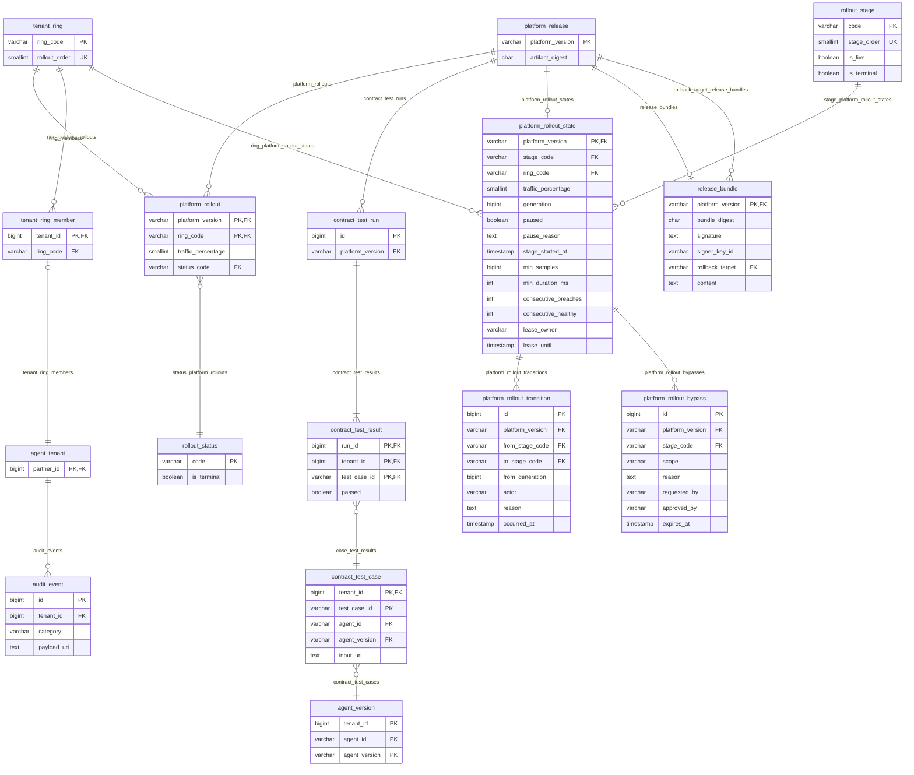
```mermaid
erDiagram
    tenant_ring ||--o{ platform_rollout : ring_platform_rollouts
    platform_release ||--o{ platform_rollout : platform_rollouts
    platform_release ||--o{ contract_test_run : contract_test_runs
    contract_test_run ||--|{ contract_test_result : contract_test_results
    contract_test_result }o--|| contract_test_case : case_test_results
    contract_test_case }o--|| agent_version : contract_test_cases
    platform_rollout }o--|| rollout_status : status_platform_rollouts
    tenant_ring ||--o{ tenant_ring_member : ring_members
    tenant_ring_member |o--|| agent_tenant : tenant_ring_members
    agent_tenant ||--o{ audit_event : audit_events
    platform_release ||--o| platform_rollout_state : platform_rollout_states
    rollout_stage ||--o{ platform_rollout_state : stage_platform_rollout_states
    tenant_ring ||--o{ platform_rollout_state : ring_platform_rollout_states
    platform_rollout_state ||--o{ platform_rollout_transition : platform_rollout_transitions
    platform_rollout_state ||--o{ platform_rollout_bypass : platform_rollout_bypasses
    platform_release ||--o| release_bundle : release_bundles
    platform_release ||--o{ release_bundle : rollback_target_release_bundles

    agent_tenant {
        bigint partner_id PK,FK
    }
    agent_version {
        bigint tenant_id PK
        varchar agent_id PK
        varchar agent_version PK
    }
    tenant_ring {
        varchar ring_code PK
        smallint rollout_order UK
    }
    tenant_ring_member {
        bigint tenant_id PK,FK
        varchar ring_code FK
    }
    platform_release {
        varchar platform_version PK
        char artifact_digest
    }
    platform_rollout {
        varchar platform_version PK,FK
        varchar ring_code PK,FK
        smallint traffic_percentage
        varchar status_code FK
    }
    rollout_status {
        varchar code PK
        boolean is_terminal
    }
    contract_test_case {
        bigint tenant_id PK,FK
        varchar test_case_id PK
        varchar agent_id FK
        varchar agent_version FK
        text input_uri
    }
    contract_test_run {
        bigint id PK
        varchar platform_version FK
    }
    contract_test_result {
        bigint run_id PK,FK
        bigint tenant_id PK,FK
        varchar test_case_id PK,FK
        boolean passed
    }
    audit_event {
        bigint id PK
        bigint tenant_id FK
        varchar category
        text payload_uri
    }
    rollout_stage {
        varchar code PK
        smallint stage_order UK
        boolean is_live
        boolean is_terminal
    }
    platform_rollout_state {
        varchar platform_version PK,FK
        varchar stage_code FK
        varchar ring_code FK
        smallint traffic_percentage
        bigint generation
        boolean paused
        text pause_reason
        timestamp stage_started_at
        bigint min_samples
        int min_duration_ms
        int consecutive_breaches
        int consecutive_healthy
        varchar lease_owner
        timestamp lease_until
    }
    platform_rollout_transition {
        bigint id PK
        varchar platform_version FK
        varchar from_stage_code FK
        varchar to_stage_code FK
        bigint from_generation
        varchar actor
        text reason
        timestamp occurred_at
    }
    platform_rollout_bypass {
        bigint id PK
        varchar platform_version FK
        varchar stage_code FK
        varchar scope
        text reason
        varchar requested_by
        varchar approved_by
        timestamp expires_at
    }
    release_bundle {
        varchar platform_version PK,FK
        char bundle_digest
        text signature
        varchar signer_key_id
        varchar rollback_target FK
        text content
    }
```

Agent canaries in `agent_deployment` remain independent from platform rings in `platform_rollout`. Compatibility results, rollout health, and redacted audit events provide the evidence required to advance or restore a release.

### Version pins and per-conversation release identity

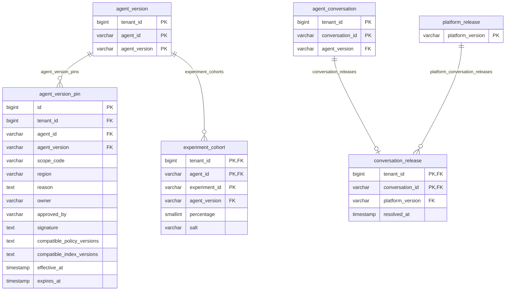
```mermaid
erDiagram
    agent_version ||--o{ agent_version_pin : agent_version_pins
    agent_version ||--o{ experiment_cohort : experiment_cohorts
    agent_conversation ||--o| conversation_release : conversation_releases
    platform_release ||--o{ conversation_release : platform_conversation_releases

    agent_version {
        bigint tenant_id PK
        varchar agent_id PK
        varchar agent_version PK
    }
    agent_conversation {
        bigint tenant_id PK
        varchar conversation_id PK
        varchar agent_version FK
    }
    platform_release {
        varchar platform_version PK
    }
    agent_version_pin {
        bigint id PK
        bigint tenant_id FK
        varchar agent_id FK
        varchar agent_version FK
        varchar scope_code
        varchar region
        text reason
        varchar owner
        varchar approved_by
        text signature
        text compatible_policy_versions
        text compatible_index_versions
        timestamp effective_at
        timestamp expires_at
    }
    experiment_cohort {
        bigint tenant_id PK,FK
        varchar agent_id PK,FK
        varchar experiment_id PK
        varchar agent_version FK
        smallint percentage
        varchar salt
    }
    conversation_release {
        bigint tenant_id PK,FK
        varchar conversation_id PK,FK
        varchar platform_version FK
        timestamp resolved_at
    }
```

A conversation carries two independent identities: `agent_conversation.agent_version` for the tenant's agent and `conversation_release.platform_version` for the platform release it was created on. Both are resolved once at session creation and read, never re-resolved, on later turns, so a rollback of either control changes new assignments only.

### Rollout state, pins, and release identity

`platform_release` remains the deployable artifact identity and `platform_rollout` the per-ring traffic row. `platform_rollout_state` adds the controller's own state: current stage, traffic share, stage minimums, pause reason, a monotonic `generation` every transition compare-and-swaps against, and the row lease (`lease_owner`, `lease_until`) that stops two controllers from advancing the same release. `platform_rollout_transition` is the audited history of those moves and `platform_rollout_bypass` records scoped, approved, expiring exceptions.

`release_bundle` records what a platform release certifies — model and provider version, tokenizer, runtime, decoding defaults, prompt, embedding and reranker with index generation, tools, safety policy, migration set, residency policy, provenance, compatibility constraints, and rollback target — under a digest and signature. Nothing routes on the bundle; it exists so "roll back to the previous release" names exactly what it restores.

Agent-version and platform-release identity stay separate. `agent_version_pin` holds compliance and tenant pins with effective and expiry dates, owner, approval, and the policy and index versions each pin is compatible with; `experiment_cohort` holds the stable-hash cohort assignment. A conversation persists both identities: `agent_conversation.agent_version` for the agent and `conversation_release.platform_version` for the release it was created on, so a rollback changes new assignments only and live conversations drain on what they started with.

### Quality evaluation

The `evaluation` group holds the evidence a rollout gate consumes.

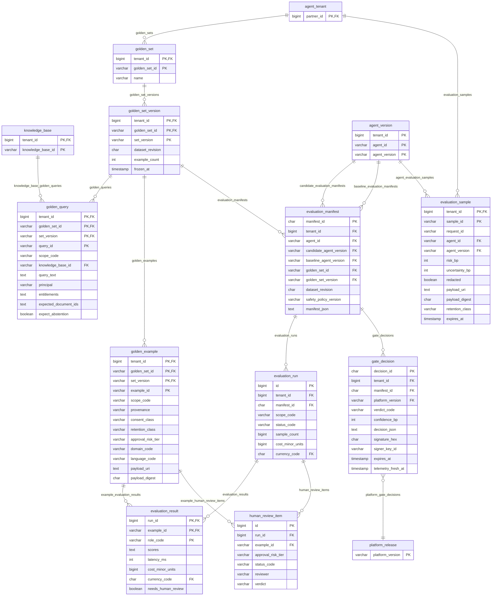
```mermaid
erDiagram
    knowledge_base ||--o{ golden_query : knowledge_base_golden_queries
    agent_tenant ||--o{ golden_set : golden_sets
    golden_set ||--o{ golden_set_version : golden_set_versions
    golden_set_version ||--o{ golden_query : golden_queries
    golden_set_version ||--o{ golden_example : golden_examples
    golden_set_version ||--o{ evaluation_manifest : evaluation_manifests
    agent_version ||--o{ evaluation_manifest : candidate_evaluation_manifests
    agent_version ||--o{ evaluation_manifest : baseline_evaluation_manifests
    evaluation_manifest ||--o{ evaluation_run : evaluation_runs
    evaluation_run ||--o{ evaluation_result : evaluation_results
    golden_example ||--o{ evaluation_result : example_evaluation_results
    evaluation_run ||--o{ human_review_item : human_review_items
    golden_example ||--o{ human_review_item : example_human_review_items
    evaluation_manifest ||--o{ gate_decision : gate_decisions
    gate_decision }o--|| platform_release : platform_gate_decisions
    agent_tenant ||--o{ evaluation_sample : evaluation_samples
    agent_version ||--o{ evaluation_sample : agent_evaluation_samples

    agent_tenant {
        bigint partner_id PK,FK
    }
    agent_version {
        bigint tenant_id PK
        varchar agent_id PK
        varchar agent_version PK
    }
    knowledge_base {
        bigint tenant_id PK,FK
        varchar knowledge_base_id PK
    }
    platform_release {
        varchar platform_version PK
    }
    golden_set {
        bigint tenant_id PK,FK
        varchar golden_set_id PK
        varchar name
    }
    golden_set_version {
        bigint tenant_id PK,FK
        varchar golden_set_id PK,FK
        varchar set_version PK
        char dataset_revision
        int example_count
        timestamp frozen_at
    }
    golden_example {
        bigint tenant_id PK,FK
        varchar golden_set_id PK,FK
        varchar set_version PK,FK
        varchar example_id PK
        varchar scope_code
        varchar provenance
        varchar consent_class
        varchar retention_class
        varchar approval_risk_tier
        varchar domain_code
        varchar language_code
        text payload_uri
        char payload_digest
    }
    golden_query {
        bigint tenant_id PK,FK
        varchar golden_set_id PK,FK
        varchar set_version PK,FK
        varchar query_id PK
        varchar scope_code
        varchar knowledge_base_id FK
        text query_text
        varchar principal
        text entitlements
        text expected_document_ids
        boolean expect_abstention
    }
    evaluation_manifest {
        char manifest_id PK
        bigint tenant_id FK
        varchar agent_id FK
        varchar candidate_agent_version FK
        varchar baseline_agent_version FK
        varchar golden_set_id FK
        varchar golden_set_version FK
        char dataset_revision
        varchar safety_policy_version
        text manifest_json
    }
    evaluation_run {
        bigint id PK
        bigint tenant_id FK
        char manifest_id FK
        varchar scope_code
        varchar status_code
        bigint sample_count
        bigint cost_minor_units
        char currency_code FK
    }
    evaluation_result {
        bigint run_id PK,FK
        varchar example_id PK,FK
        varchar role_code PK
        text scores
        int latency_ms
        bigint cost_minor_units
        char currency_code FK
        boolean needs_human_review
    }
    gate_decision {
        char decision_id PK
        bigint tenant_id FK
        char manifest_id FK
        varchar platform_version FK
        varchar verdict_code
        int confidence_bp
        text decision_json
        char signature_hex
        varchar signer_key_id
        timestamp expires_at
        timestamp telemetry_fresh_at
    }
    human_review_item {
        bigint id PK
        bigint run_id FK
        varchar example_id FK
        varchar approval_risk_tier
        varchar status_code
        varchar reviewer
        varchar verdict
    }
    evaluation_sample {
        bigint tenant_id PK,FK
        varchar sample_id PK
        varchar request_id
        varchar agent_id FK
        varchar agent_version FK
        int risk_bp
        int uncertainty_bp
        boolean redacted
        text payload_uri
        char payload_digest
        varchar retention_class
        timestamp expires_at
    }
```
 `evaluation_manifest` is content-addressed over the candidate and baseline component versions, dataset revision, evaluator versions, and safety policy. `golden_set`, `golden_set_version`, `golden_example`, and `golden_query` carry versioned truth with provenance, consent and retention class, risk tier, and slices, and a scope column that keeps hidden gate examples out of the dev scope. `evaluation_run` and `evaluation_result` store per-example outcomes with minor-unit cost, `gate_decision` stores the signed, expiring verdict, `human_review_item` the adjudication queue, and `evaluation_sample` the policy-bounded production samples whose payloads are sealed in object storage.

## Scout table inventory

Tables are grouped by the schema module that owns them. A downstream generates only the modules its product uses; see the profile table in [README.md](../README.md#generate-dialect-specific-ddl).

| Module | Tables |
|---|---|
| `catalog` | `currency`, `priority_class`, `turn_status`, `idempotency_status`, `reservation_status`, `rollout_status`, `usage_category`, `config_scope_kind`, `config_resource_kind`, `config_merge_mode`, `audit_decision_outcome`, `approval_status`, `approval_risk_tier`, `agent_output_class`, `agent_state` |
| `tenancy` | `agent_tenant`, `tenant_runtime_policy`, `tenant_current_policy`, `tenant_quota` |
| `prompt` | `prompt_section`, `prompt_baseline` |
| `model` | `model_provider`, `model_definition`, `model_capability`, `model_price`, `tenant_model_access` |
| `agent` | `agent_type`, `agent_type_version`, `agent_capability_package`, `agent_type_capability`, `agent_profile`, `guardrail_config`, `agent_draft`, `agent_alias`, `agent_studio_event`, `agent_prompt_override`, `tenant_prompt_default`, `agent_version`, `agent_deployment`, `agent_version_quarantine` |
| `tool` | `tool_profile`, `tool_version`, `tool_egress_rule`, `agent_tool_binding`, `tool_credential_binding` |
| `execution_graph` | `execution_graph`, `execution_step`, `execution_graph_entry`, `execution_transition` |
| `knowledge` | `knowledge_base`, `knowledge_base_version`, `knowledge_document`, `knowledge_chunk`, `agent_knowledge_binding`, `knowledge_document_manifest`, `knowledge_base_alias`, `knowledge_source_event` |
| `knowledge_vector` | `knowledge_chunk_vector` |
| `runtime` | `agent_conversation`, `conversation_turn`, `conversation_turn_detail`, `step_checkpoint`, `session_snapshot`, `step_idempotency`, `turn_queue`, `turn_dead_letter`, `budget_reservation`, `usage_event`, `agent_run`, `agent_ops_event`, `agent_work_item` |
| `release` | `rollout_stage`, `platform_release`, `release_bundle`, `tenant_ring`, `tenant_ring_member`, `contract_test_case`, `contract_test_run`, `contract_test_result`, `platform_rollout`, `platform_rollout_state`, `platform_rollout_transition`, `platform_rollout_bypass`, `agent_version_pin`, `experiment_cohort`, `conversation_release`, `audit_event` |
| `evaluation` | `evaluation_manifest`, `golden_set`, `golden_set_version`, `golden_example`, `golden_query`, `evaluation_run`, `evaluation_result`, `gate_decision`, `human_review_item`, `evaluation_sample` |
| `agent_authorization` | `agent_permission`, `delegation_grant` |
| `configuration` | `configuration`, `config_scope_binding`, `effective_agent_release` |
| `approval` | `approval_request`, `approval_decision` |

Every catalog table above is a foreign-key target, so the tables referencing them
cannot accept a row until they hold values — Scout seeds them all. `prompt_section`
is seeded the same way: ids 1-9 are the platform sections (`task`, `tone_of_voice`,
`brand_guidelines`, `target_audience`, `language_style`, `location`,
`sensitive_topics`, `prohibited_content`, `escalation_policy`) and ids up to 100
are reserved, so `prompt_section_seq` starts at 101. Those ids are referenced by
`prompt_baseline` data across every downstream — never renumber them.
