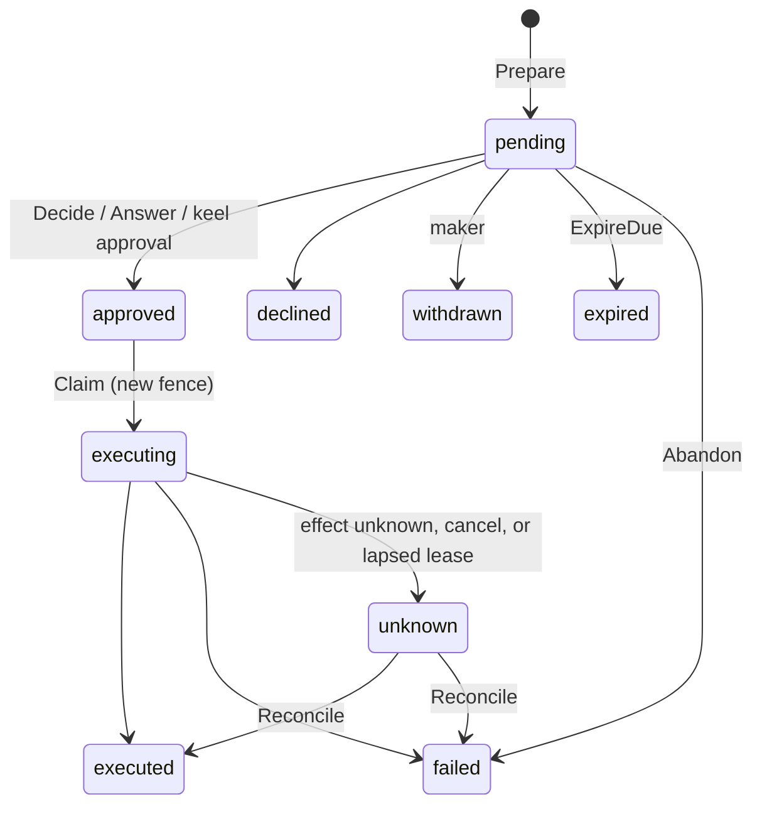

# Policy, approvals, credentials, and evidence

Where [doc/authority.md](authority.md) establishes *who* is acting and *what* their
configuration is, this covers what happens at the boundary: whether the action is allowed, what
conditions ride along, who has to say yes, which identity the call uses, and what is written down.

## Decision point

`policy.SetEvaluator` implements `contract.PolicyDecisionPoint` over the policy statements frozen
into the principal's effective release, read by `policy.ReleaseResolver`. Using the release rather
than the scope's current bindings means a decision uses the policy the work was published with.

Three rules make the default safe:

- **Deny wins**, regardless of statement order.
- **No match is a deny.** An unbound resource is refused, never allowed by omission.
- **An evaluator failure is a deny**, and it returns an auditable reason rather than an error alone.

Patterns match exactly or with a single trailing `*`. Nothing richer, so a pattern cannot widen in a
way its author did not intend.

Statements bind at any scope through `config_scope_binding` with `config_resource_kind = policy`, and the
`policy` narrowing rule enforces the asymmetry that matters: **a child may drop an allow or add a
deny, never add an allow.**

## Restriction layers

A prohibition that must reach every running agent cannot wait for each release to be republished.
The platform layer and each tenant's layer hold standing denials and guardrail rules, read at
decision time on top of the pinned release:

- **They only restrict.** A layer holds deny statements, each naming actions and resources and no
  obligations, and guardrail rules that block or redact. Anything else is `ErrValidation`.
- **They are immutable and digest-addressed.** `policy.TableRestrictionLayers` stores each version
  under its canonical digest and moves the current pointer by compare-and-swap; the expected digest
  is empty before the first write. Writing the value already in force succeeds unchanged; a stale
  expectation is `ErrConflict` with the current digest. The store clock stamps every change.
- **Only a service principal writes,** and every change is an audit record (`restriction` category)
  written in the swap's transaction: a change that cannot be audited does not commit.
- **An unreadable layer denies.** A layer that cannot be read, or whose content no longer matches
  its digest, fails the guardrail inspection and the policy decision. A layer never written is empty.

`policy.RestrictedResolver` wraps the release resolver: it appends both layers' denials, and the
decision's policy version digests the release and both layers. `guardrail.EnforcerConfig.Restrictions`
runs the layers' rules between the baseline and the release, attributed to the `platform` or `tenant`
layer in safety events. Reads are cached in each process for `DefaultRestrictionTTL`, which bounds how
long a new prohibition takes to arrive.

## Obligations

An allow may carry obligations — `require_approval`, `redact`, `cap_spend`, `record_evidence`,
`notify`. `GovernedGateway` applies them before egress, and an obligation with no registered
enforcer is a hard failure (`domain.ErrDegraded`). Silently skipping one would turn a conditional
allow into an unconditional one, which is the whole point of the mechanism.

This is where the operating modes live. `advise`, `draft`, `execute_with_approval`, and
`bounded_autonomous` are enforced as obligations and limits, never as prompt text.

## Durable approvals

An irreversible action does not fail for lack of a human — it waits.

`approval.Gate` implements `contract.ToolApprovalGate` over durable requests. The first call opens an
`turn_approval_request` and returns pending; later calls return whatever verdict was recorded. Open is
idempotent on `(tenant, request, execution_step)`, so a replayed turn re-attaches instead of asking
the same person twice.

With `TableStore.NotifyThroughOutbox`, opening a request also queues the approver's notice as a keel
`outbox_event` (`turn_approval_request` / `approval.requested`) in the same transaction and records it in
`turn_approval_request.notification_event_id`, so a request never exists without its notice and the
event's `dispatched_at` proves delivery. Only the call that creates the request queues one; a request
routed by scope has no recipient and none. A keel outbox worker's `Dispatcher` delivers the notice;
leave `Gate.Notifier` unset, or the approver is told twice. Escalation to a backup is not notified.

`ProposalDigest` binds a verdict to the exact call — tenant, request, tool, version, and arguments.
The digest is also a `WHERE` predicate in the resolve statement, so approving a changed action
updates nothing rather than resolving the wrong proposal.

The turn lifecycle gained `suspended`:

| Step | What happens |
| --- | --- |
| Pending approval | `guardrail.ErrApprovalPending` wraps `domain.ErrApprovalPending`, not `ErrForbidden` |
| `TurnRuntime.suspend` | Records the suspension, publishes a final frame, acks the delivery |
| Budget | The reservation stays **held** — settling would resume with no budget, releasing would let a tenant park work to dodge its ceiling |
| Verdict | `approval.Resumer` records it, returns the turn to `queued`, and re-dispatches |
| Replay | The worker resumes from the last checkpoint through `StepIdempotencyStore`; committed steps do not re-execute |

Resolving without re-dispatching would leave the turn parked forever, so `Resumer` owns all three
steps rather than leaving the last one to a caller.

`approval.Sweeper` moves overdue requests on: `BackupEscalation` routes to a configured backup and,
with none, expires the request. A backup needs its own grant — escalation moves *who decides*, never
*what may be decided*.

## Confirmed MCP tool calls

An MCP client can call a tool that must not act until a person confirms it. That call is not a turn,
so `service/confirmation` holds it instead of the turn approval module:



- **The stored action is what runs.** `Prepare` keeps the exact payload under an action digest; the
  executor never runs re-sent arguments. One action has one open confirmation, and it belongs to its
  maker and client: anyone else preparing it gets `ErrConflict`, and an elicitation answer must name
  the maker's own confirmation for the same tool and digest.
- **The product decides who may act.** `contract.MCPConfirmationChecker` checks a direct decider,
  then re-checks both maker and recorded decider before the run. Its error refuses.
- **Maker-checker is keel's.** Set `ApprovalRequired` at preparation so direct decisions fail closed
  while the keel request is opened. `AttachApproval` links it, and `DecideApprovalTx`, called from
  `approval.Service.OnDecided`, decides both records in keel's transaction.
- **Exactly once, or unknown.** A run holds a store-clock lease under a fence that only it may
  complete. A runner error wrapping `domain.ErrEffectUnknown`, a success whose result cannot be
  stored, a cancellation, or a lost claim is `unknown`, never success and never retried; a person records the verified outcome with `Reconcile`.
- **Client-safe reasons.** The stored and returned reason is generic or the product's `Reason`; the
  cause goes to `Executor.OnFailure`.

## Credentials

`ToolCredentialProvider` is keyed on the principal, not the tenant:

```go
Credential(ctx, principal, toolID, action, purpose) ([]byte, domain.AuthorityRef, error)
```

`tool_credential_binding` maps `(tenant, principal, tool, purpose)` to a reference into keel's secret or
OAuth-connection store — never secret material, so a binding is safe in logs, definitions, and audit
payloads. `BoundCredentialProvider` resolves it just in time, after policy, guardrails, egress, and
admission have all passed.

Two agents on the same tool version therefore resolve **different** identities. The returned
`AuthorityRef` names whose authority was exercised, including the human behind a delegated OAuth
connection; the gateway records it and never the secret. `TableCredentialBindings.Revoked` reports
bindings whose delegation ended so bound work can be stopped rather than continuing orphaned.

## Evidence

`domain.DecisionRecord` replaces the old opaque audit event. It carries principal, authority chain,
scope, action, resource, release, policy id and version, outcome, obligations, reason, and a
reference to redacted evidence in object storage.

`observability.TableAuditSink` is both sides: `Record` writes, `RecordTx` writes inside a caller's
transaction so a state change commits only with its record, `Decisions` reads. Evidence with no
way to read it answers nothing, which is why `AuditQuery` ships with the sink rather than later.
A query reads exactly one tenant, or — with `TenantID` zero — only the platform-wide records that
name no tenant, such as a rollout transition. Reading across tenants is not expressible in
`domain.DecisionQuery`, and a platform-wide record may not name a tenant scope.

Evidence is deliberately not telemetry. Metrics are sampled and lossy; a decision record is not, and
never derives from one.

Records are emitted at turn admission, model routing, every governed tool invocation, guardrail
hits, credential resolution, approval verdicts, rollout transitions, version resolution, and turn
terminal states.

A decision is recorded once. `domain.WithDecisionScope` marks the replay-stable position a decision
is made at — the turn, the step, the loop iteration, the tool call by its idempotency key — and
`domain.DecisionKeyFor` derives `audit_event.decision_key` from that scope and the record's
category, action, and resource; the nth identical decision in one scope gets the nth key. The sink
keeps the first record of a key, so a redelivered turn re-makes a decision without writing it twice.
A decision made outside any scope has no key and stays append-only.

A turn's chain is gap-free: it opens with `turn_admitted`, written before dispatch, and closes with
exactly one of `turn_completed`, `turn_failed`, or `turn_cancelled`. An audit write that fails fails
the delivery rather than passing silently, and the terminal replay offers the terminal record again,
which the key makes a no-op unless the first write was lost. `observability.VerifyTurnChain` asserts
all of this over one request's records.

## Attribution

`usage_event` gained `principal_kind`, `principal_id`, and `scope_id`, and `RecordUsage` takes a
`domain.UsageAttribution`. Cost is now reportable per agent and per organizational scope, not only
per tenant — which is what a per-managed-agent price and a cost-per-outcome metric need.

`isolation.ReleaseLimits` reads the budget and autonomy frozen into the release. Compilation already
narrowed both against every parent scope, so nothing here re-derives inheritance: it reads one row.
Outside its operating window a `bounded_autonomous` agent degrades to `execute_with_approval` rather
than stopping, so out-of-hours work is queued for a human instead of lost.

## What is not here yet

Tracked in [TODO.md](../TODO.md): the OPA/cedar-go adapter behind the decision point (A3),
SPIFFE and RFC 8693 credential adapters (K4), and the OpenTelemetry GenAI mapping (V4).
